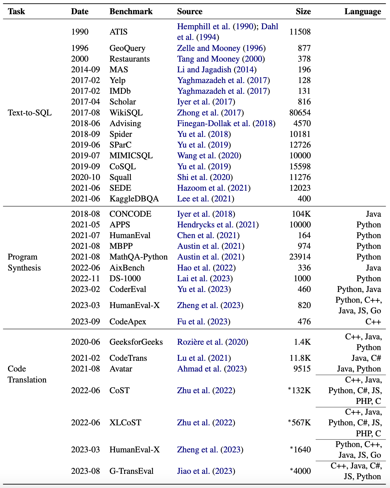

# Awesome-Code-LLM

This is the repo for our [survey]() - a comprehensive review of LLM researches for code. Wroks in each category are ordered chronologically. If you have a basic understanding of machine learning but are new to NLP, we also provide a list of recommended readings in [section 4](#4-recommended-readings).

## Table of Contents

1. [Surveys](#1-surveys)

2. [Models](#2-models)

   2.1 [Off-the-Shelf LLM](#21-off-the-shelf-llm)

   2.2 [Existing LLM Further Trained on Code](#22-existing-llm-further-trained-on-code)

   2.3 [General Pretraining on Code](#23-general-pretraining-on-code)

   - [Encoder](#encoder)

   - [Decoder](#decoder)

   - [Encoder-Decoder](#encoder-decoder)

   - [UniLM](#unilm)

   <!-- prettier ignore -->

   2.4 [Instruction Fine-Tuning on Code](#24-instruction-fine-tuning-on-code)

   2.5 [Reinforcement Learning on Code](#25-reinforcement-learning-on-code)

3. [Datasets](#3-datasets)

   3.1 [Pretraining](#31-pretraining)

   3.2 [Benchmarks](#32-benchmarks)

   - [Program Synthesis](#program-synthesis)
   - [Code Translation](#code-translation)

4. [Recommended Readings](#4-recommended-readings)

## 1. Surveys

We list five recent surveys on similar topics. While they are all about language models for code, the first two focus on NLP side, and the later three focus on SE side.

1. "Large Language Models Meet NL2Code: A Survey", 2022-12, ACL 2023, [[paper](https://arxiv.org/abs/2212.09420)]

2. "A Survey on Pretrained Language Models for Neural Code Intelligence", 2022-12, arXiv, [[paper](https://arxiv.org/abs/2212.10079)]

3. "An Empirical Comparison of Pre-Trained Models of Source Code", 2023-02, ICSE 2023, [[paper](https://arxiv.org/abs/2302.04026)]

4. "Large Language Models for Software Engineering: A Systematic Literature Review", 2023-08, arXiv, [[paper](https://arxiv.org/abs/2308.10620)]

5. "Towards an Understanding of Large Language Models in Software Engineering Tasks", 2023-08, arXiv, [[paper](https://arxiv.org/abs/2308.11396)]

## 2. Models

### 2.1 Off-the-Shelf LLM

These LLMs are not specifically trained for code, but have demonstrated varying coding capability.

1. **LaMDA**: "LaMDA: Language Models for Dialog Applications", 2022-01, arXiv, [[paper](https://arxiv.org/abs/2201.08239)]

2. **PaLM**: "PaLM: Scaling Language Modeling with Pathways", 2022-04, arXiv, [[paper](https://arxiv.org/abs/2204.02311)]

3. **GPT-NeoX**: "GPT-NeoX-20B: An Open-Source Autoregressive Language Model", 2022-04, ACL 2022 Workshop on Challenges & Perspectives in Creating Large Language Models, [[paper](https://arxiv.org/abs/2204.06745)] [[repo](https://github.com/EleutherAI/gpt-neox)]

4. **BLOOM**: "BLOOM: A 176B-Parameter Open-Access Multilingual Language Model", 2022-11, arXiv, [[paper](https://arxiv.org/abs/2211.05100)] [[model](https://huggingface.co/models?search=bigscience/bloom)]

5. **LLaMA**: "LLaMA: Open and Efficient Foundation Language Models", 2023-02, arXiv, [[paper](https://arxiv.org/abs/2302.13971)]

6. **GPT-4**: "GPT-4 Technical Report", 2023-03, arXiv, [[paper](https://arxiv.org/abs/2303.08774)]

7. **LLaMA 2**: "Llama 2: Open Foundation and Fine-Tuned Chat Models", 2023-07, arXiv, [[paper](https://arxiv.org/abs/2307.09288)] [[repo](https://github.com/facebookresearch/llama)]

8. **Phi-1.5**: "Textbooks Are All You Need II: phi-1.5 technical report", 2023-09, arXiv, [[paper](https://arxiv.org/abs/2309.05463)] [[model](https://huggingface.co/microsoft/phi-1_5)]

9. **Baichuan 2**: "Baichuan 2: Open Large-scale Language Models", 2023-09, arXiv, [[paper](https://arxiv.org/abs/2309.10305)] [[repo](https://github.com/baichuan-inc/Baichuan2)]

10. **Qwen**: "Qwen Technical Report", 2023-09, arXiv, [[paper](https://arxiv.org/abs/2309.16609)] [[repo](https://github.com/QwenLM/Qwen)]

### 2.2 Existing LLM Further Trained on Code

These models are general-purpose LLMs further pretrained on code-related data.

1. **Codex** (GPT-3): "Evaluating Large Language Models Trained on Code", 2021-07, arXiv, [[paper](https://arxiv.org/abs/2107.03374)]

2. **PaLM Coder** (PaLM): "PaLM: Scaling Language Modeling with Pathways", 2022-04, arXiv, [[paper](https://arxiv.org/abs/2204.02311)]

3. **Minerva** (PaLM): "Solving Quantitative Reasoning Problems with Language Models", 2022-06, arXiv, [[paper](https://arxiv.org/abs/2206.14858)]

4. **PaLM 2 \*** (PaLM 2): "PaLM 2 Technical Report", 2023-05, arXiv, [[paper](https://arxiv.org/abs/2305.10403)]

5. **Code LLaMA** (LLaMA 2): "Code Llama: Open Foundation Models for Code", 2023-08, arXiv, [[paper](https://arxiv.org/abs/2308.12950)] [[repo](https://github.com/facebookresearch/codellama)]

### 2.3 General Pretraining on Code

These models are Transformer encoders, decoders, and encoder-decoders pretrained from scratch using existing objectives for general language modeling.

#### Encoder

1. **CuBERT** (MLM + NSP): "Learning and Evaluating Contextual Embedding of Source Code", 2019-12, ICML 2020, [[paper](https://arxiv.org/abs/2001.00059)] [[repo](https://github.com/google-research/google-research/tree/master/cubert)]

2. **CodeBERT** (MLM + RTD): "CodeBERT: A Pre-Trained Model for Programming and Natural Languages", 2020-02, EMNLP findings 2020, [[paper](https://arxiv.org/abs/2002.08155)] [[repo](https://github.com/microsoft/CodeBERT)]

3. **GraphCodeBERT** (MLM + DFG Edge Prediction + DFG Node Alignment): "GraphCodeBERT: Pre-training Code Representations with Data Flow", 2020-09, ICLR 2021, [[paper](https://arxiv.org/abs/2009.08366)] [[repo](https://github.com/microsoft/CodeBERT)]

4. **SynCoBERT** (MLM + Identifier Prediction + AST Edge Prediction + Contrastive Learning): "SynCoBERT: Syntax-Guided Multi-Modal Contrastive Pre-Training for Code Representation", 2021-08, arXiv, [[paper](https://arxiv.org/abs/2108.04556)]

5. **DISCO** (MLM + Node Type MLM + Contrastive Learning): "Towards Learning (Dis)-Similarity of Source Code from Program Contrasts", 2021-q0, ACL 2022, [[paper](https://arxiv.org/abs/2110.03868)]

6. **Code-MVP** (MLM + Type Inference + Contrastive Learning): "CODE-MVP: Learning to Represent Source Code from Multiple Views with Contrastive Pre-Training", 2022-05, NAACL 2022 Technical Track, [[paper](https://arxiv.org/abs/2205.02029)]

#### Decoder

1. **GPT-C** (CLM): "IntelliCode Compose: Code Generation Using Transformer", 2020-05, ESEC/FSE 2020, [[paper](https://arxiv.org/abs/2005.08025)]

2. **CodeGPT** (CLM): "CodeXGLUE: A Machine Learning Benchmark Dataset for Code Understanding and Generation", 2021-02, NeurIPS Datasets and Benchmarks 2021, [[paper](https://arxiv.org/abs/2102.04664)] [[repo](https://github.com/microsoft/CodeXGLUE)]

3. **CodeParrot** (CLM), 2021-12, [[blog](https://huggingface.co/blog/codeparrot)]

4. **PolyCoder** (CLM): "A Systematic Evaluation of Large Language Models of Code", 2022-02, - DL4C@ICLR 2022, [[paper](https://arxiv.org/abs/2202.13169)] [[repo](https://github.com/VHellendoorn/Code-LMs)]

5. **CodeGen** (CLM): "CodeGen: An Open Large Language Model for Code with Multi-Turn Program Synthesis", 2022-03, ICLR 2023, [[paper](https://arxiv.org/abs/2203.13474)] [[repo](https://github.com/salesforce/CodeGen)]

6. **InCoder** (Causal Masking): "InCoder: A Generative Model for Code Infilling and Synthesis", 2022-04, ICLR 2023, [[paper](https://arxiv.org/abs/2204.05999)] [[repo](https://github.com/dpfried/incoder)]

7. **PyCodeGPT** (CLM): "CERT: Continual Pre-Training on Sketches for Library-Oriented Code Generation", 2022-06, IJCAI-ECAI 2022, [[paper](https://arxiv.org/abs/2206.06888)] [[repo](https://github.com/microsoft/PyCodeGPT)]

8. **PanGu-Coder** (CLM): "PanGu-Coder: Program Synthesis with Function-Level Language Modeling", 2022-07, arxiv, [[paper](https://arxiv.org/abs/2207.11280)]

9. **SantaCoder** (FIM): "SantaCoder: don't reach for the stars!", 2023-01, arXiv, [[paper](https://arxiv.org/abs/2301.03988)] [[model](https://huggingface.co/bigcode/santacoder)]

10. **CodeGeeX** (CLM): "CodeGeeX: A Pre-Trained Model for Code Generation with Multilingual Evaluations on HumanEval-X", 2023-03, arxiv, [[paper](https://arxiv.org/abs/2303.17568)] [[repo](https://github.com/THUDM/CodeGeeX)]

11. **StarCoder** (FIM): "StarCoder: may the source be with you!", 2023-05, arXiv, [[paper](https://arxiv.org/abs/2305.06161)] [[model](https://huggingface.co/bigcode/starcoder)]

12. **Phi-1** (CLM): "Textbooks Are All You Need", 2023-06, arxiv, [[paper](https://arxiv.org/abs/2306.11644)] [[model](https://huggingface.co/microsoft/phi-1)]

13. **CodeFuse** (CLM): "CodeFuse-13B: A Pretrained Multi-lingual Code Large Language Model", 2023-10, arxiv, [[paper](https://arxiv.org/abs/2310.06266)] [[model](https://huggingface.co/codefuse-ai/CodeFuse-13B)]

14. **CodeShell** (CLM), 2023-10, [[repo](https://github.com/WisdomShell/codeshell)]

15. **DeepSeek Coder** (CLM), 2023-10, [[repo](https://github.com/deepseek-ai/DeepSeek-Coder)]

#### Encoder-Decoder

1. **PyMT5** (Span Corruption): "PyMT5: multi-mode translation of natural language and Python code with transformers", 2020-10, EMNLP 2020, [[paper](https://arxiv.org/abs/2010.03150)]

2. **Mastropaolo et al.** (MLM + Deobfuscation): "DOBF: A Deobfuscation Pre-Training Objective for Programming Languages", 2021-02, ICSE 2021, [[paper](https://arxiv.org/abs/2102.02017)] [[repo](https://github.com/antonio-mastropaolo/TransferLearning4Code)]

3. **DOBF** (Span Corruption): "Studying the Usage of Text-To-Text Transfer Transformer to Support Code-Related Tasks", 2021-02, NeurIPS 2021, [[paper](https://arxiv.org/abs/2102.07492)] [[repo](https://github.com/facebookresearch/CodeGen/blob/main/docs/dobf.md)]

4. **PLBART** (DAE): "Unified Pre-training for Program Understanding and Generation", 2021-03, NAACL 2021, [[paper](https://arxiv.org/abs/2103.06333)] [[repo](https://github.com/wasiahmad/PLBART)]

5. **CodeT5** (Span Corruption + Identifier Tagging + Masked Identifier Prediction + Text2Code + Code2Text): "CodeT5: Identifier-aware Unified Pre-trained Encoder-Decoder Models for Code Understanding and Generation", 2021-09, EMNLP 2021, [[paper](https://arxiv.org/abs/2109.00859)] [[repo](https://github.com/salesforce/CodeT5)]

6. **SPT-Code** (Span Corruption + NSP + Method Name Prediction): "SPT-Code: Sequence-to-Sequence Pre-Training for Learning Source Code Representations", 2022-01, ICSE 2022 Technical Track, [[paper](https://arxiv.org/abs/2201.01549)]

7. **AlphaCode** (MLM + CLM): "Competition-Level Code Generation with AlphaCode", 2022-02, Science, [[paper](https://arxiv.org/abs/2203.07814)] [[arxiv](https://deepmind.google/discover/blog/competitive-programming-with-alphacode/)]

8. **NatGen** (Code Naturalization): "NatGen: Generative pre-training by "Naturalizing" source code", 2022-06, ESEC/FSE 2022, [[paper](https://arxiv.org/abs/2206.07585)] [[repo](https://github.com/saikat107/NatGen)]

9. **CodeT5+** (Span Corruption + CLM + Text-Code Contrastive Learning + Text-Code Translation): "CodeT5+: Open Code Large Language Models for Code Understanding and Generation", 2023-05, arXiv, [[paper](https://arxiv.org/abs/2305.07922)] [[repo](https://github.com/salesforce/CodeT5)]

#### UniLM

1. **CugLM** (MLM + NSP + CLM): "Multi-task Learning based Pre-trained Language Model for Code Completion", 2020-12, ASE 2020, [[paper](https://arxiv.org/abs/2012.14631)]

2. **UniXcoder** (MLM + NSP + CLM + Span Corruption + Contrastive Learning + Code2Text): "UniXcoder: Unified Cross-Modal Pre-training for Code Representation", 2022-03, ACL 2022, [[paper](https://arxiv.org/abs/2203.03850)] [[repo](https://github.com/microsoft/CodeBERT)]

### 2.4 Instruction Fine-Tuning on Code

These models apply Instruction Fine-Tuning techniques to enhance the capacities of Code LLMs.

1. **WizardCoder** (StarCoder + Evol-Instruct): "WizardCoder: Empowering Code Large Language Models with Evol-Instruct", 2023-06, arXiv, [[paper](https://arxiv.org/abs/2306.08568)] [[repo](https://github.com/nlpxucan/WizardLM)]

2. **PanGu-Coder 2** (StarCoder + Evol-Instruct + RRTF): "PanGu-Coder2: Boosting Large Language Models for Code with Ranking Feedback", 2023-07, arXiv, [[paper](https://arxiv.org/abs/2307.14936)]

3. **OctoCoder** (StarCoder) / **OctoGeeX** (CodeGeeX2): "OctoPack: Instruction Tuning Code Large Language Models", 2023-08, arXiv, [[paper](https://arxiv.org/abs/2308.07124)] [[repo](https://github.com/bigcode-project/octopack)]

4. **MFTCoder** (Code LLaMA): "MFTCoder: Boosting Code LLMs with Multitask Fine-Tuning", 2023-11, arXiv, [[paper](https://arxiv.org/abs/2311.02303)] [[repo](https://github.com/codefuse-ai/MFTCoder)]

### 2.5 Reinforcement Learning on Code

1. **CompCoder**: "Compilable Neural Code Generation with Compiler Feedback", 2022-03, ACL 2022, [[paper](https://arxiv.org/abs/2203.05132)]

2. **CodeRL**: "CodeRL: Mastering Code Generation through Pretrained Models and Deep Reinforcement Learning", 2022-07, NeurIPS 2022, [[paper](https://arxiv.org/abs/2207.01780)] [[repo](https://github.com/salesforce/CodeRL)]

3. **PPOCoder**: "Execution-based Code Generation using Deep Reinforcement Learning", 2023-01, TMLR 2023, [[paper](https://arxiv.org/abs/2301.13816)] [[repo](https://github.com/reddy-lab-code-research/PPOCoder)]

4. **RLTF**: "RLTF: Reinforcement Learning from Unit Test Feedback", 2023-07, arXiv, [[paper](https://arxiv.org/abs/2307.04349)] [[repo](https://github.com/Zyq-scut/RLTF)]

## 3. Datasets

### 3.1 Pretraining

1. **CodeSearchNet**: "CodeSearchNet Challenge: Evaluating the State of Semantic Code Search", 2019-09, arXiv, [[paper](https://arxiv.org/abs/1909.09436)] [[repo](https://github.com/github/CodeSearchNet)] [[data](https://huggingface.co/datasets/code_search_net)]

2. **The Pile**: "The Pile: An 800GB Dataset of Diverse Text for Language Modeling", 2020-12, arXiv, [[paper](https://arxiv.org/abs/2101.00027)] [[data](https://pile.eleuther.ai/)]

3. **CodeParrot**, 2022-02, [[data](https://huggingface.co/datasets/codeparrot/github-code)]

4. **The Stack**: "The Stack: 3 TB of permissively licensed source code", 2022-11, arXiv, [[paper](https://arxiv.org/abs/2211.15533)] [[data](https://huggingface.co/datasets/bigcode/the-stack)]

5. **ROOTS**: "The BigScience ROOTS Corpus: A 1.6TB Composite Multilingual Dataset", 2023-03, NeurIPS 2022 Datasets and Benchmarks Track, [[paper](https://arxiv.org/abs/2303.03915)] [[data](https://huggingface.co/datasets?search=bigscience-data/roots)]

### 3.2 Benchmarks

1. **CodeXGLUE**: "CodeXGLUE: A Machine Learning Benchmark Dataset for Code Understanding and Generation", 2021-02, NeurIPS Datasets and Benchmarks 2021, [[paper](https://arxiv.org/abs/2102.04664)] [[repo](https://github.com/microsoft/CodeXGLUE)] [[data](https://huggingface.co/datasets?search=code_x_glue)]

#### Program Synthesis

1. **CONCODE**: "Mapping Language to Code in Programmatic Context", 2018-08, EMNLP 2018, [[paper](https://arxiv.org/abs/1808.09588)] [[data](https://github.com/sriniiyer/concode)]

2. **APPS**: "Measuring Coding Challenge Competence With APPS", 2021-05, NeurIPS 2021, [[paper](https://arxiv.org/abs/2105.09938)] [[data](https://github.com/hendrycks/apps)]

3. **HumanEval**: "Evaluating Large Language Models Trained on Code", 2021-07, arXiv, [[paper](https://arxiv.org/abs/2107.03374)] [[data](https://github.com/openai/human-eval)]

4. **MBPP**, **MathQA-Python**: "Program Synthesis with Large Language Models", 2021-08, arXiv, [[paper](https://arxiv.org/abs/2108.07732)] [[MBPP](https://github.com/google-research/google-research/tree/master/mbpp)] [[MathQA-Python](https://github.com/google/trax/blob/master/trax/examples/MathQA_Python_generation_notebook.ipynb)]

5. **AixBench**: "AixBench: A Code Generation Benchmark Dataset", 2022-06, arXiv, [[paper](https://arxiv.org/abs/2206.13179)] [[data](https://github.com/aixcoder-plugin/nl2code-dataset)]

6. **MultiPL-E**: "MultiPL-E: A Scalable and Extensible Approach to Benchmarking Neural Code Generation", 2022-08, IEEE Trans. Software Engineering 2023, [[paper](https://arxiv.org/abs/2208.08227)] [[data](https://github.com/nuprl/MultiPL-E)]

7. **DS-1000**: "DS-1000: A Natural and Reliable Benchmark for Data Science Code Generation", 2022-11, arXiv, [[paper](https://arxiv.org/abs/2211.11501)] [[data](https://github.com/xlang-ai/DS-1000)]

8. **CoderEval**: "CoderEval: A Benchmark of Pragmatic Code Generation with Generative Pre-trained Models", 2023-02, arXiv, [[paper](https://arxiv.org/abs/2302.00288)] [[data](https://github.com/CoderEval/CoderEval)]

9. **HumanEval-X**: "CodeGeeX: A Pre-Trained Model for Code Generation with Multilingual Evaluations on HumanEval-X", 2023-03, arXiv, [[paper](https://arxiv.org/abs/2303.17568)] [[data](https://hub.docker.com/r/codegeex/codegeex)]

10. **HumanEval+**: "Is Your Code Generated by ChatGPT Really Correct? Rigorous Evaluation of Large Language Models for Code Generation", 2023-05, arXiv, [[paper](https://arxiv.org/abs/2305.01210)] [[data](https://github.com/evalplus/evalplus)]

11. **HumanEvalPack**: "OctoPack: Instruction Tuning Code Large Language Models", 2023-08, arXiv, [[paper](https://arxiv.org/abs/2308.07124)] [[data](https://huggingface.co/datasets/bigcode/humanevalpack)]

12. **CodeApex**: "CodeApex: A Bilingual Programming Evaluation Benchmark for Large Language Models", 2023-09, arXiv, [[paper](https://arxiv.org/abs/2309.01940)] [[data](https://github.com/APEXLAB/CodeApex)]

#### Code Translation

1. **Transcoder GeeksforGeeks**: "Unsupervised Translation of Programming Languages", 2020-06, NeurIPS 2020, [[paper](https://arxiv.org/abs/2006.03511)] [[data](https://github.com/facebookresearch/TransCoder)]

2. **CodeTrans**: "CodeXGLUE: A Machine Learning Benchmark Dataset for Code Understanding and Generation", 2021-02, NeurIPS Datasets and Benchmarks 2021, [[paper](https://arxiv.org/abs/2102.04664)] [[data](https://huggingface.co/datasets/code_x_glue_cc_code_to_code_trans)]

3. **Avatar**: "AVATAR: A Parallel Corpus for Java-Python Program Translation", 2021-08, ACL 2023 Findings, [[paper](https://arxiv.org/abs/2108.11590)] [[data](https://github.com/wasiahmad/AVATAR)]

4. **CoST**: "Multilingual Code Snippets Training for Program Translation", 2022-06, AAAI 2022, [[paper](https://ojs.aaai.org/index.php/AAAI/article/view/21434)] [[data](https://github.com/reddy-lab-code-research/MuST-CoST)]

5. **XLCoST**: "XLCoST: A Benchmark Dataset for Cross-lingual Code Intelligence", 2022-06, arXiv, [[paper](https://arxiv.org/abs/2206.08474)] [[data](https://github.com/reddy-lab-code-research/XLCoST)]

6. **HumanEval-X**: "CodeGeeX: A Pre-Trained Model for Code Generation with Multilingual Evaluations on HumanEval-X", 2023-03, arXiv, [[paper](https://arxiv.org/abs/2303.17568)] [[data](https://github.com/THUDM/CodeGeeX)]

7. **G-TransEval**: "On the Evaluation of Neural Code Translation: Taxonomy and Benchmark", 2023-08, arXiv, [[paper](https://arxiv.org/abs/2308.08961)] [[data](https://github.com/PolyEval/G-TransEval)]

#### Other tasks are coming soon!

## 4. Recommended Readings

30 papers as a primer on LLM.

|  Date   |         Keyword          | Paper                                                                                                                                                                                  | TL;DR                                                                                                                                |
| :-----: | :----------------------: | -------------------------------------------------------------------------------------------------------------------------------------------------------------------------------------- | ------------------------------------------------------------------------------------------------------------------------------------ |
| 2014-09 |        Attention         | [Neural Machine Translation by Jointly Learning to Align and Translate](https://arxiv.org/abs/1409.0473)                                                                               | The original attention, proposed for encoder-decoder RNN                                                                             |
| 2015-08 |           BPE            | [Neural Machine Translation of Rare Words with Subword Units](https://arxiv.org/abs/1508.07909)                                                                                        | Byte-pair encoding: split rare words into subword units                                                                              |
| 2017-06 |       Transformer        | [Attention Is All You Need](https://arxiv.org/abs/1706.03762)                                                                                                                          | Replace LSTM with self-attention for long-range dependency and parallel training                                                     |
| 2017-10 | Mixed Precision Training | [Mixed Precision Training](https://arxiv.org/abs/1710.03740)                                                                                                                           | Store model weights in fp16 to save memory                                                                                           |
| 2018-04 |           GLUE           | [GLUE: A Multi-Task Benchmark and Analysis Platform for Natural Language Understanding](https://arxiv.org/abs/1804.07461)                                                              | A language understanding benchmark                                                                                                   |
| 2018-06 |           GPT            | [Improving Language Understanding by Generative Pre-Training](https://s3-us-west-2.amazonaws.com/openai-assets/research-covers/language-unsupervised/language_understanding_paper.pdf) | Pretraining-finetuning paradigm applied to Transformer decoder                                                                       |
| 2018-10 |           BERT           | [BERT: Pre-training of Deep Bidirectional Transformers for Language Understanding](https://arxiv.org/abs/1810.04805)                                                                   | Masked Language Modeling (MLM) applied to Transformer encoder for pretraining                                                        |
| 2019-02 |          GPT-2           | [Language Models are Unsupervised Multitask Learners](https://d4mucfpksywv.cloudfront.net/better-language-models/language-models.pdf)                                                  | GPT made larger (1.5B). They found language models implicitly learn about downstream tasks (such as translation) during pretraining. |
| 2019-05 |        SuperGLUE         | [SuperGLUE: A Stickier Benchmark for General-Purpose Language Understanding Systems](https://arxiv.org/abs/1905.00537)                                                                 | Another langauge understanding benchmark                                                                                             |
| 2019-07 |         RoBERTa          | [RoBERTa: A Robustly Optimized BERT Pretraining Approach](https://arxiv.org/abs/1907.11692)                                                                                            | An optimized BERT                                                                                                                    |
| 2019-09 |       Megatron-LM        | [Megatron-LM: Training Multi-Billion Parameter Language Models Using Model Parallelism](https://arxiv.org/abs/1909.08053)                                                              | Model parallelism                                                                                                                    |
| 2019-10 |           ZeRO           | [ZeRO: Memory Optimizations Toward Training Trillion Parameter Models](https://arxiv.org/abs/1910.02054)                                                                               | Memory-efficient distributed optimization                                                                                            |
| 2019-10 |            T5            | [Exploring the Limits of Transfer Learning with a Unified Text-to-Text Transformer](https://arxiv.org/abs/1910.10683)                                                                  | Transformer encoder-decoder pretrained with an MLM-like denoising objective                                                          |
| 2020-05 |          GPT-3           | [Language Models are Few-Shot Learners](https://arxiv.org/abs/2005.14165)                                                                                                              | By training an even larger version of GPT-2 (175B), they discovered a new learning paradigm: In-Context Learning (ICL)               |
| 2020-09 |           MMLU           | [Measuring Massive Multitask Language Understanding](https://arxiv.org/abs/2009.03300)                                                                                                 | A world-knowledge and complex reasoning benchmark                                                                                    |
| 2020-12 |           Pile           | [The Pile: An 800GB Dataset of Diverse Text for Language Modeling](https://arxiv.org/abs/2101.00027)                                                                                   | A diverse pretraining dataset                                                                                                        |
| 2021-06 |           LoRA           | [LoRA: Low-Rank Adaptation of Large Language Models](https://arxiv.org/abs/2106.09685)                                                                                                 | Memory-efficient finetuning                                                                                                          |
| 2021-09 |           FLAN           | [Finetuned Language Models Are Zero-Shot Learners](https://arxiv.org/abs/2109.01652)                                                                                                   | Instruction-finetuning                                                                                                               |
| 2021-10 |            T0            | [Multitask Prompted Training Enables Zero-Shot Task Generalization](https://arxiv.org/abs/2110.08207)                                                                                  | Also instruction finetuning, but applied to the much smaller T5                                                                      |
| 2021-12 |          Gopher          | [Scaling Language Models: Methods, Analysis & Insights from Training Gopher](https://arxiv.org/abs/2112.11446)                                                                         | A 280B LLM with comprehensive experiments                                                                                            |
| 2022-01 |           CoT            | [Chain-of-Thought Prompting Elicits Reasoning in Large Language Models](https://arxiv.org/abs/2201.11903)                                                                              | Chain-of-Though reasoning                                                                                                            |
| 2022-03 |       InstructGPT        | [Training language models to follow instructions with human feedback](https://arxiv.org/abs/2203.02155)                                                                                | GPT-3 instruction finetuned with RLHF (reinforcement learning from human feedback)                                                   |
| 2022-03 |        Chinchilla        | [Training Compute-Optimal Large Language Models](https://arxiv.org/abs/2203.15556)                                                                                                     | A smaller (70B) version of Gopher that's pretrained on more data                                                                     |
| 2022-04 |           PaLM           | [PaLM: Scaling Language Modeling with Pathways](https://arxiv.org/abs/2204.02311)                                                                                                      | The largest dense model ever (540B)                                                                                                  |
| 2022-05 |        0-shot CoT        | [Large Language Models are Zero-Shot Reasoners](https://arxiv.org/abs/2205.11916)                                                                                                      | Tell LLMs to think step by step, and they can actually do it                                                                         |
| 2022-06 |        BIG Bench         | [Beyond the Imitation Game: Quantifying and extrapolating the capabilities of language models](https://arxiv.org/abs/2206.04615)                                                       | Another world-knowledge and complex reasoning benchmark                                                                              |
| 2022-06 |     Emergent Ability     | [Emergent Abilities of Large Language Models](https://arxiv.org/abs/2206.07682)                                                                                                        | A review on emergent abilities                                                                                                       |
| 2022-10 |           Flan           | [Scaling Instruction-Finetuned Language Models](https://arxiv.org/abs/2210.11416)                                                                                                      | Consolidate all the existing instruction tuning datasets, and you get SOTA                                                           |
| 2022-11 |          BLOOM           | [BLOOM: A 176B-Parameter Open-Access Multilingual Language Model](https://arxiv.org/abs/2211.05100)                                                                                    | The largest open-source LLM, trained on 46 languages, with detailed discussion about training and evaluation                         |
| 2022-12 |      Self-Instruct       | [Self-Instruct: Aligning Language Models with Self-Generated Instructions](https://arxiv.org/abs/2212.10560)                                                                           | Instruction tuning using LLM-generated data                                                                                          |

This list aims to provide the essential background for understanding current LLM technologies, and thus excludes more recent models such as [LLaMA](https://arxiv.org/abs/2302.13971), [GPT-4](https://arxiv.org/abs/2303.08774) or [PaLM 2](https://arxiv.org/abs/2305.10403). For comprehensive reviews on these more general topics, we refer to other sources such as [this paper](https://arxiv.org/abs/2303.18223) or these repositories: [Awesome-LLM](https://github.com/Hannibal046/Awesome-LLM), [Awesome AIGC Tutorials](https://github.com/luban-agi/Awesome-AIGC-Tutorials), [Awesome Domain LLM](https://github.com/luban-agi/Awesome-Domain-LLM).
