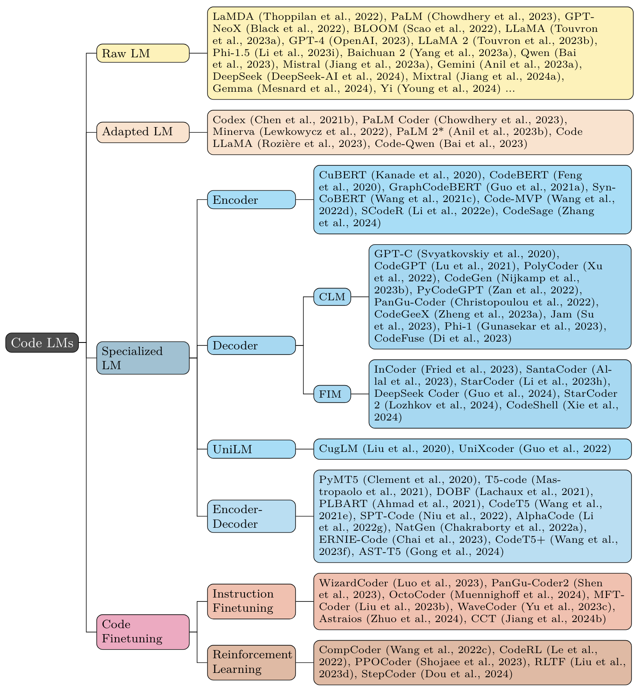
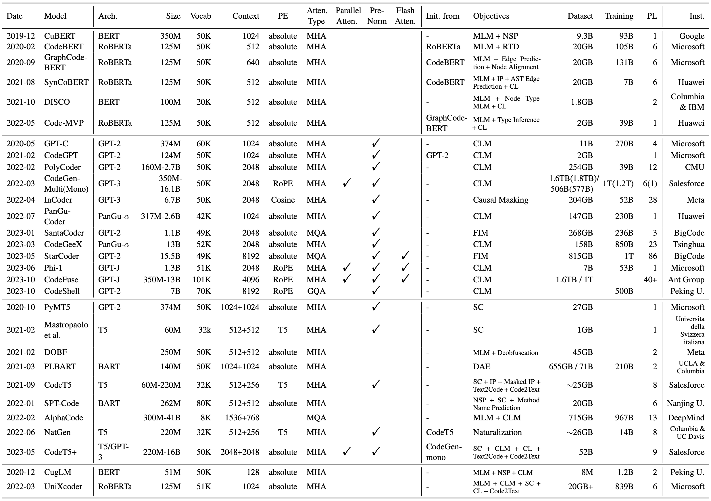
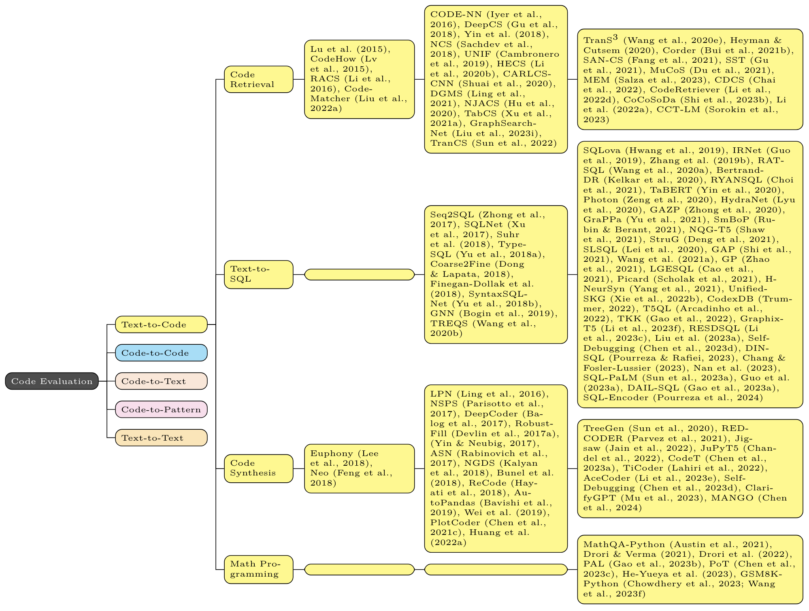
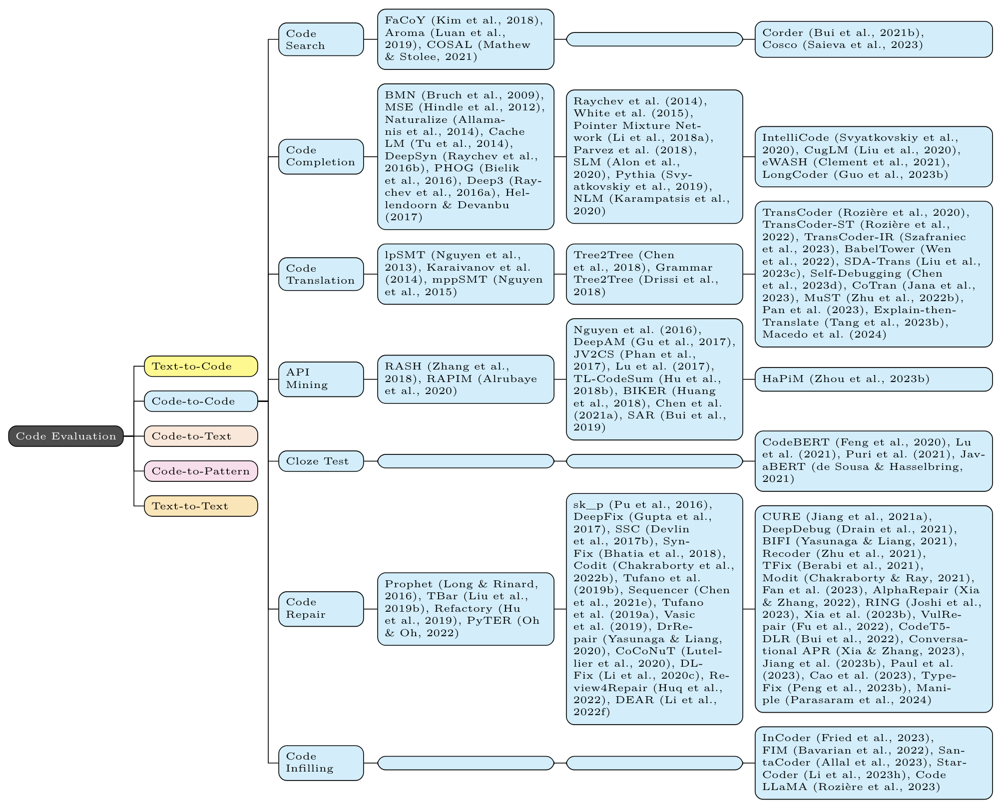
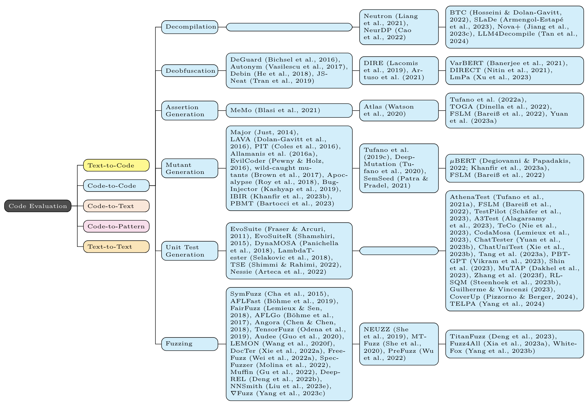
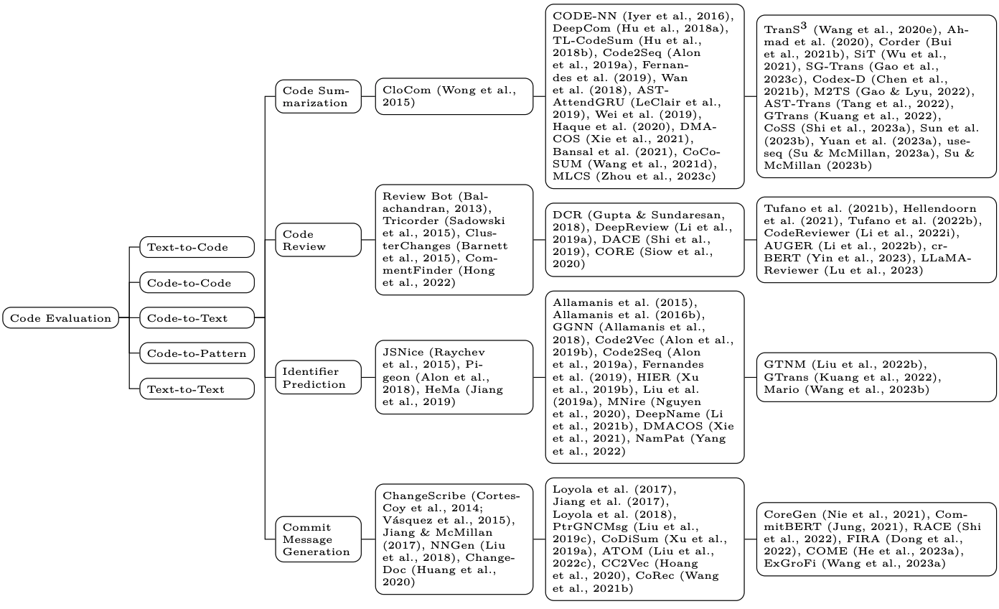
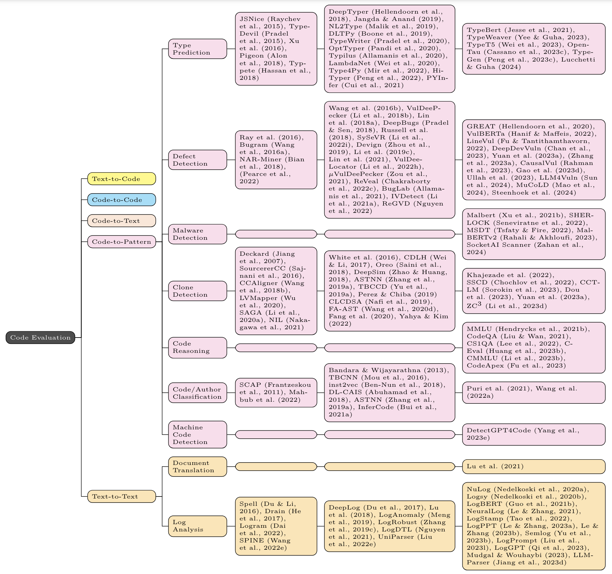

# Awesome-Code-LLM

This is the repo for our survey [Unifying the Perspectives of NLP and Software Engineering: A Survey on Language Models for Code](https://arxiv.org/abs/2311.07989) - a comprehensive review of LLM researches for code. Works in each category are ordered chronologically. If you have a basic understanding of machine learning but are new to NLP, we also provide a list of recommended readings in [section 9](#9-recommended-readings).

<p align='center'>

</p>

## News

🔥🔥🔥 [2024/08/21] ACL 2024 papers (both main conference and findings) have been added. Just search for the keyword "ACL 2024" in this page.

🔥🔥🔥 [2024/08/22] Latest papers:

- 🔥🔥 [Leveraging Large Language Models for Enhancing the Understandability of Generated Unit Tests](https://arxiv.org/abs/2408.11710) from Delft University of Technology.

- 🔥🔥 [To Code, or Not To Code? Exploring Impact of Code in Pre-training](https://arxiv.org/abs/2408.10914) from Cohere For AI.

- 🔥🔥 [Optimizing Large Language Model Hyperparameters for Code Generation](https://arxiv.org/abs/2408.10577) from Monash University.

- 🔥🔥 [How Well Do Large Language Models Serve as End-to-End Secure Code Producers?](https://arxiv.org/abs/2408.10495) from Beihang University.

- 🔥🔥 [Bridging the Language Gap: Enhancing Multilingual Prompt-Based Code Generation in LLMs via Zero-Shot Cross-Lingual Transfer](https://arxiv.org/abs/2408.09701) from University of Texas at Austin

- 🔥🔥 [DAC: Decomposed Automation Correction for Text-to-SQL](https://arxiv.org/abs/2408.08779) from Harbin Institute of Technology.

- 🔥🔥 [API-guided Dataset Synthesis to Finetune Large Code Models](https://arxiv.org/abs/2408.08343) from The Hong Kong University of Science and Technology.

🔥🔥&nbsp;&nbsp;&nbsp;&nbsp; [2024/08] We have compiled 117 papers from July 2024 in one [WeChat article](https://mp.weixin.qq.com/s/UKvFD7cL-qVmvm7_MO1uQA).

🔥&nbsp;&nbsp;&nbsp;&nbsp;&nbsp;&nbsp;&nbsp;&nbsp; [2024/07] We have compiled 118 papers from June 2024 in one [WeChat article](https://mp.weixin.qq.com/s/LM5imirdOsOCinaFP3NZjg).

## Table of Contents

1. [Surveys](#1-surveys)

2. [Models](#2-models)

   2.1 [Off-the-Shelf LLM](#21-off-the-shelf-llm)

   2.2 [Existing LLM Adapted to Code](#22-existing-llm-adapted-to-code)

   2.3 [General Pretraining on Code](#23-general-pretraining-on-code)

   - [Encoder](#encoder)
   - [Decoder](#decoder)
   - [Encoder-Decoder](#encoder-decoder)
   - [UniLM](#unilm)

   <!-- prettier ignore -->

   2.4 [(Instruction) Fine-Tuning on Code](#24-instruction-fine-tuning-on-code)

   2.5 [Reinforcement Learning on Code](#25-reinforcement-learning-on-code)

3. [When Coding Meets Reasoning](#3-when-coding-meets-reasoning)

   3.1 [Coding for Reasoning](#31-coding-for-reasoning)

   3.2 [Code Simulation](#32-code-simulation)

   3.3 [Code Agents](#33-code-agents)

   3.4 [Interactive Coding](#34-interactive-coding)

4. [Code LLM for Low-Resource, Low-Level, and Domain-Specific Languages](#4-code-llm-for-low-resource-low-level-and-domain-specific-languages)

5. [Methods/Models for Downstream Tasks](#5-methodsmodels-for-downstream-tasks)

   - Programming

     - [Code Generation](#code-generation)
     - [Code Translation](#code-translation)
     - [Code Summarization](#code-summarization)
     - [Program Repair](#program-repair)
     - [Code Similarity and Embedding (Clone Detection, Code Search)](#code-similarity-and-embedding-clone-detection-code-search)
     - [Type Prediction](#type-prediction)
     - [Repository-Level Coding](#repository-level-coding)
     - [Frontend Development & Web Agents](#frontend-development--web-agents)
     - [Text-To-SQL](#text-to-sql)

   - Testing and Deployment

     - [Test Generation](#test-generation)
     - [Oracle Generation](#oracle-generation)
     - [Mutation Testing](#mutation-testing)
     - [Vulnerability Detection](#vulnerability-detection)
     - [Malicious Code Detection](#malicious-code-detection)
     - [Compiler Optimization](#compiler-optimization)
     - [Decompilation](#decompilation)

   - DevOps

     - [Commit Message Generation](#commit-message-generation)
     - [Code Review](#code-review)
     - [Log Analysis](#log-analysis)

   - Requirement

     - [Software Modeling](#software-modeling)
     - [Requirement Engineering](#requirement-engineering)

6. [Analysis of AI-Generated Code](#6-analysis-of-ai-generated-code)

   - [Security and Vulnerabilities](#security-and-vulnerabilities)
   - [Correctness](#correctness)
   - [Hallucination](#hallucination)
   - [Efficiency](#efficiency)
   - [Robustness](#robustness)
   - [Interpretability](#interpretability)
   - [AI-Generated Code Detection](#ai-generated-code-detection)
   - [Others](#others)

7. [User-LLM Interaction](#7-user-llm-interaction)

8. [Datasets](#8-datasets)

   8.1 [Pretraining](#81-pretraining)

   8.2 [Benchmarks](#82-benchmarks)

   - [Integrated Benchmarks](#integrated-benchmarks)
   - [Program Synthesis](#program-synthesis)
   - [Visually Grounded Program Synthesis](#visually-grounded-program-synthesis)
   - [Code Reasoning and QA](#code-reasoning-and-qa)
   - [Text-to-SQL](#text-to-sql-1)
   - [Code Translation](#code-translation-1)
   - [Program Repair](#program-repair-1)
   - [Code Summarization](#code-summarization-1)
   - [Defect/Vulnerability Detection](#defectvulnerability-detection)
   - [Code Retrieval](#code-retrieval)
   - [Type Inference](#type-inference)
   - [Commit Message Generation](#commit-message-generation-1)
   - [Repo-Level Coding](#repo-level-coding)

9. [Recommended Readings](#9-recommended-readings)

10. [Citation](#citation)

11. [Star History](#star-history)

12. [Join Us](#join-us)

## 1. Surveys

We list several recent surveys on similar topics. While they are all about language models for code, 1-2 focus on NLP side; 3-6 focus on SE side; 7-11 are released after ours.

1. "Large Language Models Meet NL2Code: A Survey" [2022-12] [ACL 2023] [[paper](https://arxiv.org/abs/2212.09420)]

2. "A Survey on Pretrained Language Models for Neural Code Intelligence" [2022-12] [[paper](https://arxiv.org/abs/2212.10079)]

3. "An Empirical Comparison of Pre-Trained Models of Source Code" [2023-02] [ICSE 2023] [[paper](https://arxiv.org/abs/2302.04026)]

4. "Large Language Models for Software Engineering: A Systematic Literature Review" [2023-08] [[paper](https://arxiv.org/abs/2308.10620)]

5. "Towards an Understanding of Large Language Models in Software Engineering Tasks" [2023-08] [[paper](https://arxiv.org/abs/2308.11396)]

6. "Pitfalls in Language Models for Code Intelligence: A Taxonomy and Survey" [2023-10] [[paper](https://arxiv.org/abs/2310.17903)]

7. "A Survey on Large Language Models for Software Engineering" [2023-12] [[paper](https://arxiv.org/abs/2312.15223)]

8. "Deep Learning for Code Intelligence: Survey, Benchmark and Toolkit" [2023-12] [[paper](https://arxiv.org/abs/2401.00288)]

9. "A Survey of Neural Code Intelligence: Paradigms, Advances and Beyond" [2024-03] [[paper](https://arxiv.org/abs/2403.14734)]

10. "Tasks People Prompt: A Taxonomy of LLM Downstream Tasks in Software Verification and Falsification Approaches" [2024-04] [[paper](https://arxiv.org/abs/2404.09384)]

11. "Automatic Programming: Large Language Models and Beyond" [2024-05] [[paper](https://arxiv.org/abs/2405.02213)]

## 2. Models

### 2.1 Off-the-Shelf LLM

These LLMs are not specifically trained for code, but have demonstrated varying coding capability.

1. **LaMDA**: "LaMDA: Language Models for Dialog Applications" [2022-01] [[paper](https://arxiv.org/abs/2201.08239)]

2. **PaLM**: "PaLM: Scaling Language Modeling with Pathways" [2022-04] [JMLR] [[paper](https://arxiv.org/abs/2204.02311)]

3. **GPT-NeoX**: "GPT-NeoX-20B: An Open-Source Autoregressive Language Model" [2022-04] [ACL 2022 Workshop on Challenges & Perspectives in Creating LLMs] [[paper](https://arxiv.org/abs/2204.06745)] [[repo](https://github.com/EleutherAI/gpt-neox)]

4. **BLOOM**: "BLOOM: A 176B-Parameter Open-Access Multilingual Language Model" [2022-11] [[paper](https://arxiv.org/abs/2211.05100)] [[model](https://huggingface.co/models?search=bigscience/bloom)]

5. **LLaMA**: "LLaMA: Open and Efficient Foundation Language Models" [2023-02] [[paper](https://arxiv.org/abs/2302.13971)]

6. **GPT-4**: "GPT-4 Technical Report" [2023-03] [[paper](https://arxiv.org/abs/2303.08774)]

7. **LLaMA 2**: "Llama 2: Open Foundation and Fine-Tuned Chat Models" [2023-07] [[paper](https://arxiv.org/abs/2307.09288)] [[repo](https://github.com/facebookresearch/llama)]

8. **Phi-1.5**: "Textbooks Are All You Need II: phi-1.5 technical report" [2023-09] [[paper](https://arxiv.org/abs/2309.05463)] [[model](https://huggingface.co/microsoft/phi-1_5)]

9. **Baichuan 2**: "Baichuan 2: Open Large-scale Language Models" [2023-09] [[paper](https://arxiv.org/abs/2309.10305)] [[repo](https://github.com/baichuan-inc/Baichuan2)]

10. **Qwen**: "Qwen Technical Report" [2023-09] [[paper](https://arxiv.org/abs/2309.16609)] [[repo](https://github.com/QwenLM/Qwen)]

11. **Mistral**: "Mistral 7B" [2023-10] [[paper](https://arxiv.org/abs/2310.06825)] [[repo](https://github.com/mistralai/mistral-src)]

12. **Gemini**: "Gemini: A Family of Highly Capable Multimodal Models" [2023-12] [[paper](https://arxiv.org/abs/2312.11805)]

13. **Phi-2**: "Phi-2: The surprising power of small language models" [2023-12] [[blog](https://www.microsoft.com/en-us/research/blog/phi-2-the-surprising-power-of-small-language-models/)]

14. **YAYI2**: "YAYI 2: Multilingual Open-Source Large Language Models" [2023-12] [[paper](https://arxiv.org/abs/2312.14862)] [[repo](https://github.com/wenge-research/YAYI2)]

15. **DeepSeek**: "DeepSeek LLM: Scaling Open-Source Language Models with Longtermism" [2024-01] [[paper](https://arxiv.org/abs/2401.02954)] [[repo](https://github.com/deepseek-ai/DeepSeek-LLM)]

16. **Mixtral**: "Mixtral of Experts" [2024-01] [[paper](https://arxiv.org/abs/2401.04088)] [[blog](https://mistral.ai/news/mixtral-of-experts/)]

17. **DeepSeekMoE**: "DeepSeekMoE: Towards Ultimate Expert Specialization in Mixture-of-Experts Language Models" [2024-01] [[paper](https://arxiv.org/abs/2401.12246)] [[repo](https://github.com/deepseek-ai/DeepSeek-MoE)]

18. **Orion**: "Orion-14B: Open-source Multilingual Large Language Models" [2024-01] [[paper](https://arxiv.org/abs/2401.06066)] [[repo](https://github.com/OrionStarAI/Orion)]

19. **OLMo**: "OLMo: Accelerating the Science of Language Models" [2024-02] [[paper](https://arxiv.org/abs/2402.00838)] [[repo](https://github.com/allenai/OLMo)]

20. **Gemma**: "Gemma: Open Models Based on Gemini Research and Technology" [2024-02] [[paper](https://storage.googleapis.com/deepmind-media/gemma/gemma-report.pdf)] [[blog](https://blog.google/technology/developers/gemma-open-models/)]

21. **Claude 3**: "The Claude 3 Model Family: Opus, Sonnet, Haiku" [2024-03] [[paper](https://www-cdn.anthropic.com/de8ba9b01c9ab7cbabf5c33b80b7bbc618857627/Model_Card_Claude_3.pdf)] [[blog](https://www.anthropic.com/news/claude-3-family)]

22. **Yi**: "Yi: Open Foundation Models by 01.AI" [2024-03] [[paper](https://arxiv.org/abs/2403.04652)] [[repo](https://github.com/01-ai/Yi)]

23. **Poro**: "Poro 34B and the Blessing of Multilinguality" [2024-04] [[paper](https://arxiv.org/abs/2404.01856)] [[model](https://huggingface.co/LumiOpen/Poro-34B)]

24. **JetMoE**: "JetMoE: Reaching Llama2 Performance with 0.1M Dollars" [2024-04] [[paper](https://arxiv.org/abs/2404.07413)] [[repo](https://github.com/myshell-ai/JetMoE)]

25. **LLaMA 3**: "The Llama 3 Herd of Models" [2024-04] [[blog](https://ai.meta.com/blog/meta-llama-3/)] [[repo](https://github.com/meta-llama/llama3)] [[paper](https://arxiv.org/abs/2407.21783)]

26. **Reka Core**: "Reka Core, Flash, and Edge: A Series of Powerful Multimodal Language Models" [2024-04] [[paper](https://arxiv.org/abs/2404.12387)]

27. **Phi-3**: "Phi-3 Technical Report: A Highly Capable Language Model Locally on Your Phone" [2024-04] [[paper](https://arxiv.org/abs/2404.14219)]

28. **OpenELM**: "OpenELM: An Efficient Language Model Family with Open-source Training and Inference Framework" [2024-04] [[paper](https://arxiv.org/abs/2404.14619)] [[repo](https://github.com/apple/corenet/tree/main/projects/openelm)]

29. **Tele-FLM**: "Tele-FLM Technical Report" [2024-04] [[paper](https://arxiv.org/abs/2404.16645)] [[model](https://huggingface.co/CofeAI/Tele-FLM)]

30. **DeepSeek-V2**: "DeepSeek-V2: A Strong, Economical, and Efficient Mixture-of-Experts Language Model" [2024-05] [[paper](https://arxiv.org/abs/2405.04434)] [[repo](https://github.com/deepseek-ai/DeepSeek-V2)]

31. **GECKO**: "GECKO: Generative Language Model for English, Code and Korean" [2024-05] [[paper](https://arxiv.org/abs/2405.15640)] [[model](https://huggingface.co/kifai/GECKO-7B)]

32. **MAP-Neo**: "MAP-Neo: Highly Capable and Transparent Bilingual Large Language Model Series" [2024-05] [[paper](https://arxiv.org/abs/2405.19327)] [[repo](https://github.com/multimodal-art-projection/MAP-NEO)]

33. **Skywork-MoE**: "Skywork-MoE: A Deep Dive into Training Techniques for Mixture-of-Experts Language Models" [2024-06] [[paper](https://arxiv.org/abs/2406.06563)]

34. **Xmodel-LM**: "Xmodel-LM Technical Report" [2024-06] [[paper](https://arxiv.org/abs/2406.02856)]

35. **GEB**: "GEB-1.3B: Open Lightweight Large Language Model" [2024-06] [[paper](https://arxiv.org/abs/2406.09900)]

36. **HARE**: "HARE: HumAn pRiors, a key to small language model Efficiency" [2024-06] [[paper](https://arxiv.org/abs/2406.11410)]

37. **DCLM**: "DataComp-LM: In search of the next generation of training sets for language models" [2024-06] [[paper](https://arxiv.org/abs/2406.11794)]

38. **Nemotron-4**: "Nemotron-4 340B Technical Report" [2024-06] [[paper](https://arxiv.org/abs/2406.11704)]

39. **ChatGLM**: "ChatGLM: A Family of Large Language Models from GLM-130B to GLM-4 All Tools" [2024-06] [[paper](https://arxiv.org/abs/2406.12793)]

40. **YuLan**: "YuLan: An Open-source Large Language Model" [2024-06] [[paper](https://arxiv.org/abs/2406.19853)]

41. **Gemma 2**: "Gemma 2: Improving Open Language Models at a Practical Size" [2024-06] [[paper](https://storage.googleapis.com/deepmind-media/gemma/gemma-2-report.pdf)]

42. **H2O-Danube3**: "H2O-Danube3 Technical Report" [2024-07] [[paper](https://arxiv.org/abs/2407.09276)]

43. **Qwen2**: "Qwen2 Technical Report" [2024-07] [[paper](https://arxiv.org/abs/2407.10671)]

44. **ALLaM**: "ALLaM: Large Language Models for Arabic and English" [2024-07] [[paper](https://arxiv.org/abs/2407.15390)]

45. **SeaLLMs 3**: "SeaLLMs 3: Open Foundation and Chat Multilingual Large Language Models for Southeast Asian Languages" [2024-07] [[paper](https://arxiv.org/abs/2407.19672)]

46. **AFM**: "Apple Intelligence Foundation Language Models" [2024-07] [[paper](https://arxiv.org/abs/2407.21075)]

47. "To Code, or Not To Code? Exploring Impact of Code in Pre-training" [2024-08] [[paper](https://arxiv.org/abs/2408.10914)]

### 2.2 Existing LLM Adapted to Code

These models are general-purpose LLMs further pretrained on code-related data.

- **Codex** (GPT-3): "Evaluating Large Language Models Trained on Code" [2021-07] [[paper](https://arxiv.org/abs/2107.03374)]

- **PaLM Coder** (PaLM): "PaLM: Scaling Language Modeling with Pathways" [2022-04] [JMLR] [[paper](https://arxiv.org/abs/2204.02311)]

- **Minerva** (PaLM): "Solving Quantitative Reasoning Problems with Language Models" [2022-06] [[paper](https://arxiv.org/abs/2206.14858)]

- **PaLM 2 \*** (PaLM 2): "PaLM 2 Technical Report" [2023-05] [[paper](https://arxiv.org/abs/2305.10403)]

- **Code LLaMA** (LLaMA 2): "Code Llama: Open Foundation Models for Code" [2023-08] [[paper](https://arxiv.org/abs/2308.12950)] [[repo](https://github.com/facebookresearch/codellama)]

- **Lemur** (LLaMA 2): "Lemur: Harmonizing Natural Language and Code for Language Agents" [2023-10] [ICLR 2024 Spotlight] [[paper](https://arxiv.org/abs/2310.06830)]

- **BTX** (LLaMA 2): "Branch-Train-MiX: Mixing Expert LLMs into a Mixture-of-Experts LLM" [2024-03] [[paper](https://arxiv.org/abs/2403.07816)]

- **HiRoPE**: "HiRoPE: Length Extrapolation for Code Models Using Hierarchical Position" [2024-03] [ACL 2024] [[paper](https://arxiv.org/abs/2403.19115)]

- "Mastering Text, Code and Math Simultaneously via Fusing Highly Specialized Language Models" [2024-03] [[paper](https://arxiv.org/abs/2403.08281)]

- **CodeGemma**: "CodeGemma: Open Code Models Based on Gemma" [2024-04] [[paper](https://storage.googleapis.com/deepmind-media/gemma/codegemma_report.pdf)] [[model](https://huggingface.co/models?search=google/codegemma)]

- **DeepSeek-Coder-V2**: "DeepSeek-Coder-V2: Breaking the Barrier of Closed-Source Models in Code Intelligence" [2024-06] [[paper](https://arxiv.org/abs/2406.11931)]

### 2.3 General Pretraining on Code

These models are Transformer encoders, decoders, and encoder-decoders pretrained from scratch using existing objectives for general language modeling.

<p align='center'>

</p>

#### Encoder

1. **CuBERT** (MLM + NSP): "Learning and Evaluating Contextual Embedding of Source Code" [2019-12] [ICML 2020] [[paper](https://arxiv.org/abs/2001.00059)] [[repo](https://github.com/google-research/google-research/tree/master/cubert)]

2. **CodeBERT** (MLM + RTD): "CodeBERT: A Pre-Trained Model for Programming and Natural Languages" [2020-02] [EMNLP 2020 findings] [[paper](https://arxiv.org/abs/2002.08155)] [[repo](https://github.com/microsoft/CodeBERT)]

3. **GraphCodeBERT** (MLM + DFG Edge Prediction + DFG Node Alignment): "GraphCodeBERT: Pre-training Code Representations with Data Flow" [2020-09] [ICLR 2021] [[paper](https://arxiv.org/abs/2009.08366)] [[repo](https://github.com/microsoft/CodeBERT)]

4. **SynCoBERT** (MLM + Identifier Prediction + AST Edge Prediction + Contrastive Learning): "SynCoBERT: Syntax-Guided Multi-Modal Contrastive Pre-Training for Code Representation" [2021-08] [[paper](https://arxiv.org/abs/2108.04556)]

5. **DISCO** (MLM + Node Type MLM + Contrastive Learning): "Towards Learning (Dis)-Similarity of Source Code from Program Contrasts" [2021-10] [ACL 2022] [[paper](https://arxiv.org/abs/2110.03868)]

6. **Code-MVP** (MLM + Type Inference + Contrastive Learning): "CODE-MVP: Learning to Represent Source Code from Multiple Views with Contrastive Pre-Training" [2022-05] [NAACL 2022 Technical Track] [[paper](https://arxiv.org/abs/2205.02029)]

7. **CodeSage** (MLM + Deobfuscation + Contrastive Learning): "Code Representation Learning At Scale" [2024-02] [ICLR 2024] [[paper](https://arxiv.org/abs/2402.01935)]

8. **CoLSBERT** (MLM): "Scaling Laws Behind Code Understanding Model" [2024-02] [[paper](https://arxiv.org/abs/2402.12813)]

#### Decoder

1. **GPT-C** (CLM): "IntelliCode Compose: Code Generation Using Transformer" [2020-05] [ESEC/FSE 2020] [[paper](https://arxiv.org/abs/2005.08025)]

2. **CodeGPT** (CLM): "CodeXGLUE: A Machine Learning Benchmark Dataset for Code Understanding and Generation" [2021-02] [NeurIPS Datasets and Benchmarks 2021] [[paper](https://arxiv.org/abs/2102.04664)] [[repo](https://github.com/microsoft/CodeXGLUE)]

3. **CodeParrot** (CLM) [2021-12] [[blog](https://huggingface.co/blog/codeparrot)]

4. **PolyCoder** (CLM): "A Systematic Evaluation of Large Language Models of Code" [2022-02] [DL4C@ICLR 2022] [[paper](https://arxiv.org/abs/2202.13169)] [[repo](https://github.com/VHellendoorn/Code-LMs)]

5. **CodeGen** (CLM): "CodeGen: An Open Large Language Model for Code with Multi-Turn Program Synthesis" [2022-03] [ICLR 2023] [[paper](https://arxiv.org/abs/2203.13474)] [[repo](https://github.com/salesforce/CodeGen)]

6. **InCoder** (Causal Masking): "InCoder: A Generative Model for Code Infilling and Synthesis" [2022-04] [ICLR 2023] [[paper](https://arxiv.org/abs/2204.05999)] [[repo](https://github.com/dpfried/incoder)]

7. **PyCodeGPT** (CLM): "CERT: Continual Pre-Training on Sketches for Library-Oriented Code Generation" [2022-06] [IJCAI-ECAI 2022] [[paper](https://arxiv.org/abs/2206.06888)] [[repo](https://github.com/microsoft/PyCodeGPT)]

8. **PanGu-Coder** (CLM): "PanGu-Coder: Program Synthesis with Function-Level Language Modeling" [2022-07] [[paper](https://arxiv.org/abs/2207.11280)]

9. **SantaCoder** (FIM): "SantaCoder: don't reach for the stars!" [2023-01] [[paper](https://arxiv.org/abs/2301.03988)] [[model](https://huggingface.co/bigcode/santacoder)]

10. **CodeGeeX** (CLM): "CodeGeeX: A Pre-Trained Model for Code Generation with Multilingual Evaluations on HumanEval-X" [2023-03] [[paper](https://arxiv.org/abs/2303.17568)] [[repo](https://github.com/THUDM/CodeGeeX)]

11. **StarCoder** (FIM): "StarCoder: may the source be with you!" [2023-05] [[paper](https://arxiv.org/abs/2305.06161)] [[model](https://huggingface.co/bigcode/starcoder)]

12. **Phi-1** (CLM): "Textbooks Are All You Need" [2023-06] [[paper](https://arxiv.org/abs/2306.11644)] [[model](https://huggingface.co/microsoft/phi-1)]

13. **CodeFuse** (CLM): "CodeFuse-13B: A Pretrained Multi-lingual Code Large Language Model" [2023-10] [[paper](https://arxiv.org/abs/2310.06266)] [[model](https://huggingface.co/codefuse-ai/CodeFuse-13B)]

14. **DeepSeek Coder** (CLM+FIM): "DeepSeek-Coder: When the Large Language Model Meets Programming -- The Rise of Code Intelligence" [2024-01] [[paper](https://arxiv.org/abs/2401.14196)] [[repo](https://github.com/deepseek-ai/DeepSeek-Coder)]

15. **StarCoder2** (CLM+FIM): "StarCoder 2 and The Stack v2: The Next Generation" [2024-02] [[paper](https://arxiv.org/abs/2402.19173)] [[repo](https://github.com/bigcode-project/starcoder2)]

16. **CodeShell** (CLM+FIM): "CodeShell Technical Report" [2024-03] [[paper](https://arxiv.org/abs/2403.15747)] [[repo](https://github.com/WisdomShell/codeshell)]

17. **CodeQwen1.5** [2024-04] [[blog](https://qwenlm.github.io/blog/codeqwen1.5/)]

18. **Granite**: "Granite Code Models: A Family of Open Foundation Models for Code Intelligence" [2024-05] [[paper](https://arxiv.org/abs/2405.04324)] "Scaling Granite Code Models to 128K Context" [2024-07] [[paper](https://arxiv.org/abs/2407.13739)]

19. **NT-Java**: "Narrow Transformer: Starcoder-Based Java-LM For Desktop" [2024-07] [[paper](https://arxiv.org/abs/2407.03941)]

#### Encoder-Decoder

1. **PyMT5** (Span Corruption): "PyMT5: multi-mode translation of natural language and Python code with transformers" [2020-10] [EMNLP 2020] [[paper](https://arxiv.org/abs/2010.03150)]

2. **Mastropaolo et al.** (MLM + Deobfuscation): "DOBF: A Deobfuscation Pre-Training Objective for Programming Languages" [2021-02] [ICSE 2021] [[paper](https://arxiv.org/abs/2102.02017)] [[repo](https://github.com/antonio-mastropaolo/TransferLearning4Code)]

3. **DOBF** (Span Corruption): "Studying the Usage of Text-To-Text Transfer Transformer to Support Code-Related Tasks" [2021-02] [NeurIPS 2021] [[paper](https://arxiv.org/abs/2102.07492)] [[repo](https://github.com/facebookresearch/CodeGen/blob/main/docs/dobf.md)]

4. **PLBART** (DAE): "Unified Pre-training for Program Understanding and Generation" [2021-03] [NAACL 2021] [[paper](https://arxiv.org/abs/2103.06333)] [[repo](https://github.com/wasiahmad/PLBART)]

5. **CodeT5** (Span Corruption + Identifier Tagging + Masked Identifier Prediction + Text2Code + Code2Text): "CodeT5: Identifier-aware Unified Pre-trained Encoder-Decoder Models for Code Understanding and Generation" [2021-09] [EMNLP 2021] [[paper](https://arxiv.org/abs/2109.00859)] [[repo](https://github.com/salesforce/CodeT5)]

6. **SPT-Code** (Span Corruption + NSP + Method Name Prediction): "SPT-Code: Sequence-to-Sequence Pre-Training for Learning Source Code Representations" [2022-01] [ICSE 2022 Technical Track] [[paper](https://arxiv.org/abs/2201.01549)]

7. **AlphaCode** (MLM + CLM): "Competition-Level Code Generation with AlphaCode" [2022-02] [Science] [[paper](https://arxiv.org/abs/2203.07814)] [[blog](https://deepmind.google/discover/blog/competitive-programming-with-alphacode/)]

8. **NatGen** (Code Naturalization): "NatGen: Generative pre-training by "Naturalizing" source code" [2022-06] [ESEC/FSE 2022] [[paper](https://arxiv.org/abs/2206.07585)] [[repo](https://github.com/saikat107/NatGen)]

9. **ERNIE-Code** (Span Corruption + Pivot-based Translation LM): "ERNIE-Code: Beyond English-Centric Cross-lingual Pretraining for Programming Languages" [2022-12] [ACL23 (Findings)] [[paper](https://aclanthology.org/2023.findings-acl.676.pdf)][[repo](https://github.com/PaddlePaddle/PaddleNLP/tree/develop/model_zoo/ernie-code)]

10. **CodeT5+** (Span Corruption + CLM + Text-Code Contrastive Learning + Text-Code Translation): "CodeT5+: Open Code Large Language Models for Code Understanding and Generation" [2023-05] [EMNLP 2023] [[paper](https://arxiv.org/abs/2305.07922)] [[repo](https://github.com/salesforce/CodeT5)]

11. **AST-T5** (Span Corruption): "AST-T5: Structure-Aware Pretraining for Code Generation and Understanding" [2024-01] [ICML 2024] [[paper](https://arxiv.org/abs/2401.03003)]

#### UniLM

1. **CugLM** (MLM + NSP + CLM): "Multi-task Learning based Pre-trained Language Model for Code Completion" [2020-12] [ASE 2020] [[paper](https://arxiv.org/abs/2012.14631)]

2. **UniXcoder** (MLM + NSP + CLM + Span Corruption + Contrastive Learning + Code2Text): "UniXcoder: Unified Cross-Modal Pre-training for Code Representation" [2022-03] [ACL 2022] [[paper](https://arxiv.org/abs/2203.03850)] [[repo](https://github.com/microsoft/CodeBERT)]

### 2.4 (Instruction) Fine-Tuning on Code

These models apply Instruction Fine-Tuning techniques to enhance the capacities of Code LLMs.

1. **WizardCoder** (StarCoder + Evol-Instruct): "WizardCoder: Empowering Code Large Language Models with Evol-Instruct" [2023-06] [ICLR 2024] [[paper](https://arxiv.org/abs/2306.08568)] [[repo](https://github.com/nlpxucan/WizardLM)]

2. **PanGu-Coder 2** (StarCoder + Evol-Instruct + RRTF): "PanGu-Coder2: Boosting Large Language Models for Code with Ranking Feedback" [2023-07] [[paper](https://arxiv.org/abs/2307.14936)]

3. **OctoCoder** (StarCoder) / **OctoGeeX** (CodeGeeX2): "OctoPack: Instruction Tuning Code Large Language Models" [2023-08] [ICLR 2024 Spotlight] [[paper](https://arxiv.org/abs/2308.07124)] [[repo](https://github.com/bigcode-project/octopack)]

4. "At Which Training Stage Does Code Data Help LLMs Reasoning" [2023-09] [ICLR 2024 Spotlight] [[paper](https://arxiv.org/abs/2309.16298)]

5. **InstructCoder**: "InstructCoder: Instruction Tuning Large Language Models for Code Editing" [[paper](https://arxiv.org/abs/2310.20329)] [[repo](https://github.com/qishenghu/CodeInstruct)]

6. **MFTCoder**: "MFTCoder: Boosting Code LLMs with Multitask Fine-Tuning" [2023-11] [KDD 2024] [[paper](https://arxiv.org/abs/2311.02303)] [[repo](https://github.com/codefuse-ai/MFTCoder)]

7. "LLM-Assisted Code Cleaning For Training Accurate Code Generators" [2023-11] [ICLR 2024] [[paper](https://arxiv.org/abs/2311.14904)]

8. **Magicoder**: "Magicoder: Empowering Code Generation with OSS-Instruct" [2023-12] [ICML 2024] [[paper](https://arxiv.org/abs/2312.02120)]

9. **WaveCoder**: "WaveCoder: Widespread And Versatile Enhancement For Code Large Language Models By Instruction Tuning" [2023-12] [ACL 2024] [[paper](https://arxiv.org/abs/2312.14187)]

10. **Astraios**: "Astraios: Parameter-Efficient Instruction Tuning Code Large Language Models" [2024-01] [[paper](https://arxiv.org/abs/2401.00788)]

11. **DolphCoder**: "DolphCoder: Echo-Locating Code Large Language Models with Diverse and Multi-Objective Instruction Tuning" [2024-02] [ACL 2024] [[paper](https://arxiv.org/abs/2402.09136)]

12. **SafeCoder**: "Instruction Tuning for Secure Code Generation" [2024-02] [ICML 2024] [[paper](https://arxiv.org/abs/2402.09497)]

13. "Code Needs Comments: Enhancing Code LLMs with Comment Augmentation" [ACL 2024 Findings] [[paper](https://arxiv.org/abs/2402.13013)]

14. **CCT**: "Code Comparison Tuning for Code Large Language Models" [2024-03] [[paper](https://arxiv.org/abs/2403.19121)]

15. **SAT**: "Structure-aware Fine-tuning for Code Pre-trained Models" [2024-04] [[paper](https://arxiv.org/abs/2404.07471)]

16. **CodeFort**: "CodeFort: Robust Training for Code Generation Models" [2024-04] [[paper](https://arxiv.org/abs/2405.01567)]

17. **XFT**: "XFT: Unlocking the Power of Code Instruction Tuning by Simply Merging Upcycled Mixture-of-Experts" [2024-04] [ACL 2024] [[paper](https://arxiv.org/abs/2404.15247)] [[repo](https://github.com/ise-uiuc/xft)]

18. **AIEV-Instruct**: "AutoCoder: Enhancing Code Large Language Model with AIEV-Instruct" [2024-05] [[paper](https://arxiv.org/abs/2405.14906)]

19. **AlchemistCoder**: "AlchemistCoder: Harmonizing and Eliciting Code Capability by Hindsight Tuning on Multi-source Data" [2024-05] [[paper](https://arxiv.org/abs/2405.19265)]

20. "From Symbolic Tasks to Code Generation: Diversification Yields Better Task Performers" [2024-05] [[paper](https://arxiv.org/abs/2405.19787)]

21. "Unveiling the Impact of Coding Data Instruction Fine-Tuning on Large Language Models Reasoning" [2024-05] [[paper](https://arxiv.org/abs/2405.20535)]

22. **PLUM**: "PLUM: Preference Learning Plus Test Cases Yields Better Code Language Models" [2024-06] [[paper](https://arxiv.org/abs/2406.06887)]

23. **mCoder**: "McEval: Massively Multilingual Code Evaluation" [2024-06] [[paper](https://arxiv.org/abs/2406.07436)]

24. "Unlock the Correlation between Supervised Fine-Tuning and Reinforcement Learning in Training Code Large Language Models" [2024-06] [[paper](https://arxiv.org/abs/2406.10305)]

25. **Code-Optimise**: "Code-Optimise: Self-Generated Preference Data for Correctness and Efficiency" [2024-06] [[paper](https://arxiv.org/abs/2406.12502)]

26. **UniCoder**: "UniCoder: Scaling Code Large Language Model via Universal Code" [2024-06] [ACL 2024] [[paper](https://arxiv.org/abs/2406.16441)]

27. "Brevity is the soul of wit: Pruning long files for code generation" [2024-06] [[paper](https://arxiv.org/abs/2407.00434)]

28. "Code Less, Align More: Efficient LLM Fine-tuning for Code Generation with Data Pruning" [2024-07] [[paper](https://arxiv.org/abs/2407.05040)]

29. **InverseCoder**: "InverseCoder: Unleashing the Power of Instruction-Tuned Code LLMs with Inverse-Instruct" [2024-07] [[paper](https://arxiv.org/abs/2407.05700)]

30. "Curriculum Learning for Small Code Language Models" [2024-07] [[paper](https://arxiv.org/abs/2407.10194)]

31. **Genetic-Instruct**: "Genetic Instruct: Scaling up Synthetic Generation of Coding Instructions for Large Language Models" [2024-07] [[paper](https://arxiv.org/abs/2407.21077)]

32. **DataScope**: "API-guided Dataset Synthesis to Finetune Large Code Models" [2024-08] [[paper](https://arxiv.org/abs/2408.08343)]

### 2.5 Reinforcement Learning on Code

1. **CompCoder**: "Compilable Neural Code Generation with Compiler Feedback" [2022-03] [ACL 2022] [[paper](https://arxiv.org/abs/2203.05132)]

2. **CodeRL**: "CodeRL: Mastering Code Generation through Pretrained Models and Deep Reinforcement Learning" [2022-07] [NeurIPS 2022] [[paper](https://arxiv.org/abs/2207.01780)] [[repo](https://github.com/salesforce/CodeRL)]

3. **PPOCoder**: "Execution-based Code Generation using Deep Reinforcement Learning" [2023-01] [TMLR 2023] [[paper](https://arxiv.org/abs/2301.13816)] [[repo](https://github.com/reddy-lab-code-research/PPOCoder)]

4. **RLTF**: "RLTF: Reinforcement Learning from Unit Test Feedback" [2023-07] [[paper](https://arxiv.org/abs/2307.04349)] [[repo](https://github.com/Zyq-scut/RLTF)]

5. **B-Coder**: "B-Coder: Value-Based Deep Reinforcement Learning for Program Synthesis" [2023-10] [ICLR 2024] [[paper](https://arxiv.org/abs/2310.03173)]

6. **StepCoder**: "StepCoder: Improve Code Generation with Reinforcement Learning from Compiler Feedback" [2024-02] [ACL 2024] [[paper](https://arxiv.org/abs/2402.01391)]

7. **RLPF & DPA**: "Performance-Aligned LLMs for Generating Fast Code" [2024-04] [[paper](https://arxiv.org/abs/2404.18864)]

8. "Measuring memorization in RLHF for code completion" [2024-06] [[paper](https://arxiv.org/abs/2406.11715)]

9. "Applying RLAIF for Code Generation with API-usage in Lightweight LLMs" [2024-06] [[paper](https://arxiv.org/abs/2406.20060)]

## 3. When Coding Meets Reasoning

### 3.1 Coding for Reasoning

1. **PAL**: "PAL: Program-aided Language Models" [2022-11] [ICML 2023] [[paper](https://arxiv.org/abs/2211.10435)] [[repo](https://github.com/reasoning-machines/pal)]

2. **PoT**: "Program of Thoughts Prompting: Disentangling Computation from Reasoning for Numerical Reasoning Tasks" [2022-11] [TMLR 2023] [[paper](https://arxiv.org/abs/2211.12588)] [[repo](https://github.com/wenhuchen/Program-of-Thoughts)]

3. **CSV**: "Solving Challenging Math Word Problems Using GPT-4 Code Interpreter with Code-based Self-Verification" [2023-08] [ICLR 2024] [[paper](https://arxiv.org/abs/2308.07921)]

4. **MathCoder**: "MathCoder: Seamless Code Integration in LLMs for Enhanced Mathematical Reasoning" [2023-10] [ICLR 2024] [[paper](https://arxiv.org/abs/2310.03731)]

5. **CoC**: "Chain of Code: Reasoning with a Language Model-Augmented Code Emulator" [2023-12] [ICML 2024] [[paper](https://arxiv.org/abs/2312.04474)]

6. **MARIO**: "MARIO: MAth Reasoning with code Interpreter Output -- A Reproducible Pipeline" [2024-01] [ACL 2024 Findings] [[paper](https://arxiv.org/abs/2401.08190)]

7. **ReGAL**: "ReGAL: Refactoring Programs to Discover Generalizable Abstractions" [2024-01] [ICML 2024] [[paper](https://arxiv.org/abs/2401.16467)]

8. "Executable Code Actions Elicit Better LLM Agents" [2024-02] [ICML 2024] [[paper](https://arxiv.org/abs/2402.01030)]

9. **HProPro**: "Exploring Hybrid Question Answering via Program-based Prompting" [2024-02] [ACL 2024] [[paper](https://arxiv.org/abs/2402.10812)]

10. **xSTREET**: "Eliciting Better Multilingual Structured Reasoning from LLMs through Code" [2024-03] [ACL 2024] [[paper](https://arxiv.org/abs/2403.02567)]

11. **FlowMind**: "FlowMind: Automatic Workflow Generation with LLMs" [2024-03] [[paper](https://arxiv.org/abs/2404.13050)]

12. **Think-and-Execute**: "Language Models as Compilers: Simulating Pseudocode Execution Improves Algorithmic Reasoning in Language Models" [2024-04] [[paper](https://arxiv.org/abs/2404.02575)]

13. **CoRE**: "CoRE: LLM as Interpreter for Natural Language Programming, Pseudo-Code Programming, and Flow Programming of AI Agents" [2024-05] [[paper](https://arxiv.org/abs/2405.06907)]

14. **MuMath-Code**: "MuMath-Code: Combining Tool-Use Large Language Models with Multi-perspective Data Augmentation for Mathematical Reasoning" [2024-05] [[paper](https://arxiv.org/abs/2405.07551)]

15. **COGEX**: "Learning to Reason via Program Generation, Emulation, and Search" [2024-05] [[paper](https://arxiv.org/abs/2405.16337)]

16. "Arithmetic Reasoning with LLM: Prolog Generation & Permutation" [2024-05] [[paper](https://arxiv.org/abs/2405.17893)]

17. "Can LLMs Reason in the Wild with Programs?" [2024-06] [[paper](https://arxiv.org/abs/2406.13764)]

18. **DotaMath**: "DotaMath: Decomposition of Thought with Code Assistance and Self-correction for Mathematical Reasoning" [2024-07] [[paper](https://arxiv.org/abs/2407.04078)]

19. **CIBench**: "CIBench: Evaluating Your LLMs with a Code Interpreter Plugin" [2024-07] [[paper](https://arxiv.org/abs/2407.10499)]

20. **PyBench**: "PyBench: Evaluating LLM Agent on various real-world coding tasks" [2024-07] [[paper](https://arxiv.org/abs/2407.16732)]

21. **AdaCoder**: "AdaCoder: Adaptive Prompt Compression for Programmatic Visual Question Answering" [2024-07] [[paper](https://arxiv.org/abs/2407.19410)]

22. **PyramidCoder**: "Pyramid Coder: Hierarchical Code Generator for Compositional Visual Question Answering" [2024-07] [[paper](https://arxiv.org/abs/2407.20563)]

### 3.2 Code Simulation

- "Code Simulation Challenges for Large Language Models" [2024-01] [[paper](https://arxiv.org/abs/2401.09074)]

- "CodeMind: A Framework to Challenge Large Language Models for Code Reasoning" [2024-02] [[paper](https://arxiv.org/abs/2402.09664)]

- "Executing Natural Language-Described Algorithms with Large Language Models: An Investigation" [2024-02] [[paper](https://arxiv.org/abs/2403.00795)]

- "Can Language Models Pretend Solvers? Logic Code Simulation with LLMs" [2024-03] [[paper](https://arxiv.org/abs/2403.16097)]

- "Evaluating Large Language Models with Runtime Behavior of Program Execution" [2024-03] [[paper](https://arxiv.org/abs/2403.16437)]

- "NExT: Teaching Large Language Models to Reason about Code Execution" [2024-04] [ICML 2024] [[paper](https://arxiv.org/abs/2404.14662)]

- "SelfPiCo: Self-Guided Partial Code Execution with LLMs" [2024-07] [[paper](https://arxiv.org/abs/2407.16974)]

### 3.3 Code Agents

1. **Self-collaboration**: "Self-collaboration Code Generation via ChatGPT" [2023-04] [[paper](https://arxiv.org/abs/2304.07590)]

2. **ChatDev**: "Communicative Agents for Software Development" [2023-07] [[paper](https://arxiv.org/abs/2307.07924)] [[repo](https://github.com/OpenBMB/ChatDev)]

3. **MetaGPT**: "MetaGPT: Meta Programming for A Multi-Agent Collaborative Framework" [2023-08] [[paper](https://arxiv.org/abs/2308.00352)] [[repo](https://github.com/geekan/MetaGPT)]

4. **CodeChain**: "CodeChain: Towards Modular Code Generation Through Chain of Self-revisions with Representative Sub-modules" [2023-10] [ICLR 2024] [[paper](https://arxiv.org/abs/2310.08992)]

5. **CodeAgent**: "CodeAgent: Enhancing Code Generation with Tool-Integrated Agent Systems for Real-World Repo-level Coding Challenges" [2024-01] [ACL 2024] [[paper](https://arxiv.org/abs/2401.07339)]

6. **CONLINE**: "CONLINE: Complex Code Generation and Refinement with Online Searching and Correctness Testing" [2024-03] [[paper](https://arxiv.org/abs/2403.13583)]

7. **LCG**: "When LLM-based Code Generation Meets the Software Development Process" [2024-03] [[paper](https://arxiv.org/abs/2403.15852)]

8. **RepairAgent**: "RepairAgent: An Autonomous, LLM-Based Agent for Program Repair" [2024-03] [[paper](https://arxiv.org/abs/2403.17134)]

9. **MAGIS:**: "MAGIS: LLM-Based Multi-Agent Framework for GitHub Issue Resolution" [2024-03] [[paper](https://arxiv.org/abs/2403.17927)]

10. **SoA**: "Self-Organized Agents: A LLM Multi-Agent Framework toward Ultra Large-Scale Code Generation and Optimization" [2024-04] [[paper](https://arxiv.org/abs/2404.02183)]

11. **AutoCodeRover**: "AutoCodeRover: Autonomous Program Improvement" [2024-04] [[paper](https://arxiv.org/abs/2404.05427)]

12. **SWE-agent**: "SWE-agent: Agent-Computer Interfaces Enable Automated Software Engineering" [2024-05] [[paper](https://arxiv.org/abs/2405.15793)]

13. **MapCoder**: "MapCoder: Multi-Agent Code Generation for Competitive Problem Solving" [2024-05] [ACL 2024] [[paper](https://arxiv.org/abs/2405.11403)]

14. "Fight Fire with Fire: How Much Can We Trust ChatGPT on Source Code-Related Tasks?" [2024-05] [[paper](https://arxiv.org/abs/2405.12641)]

15. **FunCoder**: "Divide-and-Conquer Meets Consensus: Unleashing the Power of Functions in Code Generation" [2024-05] [[paper](https://arxiv.org/abs/2405.20092)]

16. **CTC**: "Multi-Agent Software Development through Cross-Team Collaboration" [2024-06] [[paper](https://arxiv.org/abs/2406.08979)]

17. **MASAI**: "MASAI: Modular Architecture for Software-engineering AI Agents" [2024-06] [[paper](https://arxiv.org/abs/2406.11638)]

18. **AgileCoder**: "AgileCoder: Dynamic Collaborative Agents for Software Development based on Agile Methodology" [2024-06] [[paper](https://arxiv.org/abs/2406.11912)]

19. **CodeNav**: "CodeNav: Beyond tool-use to using real-world codebases with LLM agents" [2024-06] [[paper](https://arxiv.org/abs/2406.12276)]

20. **INDICT**: "INDICT: Code Generation with Internal Dialogues of Critiques for Both Security and Helpfulness" [2024-06] [[paper](https://arxiv.org/abs/2407.02518)]

21. **AppWorld**: "AppWorld: A Controllable World of Apps and People for Benchmarking Interactive Coding Agents" [2024-07] [[paper](https://arxiv.org/abs/2407.18901)]

### 3.4 Interactive Coding

- "Interactive Program Synthesis" [2017-03] [[paper](https://arxiv.org/abs/1703.03539)]

- "Question selection for interactive program synthesis" [2020-06] [PLDI 2020] [[paper](https://dl.acm.org/doi/10.1145/3385412.3386025)]

- "Interactive Code Generation via Test-Driven User-Intent Formalization" [2022-08] [[paper](https://arxiv.org/abs/2208.05950)]

- "Improving Code Generation by Training with Natural Language Feedback" [2023-03] [TMLR] [[paper](https://arxiv.org/abs/2303.16749)]

- "Self-Refine: Iterative Refinement with Self-Feedback" [2023-03] [NeurIPS 2023] [[paper](https://arxiv.org/abs/2303.17651)]

- "Teaching Large Language Models to Self-Debug" [2023-04] [[paper](https://arxiv.org/abs/2304.05128)]

- "Self-Edit: Fault-Aware Code Editor for Code Generation" [2023-05] [ACL 2023] [[paper](https://arxiv.org/abs/2305.04087)]

- "LeTI: Learning to Generate from Textual Interactions" [2023-05] [[paper](https://arxiv.org/abs/2305.10314)]

- "Is Self-Repair a Silver Bullet for Code Generation?" [2023-06] [ICLR 2024] [[paper](https://arxiv.org/abs/2306.09896)]

- "InterCode: Standardizing and Benchmarking Interactive Coding with Execution Feedback" [2023-06] [NeurIPS 2023] [[paper](https://arxiv.org/abs/2306.14898)]

- "INTERVENOR: Prompting the Coding Ability of Large Language Models with the Interactive Chain of Repair" [2023-11] [ACL 2024 Findings] [[paper](https://arxiv.org/abs/2311.09868)]

- "OpenCodeInterpreter: Integrating Code Generation with Execution and Refinement" [2024-02] [ACL 2024 Findings] [[paper](https://arxiv.org/abs/2402.14658)]

- "Iterative Refinement of Project-Level Code Context for Precise Code Generation with Compiler Feedback" [2024-03] [ACL 2024 Findings] [[paper](https://arxiv.org/abs/2403.16792)]

- "CYCLE: Learning to Self-Refine the Code Generation" [2024-03] [[paper](https://arxiv.org/abs/2403.18746)]

- "LLM-based Test-driven Interactive Code Generation: User Study and Empirical Evaluation" [2024-04] [[paper](https://arxiv.org/abs/2404.10100)]

- "SOAP: Enhancing Efficiency of Generated Code via Self-Optimization" [2024-05] [[paper](https://arxiv.org/abs/2405.15189)]

- "Code Repair with LLMs gives an Exploration-Exploitation Tradeoff" [2024-05] [[paper](https://arxiv.org/abs/2405.17503)]

- "ReflectionCoder: Learning from Reflection Sequence for Enhanced One-off Code Generation" [2024-05] [[paper](https://arxiv.org/abs/2405.17057)]

- "Training LLMs to Better Self-Debug and Explain Code" [2024-05] [[paper](https://arxiv.org/abs/2405.18649)]

- "Requirements are All You Need: From Requirements to Code with LLMs" [2024-06] [[paper](https://arxiv.org/abs/2406.10101)]

- "I Need Help! Evaluating LLM's Ability to Ask for Users' Support: A Case Study on Text-to-SQL Generation" [2024-07] [[paper](https://arxiv.org/abs/2407.14767)]

## 4. Code LLM for Low-Resource, Low-Level, and Domain-Specific Languages

- [**Ruby**] "On the Transferability of Pre-trained Language Models for Low-Resource Programming Languages" [2022-04] [ICPC 2022] [[paper](https://arxiv.org/abs/2204.09653)]

- [**Verilog**] "Benchmarking Large Language Models for Automated Verilog RTL Code Generation" [2022-12] [DATE 2023] [[paper](https://arxiv.org/abs/2212.11140)]

- [**Hansl**] "The potential of LLMs for coding with low-resource and domain-specific programming languages" [2023-07] [[paper](https://arxiv.org/abs/2307.13018)]

- [**Verilog**] "VeriGen: A Large Language Model for Verilog Code Generation" [2023-07] [[paper](https://arxiv.org/abs/2308.00708)]

- [**Verilog**] "RTLLM: An Open-Source Benchmark for Design RTL Generation with Large Language Model" [2023-08] [[paper](https://arxiv.org/abs/2308.05345)]

- [**Racket, OCaml, Lua, R, Julia**] "Knowledge Transfer from High-Resource to Low-Resource Programming Languages for Code LLMs" [2023-08] [[paper](https://arxiv.org/abs/2308.09895)]

- [**Verilog**] "VerilogEval: Evaluating Large Language Models for Verilog Code Generation" [2023-09] [ICCAD 2023] [[paper](https://arxiv.org/abs/2309.07544)]

- [**Verilog**] "RTLFixer: Automatically Fixing RTL Syntax Errors with Large Language Models" [2023-11] [[paper](https://arxiv.org/abs/2311.16543)]

- [**Verilog**] "Advanced Large Language Model (LLM)-Driven Verilog Development: Enhancing Power, Performance, and Area Optimization in Code Synthesis" [2023-12] [[paper](https://arxiv.org/abs/2312.01022)]

- [**Verilog**] "RTLCoder: Outperforming GPT-3.5 in Design RTL Generation with Our Open-Source Dataset and Lightweight Solution" [2023-12] [[paper](https://arxiv.org/abs/2312.08617)]

- [**R**] "Empirical Studies of Parameter Efficient Methods for Large Language Models of Code and Knowledge Transfer to R" [2024-03] [[paper](https://arxiv.org/abs/2405.01553)]

- [**Haskell**] "Investigating the Performance of Language Models for Completing Code in Functional Programming Languages: a Haskell Case Study" [2024-03] [[paper](https://arxiv.org/abs/2403.15185)]

- [**Verilog**] "A Multi-Expert Large Language Model Architecture for Verilog Code Generation" [2024-04] [[paper](https://arxiv.org/abs/2404.08029)]

- [**Verilog**] "CreativEval: Evaluating Creativity of LLM-Based Hardware Code Generation" [2024-04] [[paper](https://arxiv.org/abs/2404.08806)]

- [**Alloy**] "An Empirical Evaluation of Pre-trained Large Language Models for Repairing Declarative Formal Specifications" [2024-04] [[paper](https://arxiv.org/abs/2404.11050)]

- [**Verilog**] "Evaluating LLMs for Hardware Design and Test" [2024-04] [[paper](https://arxiv.org/abs/2405.02326)]

- [**Kotlin, Swift, and Rust**] "Software Vulnerability Prediction in Low-Resource Languages: An Empirical Study of CodeBERT and ChatGPT" [2024-04] [[paper](https://arxiv.org/abs/2404.17110)]

- [**Verilog**] "MEIC: Re-thinking RTL Debug Automation using LLMs" [2024-05] [[paper](https://arxiv.org/abs/2405.06840)]

- [**Bash**] "Tackling Execution-Based Evaluation for NL2Bash" [2024-05] [[paper](https://arxiv.org/abs/2405.06807)]

- [**Fortran, Julia, Matlab, R, Rust**] "Evaluating AI-generated code for C++, Fortran, Go, Java, Julia, Matlab, Python, R, and Rust" [2024-05] [[paper](https://arxiv.org/abs/2405.13101)]

- [**OpenAPI**] "Optimizing Large Language Models for OpenAPI Code Completion" [2024-05] [[paper](https://arxiv.org/abs/2405.15729)]

- [**Verilog**] "VerilogReader: LLM-Aided Hardware Test Generation" [2024-06] [[paper](https://arxiv.org/abs/2406.04373)]

- "Benchmarking Generative Models on Computational Thinking Tests in Elementary Visual Programming" [2024-06] [[paper](https://arxiv.org/abs/2406.09891)]

- [**Logo**] "Program Synthesis Benchmark for Visual Programming in XLogoOnline Environment" [2024-06] [[paper](https://arxiv.org/abs/2406.11334)]

- [**Ansible YAML, Bash**] "DocCGen: Document-based Controlled Code Generation" [2024-06] [[paper](https://arxiv.org/abs/2406.11925)]

- [**Qiskit**] "Qiskit HumanEval: An Evaluation Benchmark For Quantum Code Generative Models" [2024-06] [[paper](https://arxiv.org/abs/2406.14712)]

- [**Perl, Golang, Swift**] "DistiLRR: Transferring Code Repair for Low-Resource Programming Languages" [2024-06] [[paper](https://arxiv.org/abs/2406.14867)]

- [**Verilog**] "AssertionBench: A Benchmark to Evaluate Large-Language Models for Assertion Generation" [2024-06] [[paper](https://arxiv.org/abs/2406.18627)]

- "A Comparative Study of DSL Code Generation: Fine-Tuning vs. Optimized Retrieval Augmentation" [2024-07] [[paper](https://arxiv.org/abs/2407.02742)]

- [**Json, XLM, YAML**] "ConCodeEval: Evaluating Large Language Models for Code Constraints in Domain-Specific Languages" [2024-07] [[paper](https://arxiv.org/abs/2407.03387)]

- [**Verilog**] "AutoBench: Automatic Testbench Generation and Evaluation Using LLMs for HDL Design" [2024-07] [[paper](https://arxiv.org/abs/2407.03891)]

- [**Verilog**] "CodeV: Empowering LLMs for Verilog Generation through Multi-Level Summarization" [2024-07] [[paper](https://arxiv.org/abs/2407.10424)]

- [**Verilog**] "ITERTL: An Iterative Framework for Fine-tuning LLMs for RTL Code Generation" [2024-07] [[paper](https://arxiv.org/abs/2407.12022)]

- [**Verilog**] "OriGen:Enhancing RTL Code Generation with Code-to-Code Augmentation and Self-Reflection" [2024-07] [[paper](https://arxiv.org/abs/2407.16237)]

- [**Verilog**] "Large Language Model for Verilog Generation with Golden Code Feedback" [2024-07] [[paper](https://arxiv.org/abs/2407.18271)]

- [**Verilog**] "AutoVCoder: A Systematic Framework for Automated Verilog Code Generation using LLMs" [2024-07] [[paper](https://arxiv.org/abs/2407.18333)]

- [**RPA**] "Plan with Code: Comparing approaches for robust NL to DSL generation" [2024-08] [[paper](https://arxiv.org/abs/2408.08335)]

- [**Verilog**] "VerilogCoder: Autonomous Verilog Coding Agents with Graph-based Planning and Abstract Syntax Tree (AST)-based Waveform Tracing Tool" [2024-08] [[paper](https://arxiv.org/abs/2408.08927)]

- [**Verilog**] "Revisiting VerilogEval: Newer LLMs, In-Context Learning, and Specification-to-RTL Tasks" [2024-08] [[paper](https://arxiv.org/abs/2408.11053)]

## 5. Methods/Models for Downstream Tasks

For each task, the first column contains non-neural methods (e.g. n-gram, TF-IDF, and (occasionally) static program analysis); the second column contains non-Transformer neural methods (e.g. LSTM, CNN, GNN); the third column contains Transformer based methods (e.g. BERT, GPT, T5).

<p align='center'>





</p>

### Code Generation

- "Enhancing Large Language Models in Coding Through Multi-Perspective Self-Consistency" [2023-09] [ACL 2024] [[paper](https://arxiv.org/abs/2309.17272)]

- "Functional Overlap Reranking for Neural Code Generation" [2023-10] [ACL 2024 Findings] [[paper](https://arxiv.org/abs/2311.03366)]

- "Self-Infilling Code Generation" [2023-11] [ICML 2024] [[paper](https://arxiv.org/abs/2311.17972)]

- "JumpCoder: Go Beyond Autoregressive Coder via Online Modification" [2024-01] [ACL 2024] [[paper](https://arxiv.org/abs/2401.07870)]

- "Unsupervised Evaluation of Code LLMs with Round-Trip Correctness" [2024-02] [ICML 2024] [[paper](https://arxiv.org/abs/2402.08699)]

- "The Larger the Better? Improved LLM Code-Generation via Budget Reallocation" [2024-03] [[paper](https://arxiv.org/abs/2404.00725)]

- "Quantifying Contamination in Evaluating Code Generation Capabilities of Language Models" [2024-03] [ACL 2024] [[paper](https://arxiv.org/abs/2403.04811)]

- "Comments as Natural Logic Pivots: Improve Code Generation via Comment Perspective" [2024-04] [ACL 2024 Findings] [[paper](https://arxiv.org/abs/2404.07549)]

- "Distilling Algorithmic Reasoning from LLMs via Explaining Solution Programs" [2024-04] [[paper](https://arxiv.org/abs/2404.08148)]

- "Quality Assessment of Prompts Used in Code Generation" [2024-04] [[paper](https://arxiv.org/abs/2404.10155)]

- "Assessing GPT-4-Vision's Capabilities in UML-Based Code Generation" [2024-04] [[paper](https://arxiv.org/abs/2404.14370)]

- "CodeGRAG: Extracting Composed Syntax Graphs for Retrieval Augmented Cross-Lingual Code Generation" [2024-05] [[paper](https://arxiv.org/abs/2405.02355)]

- "Large Language Models Synergize with Automated Machine Learning" [2024-05] [[paper](https://arxiv.org/abs/2405.03727)]

- "Prompt-based Code Completion via Multi-Retrieval Augmented Generation" [2024-05] [[paper](https://arxiv.org/abs/2405.07530)]

- "Model Cascading for Code: Reducing Inference Costs with Model Cascading for LLM Based Code Generation" [2024-05] [[paper](https://arxiv.org/abs/2405.15842)]

- "A Survey on Large Language Models for Code Generation" [2024-06] [[paper](https://arxiv.org/abs/2406.00515)]

- "A Lightweight Framework for Adaptive Retrieval In Code Completion With Critique Model" [2024-06] [[papaer](https://arxiv.org/abs/2406.10263)]

- "Is Programming by Example solved by LLMs?" [2024-06] [[paper](https://arxiv.org/abs/2406.08316)]

- "Benchmarks and Metrics for Evaluations of Code Generation: A Critical Review" [2024-06] [[paper](https://arxiv.org/abs/2406.12655)]

- "MPCODER: Multi-user Personalized Code Generator with Explicit and Implicit Style Representation Learning" [2024-06] [ACL 2024] [[paper](https://arxiv.org/abs/2406.17255)]

- "Revisiting the Impact of Pursuing Modularity for Code Generation" [2024-07] [[paper](https://arxiv.org/abs/2407.11406)]

- "Evaluating Long Range Dependency Handling in Code Generation Models using Multi-Step Key Retrieval" [2024-07] [[paper](https://arxiv.org/abs/2407.21049)]

- "When to Stop? Towards Efficient Code Generation in LLMs with Excess Token Prevention" [2024-07] [[paper](https://arxiv.org/abs/2407.20042)]

- "Assessing Programming Task Difficulty for Efficient Evaluation of Large Language Models" [2024-07] [[paper](https://arxiv.org/abs/2407.21227)]

- "ArchCode: Incorporating Software Requirements in Code Generation with Large Language Models" [2024-08] [ACL 2024] [[paper](https://www.arxiv.org/abs/2408.00994)]

- "Top Pass: Improve Code Generation by Pass@k-Maximized Code Ranking" [2024-08] [[paper](https://arxiv.org/abs/2408.05715)]

- "Fine-tuning Language Models for Joint Rewriting and Completion of Code with Potential Bugs" [2024-08] [ACL 2024 Findings] [[paper](https://aclanthology.org/2024.findings-acl.938/)]

- "Selective Prompt Anchoring for Code Generation" [2024-08] [[paper](https://arxiv.org/abs/2408.09121)]

- "Bridging the Language Gap: Enhancing Multilingual Prompt-Based Code Generation in LLMs via Zero-Shot Cross-Lingual Transfer" [2024-08] [[paper](https://arxiv.org/abs/2408.09701)]

- "Optimizing Large Language Model Hyperparameters for Code Generation" [2024-08] [[paper](https://arxiv.org/abs/2408.10577)]

- "EPiC: Cost-effective Search-based Prompt Engineering of LLMs for Code Generation" [2024-08] [[paper](https://arxiv.org/abs/2408.11198)]

### Code Translation

- "Tree-to-tree Neural Networks for Program Translation" [2018-02] [NeurIPS 2018] [[paper](https://arxiv.org/abs/1802.03691)]

- "Program Language Translation Using a Grammar-Driven Tree-to-Tree Model" [2018-07] [[paper](https://arxiv.org/abs/1807.01784)]

- "Unsupervised Translation of Programming Languages" [2020-06] [NeurIPS 2020] [[paper](https://arxiv.org/abs/2006.03511)]

- "Leveraging Automated Unit Tests for Unsupervised Code Translation" [2021-10] [ICLR 2022] [paper](https://arxiv.org/abs/2110.06773)]

- "Code Translation with Compiler Representations" [2022-06] [ICLR 2023] [[paper](https://arxiv.org/abs/2207.03578)]

- "Multilingual Code Snippets Training for Program Translation" [2022-06] [AAAI 2022] [[paper](https://ojs.aaai.org/index.php/AAAI/article/view/21434)]

- "BabelTower: Learning to Auto-parallelized Program Translation" [2022-07] [ICML 2022] [[paper](https://proceedings.mlr.press/v162/wen22b.html)]

- "Syntax and Domain Aware Model for Unsupervised Program Translation" [2023-02] [ICSE 2023] [[paper](https://arxiv.org/abs/2302.03908)]

- "CoTran: An LLM-based Code Translator using Reinforcement Learning with Feedback from Compiler and Symbolic Execution" [2023-06] [[paper](https://arxiv.org/abs/2306.06755)]

- "Lost in Translation: A Study of Bugs Introduced by Large Language Models while Translating Code" [2023-08] [ICSE 2024] [[paper](https://arxiv.org/abs/2308.03109)]

- "On the Evaluation of Neural Code Translation: Taxonomy and Benchmark", 2023-08, ASE 2023, [[paper](https://arxiv.org/abs/2308.08961)]

- "Program Translation via Code Distillation" [2023-10] [EMNLP 2023] [[paper](https://arxiv.org/abs/2310.11476)]

- "Explain-then-Translate: An Analysis on Improving Program Translation with Self-generated Explanations" [2023-11] [EMNLP 2023 Findings] [[paper](https://arxiv.org/abs/2311.07070)]

- "Exploring the Impact of the Output Format on the Evaluation of Large Language Models for Code Translation" [2024-03] [[paper](https://arxiv.org/abs/2403.17214)]

- "Exploring and Unleashing the Power of Large Language Models in Automated Code Translation" [2024-04] [[paper](https://arxiv.org/abs/2404.14646)]

- "VERT: Verified Equivalent Rust Transpilation with Few-Shot Learning" [2024-04] [[paper](https://arxiv.org/abs/2404.18852)]

- "Towards Translating Real-World Code with LLMs: A Study of Translating to Rust" [2024-05] [[paper](https://arxiv.org/abs/2405.11514)]

- "An interpretable error correction method for enhancing code-to-code translation" [2024-05] [ICLR 2024] [[paper](https://openreview.net/forum?id=fVxIEHGnVT&noteId=CyxZE2UbHF)]

- "LASSI: An LLM-based Automated Self-Correcting Pipeline for Translating Parallel Scientific Codes" [2024-06] [[paper](https://arxiv.org/abs/2407.01638)]

- "Rectifier: Code Translation with Corrector via LLMs" [2024-07] [[paper](https://arxiv.org/abs/2407.07472)]

- "Enhancing Code Translation in Language Models with Few-Shot Learning via Retrieval-Augmented Generation" [2024-07] [[paper](https://arxiv.org/abs/2407.19619)]

### Code Summarization

- "A Transformer-based Approach for Source Code Summarization" [2020-05] [ACL 2020] [[paper](https://arxiv.org/abs/2005.00653)]

- "Code Summarization with Structure-induced Transformer" [2020-12] [ACL 2021 Findings] [[paper](https://arxiv.org/abs/2012.14710)]

- "Code Structure Guided Transformer for Source Code Summarization" [2021-04] [ACM TSEM] [[paper](https://arxiv.org/abs/2104.09340)]

- "M2TS: Multi-Scale Multi-Modal Approach Based on Transformer for Source Code Summarization" [2022-03] [ICPC 2022] [[paper](https://arxiv.org/abs/2203.09707)]

- "AST-trans: code summarization with efficient tree-structured attention" [2022-05] [ICSE 2022] [[paper](https://dl.acm.org/doi/abs/10.1145/3510003.3510224)]

- "CoSS: Leveraging Statement Semantics for Code Summarization" [2023-03] [IEEE TSE] [[paper](https://ieeexplore.ieee.org/document/10068264)]

- "Automatic Code Summarization via ChatGPT: How Far Are We?" [2023-05] [[paper](https://arxiv.org/abs/2305.12865)]

- "Semantic Similarity Loss for Neural Source Code Summarization" [2023-08] [[paper](https://arxiv.org/abs/2308.07429)]

- "Distilled GPT for Source Code Summarization" [2023-08] [ASE] [[paper](https://arxiv.org/abs/2308.14731)]

- "CSA-Trans: Code Structure Aware Transformer for AST" [2024-04] [[paper](https://arxiv.org/abs/2404.05767)]

- "Analyzing the Performance of Large Language Models on Code Summarization" [2024-04] [[paper](https://arxiv.org/abs/2404.08018)]

- "Enhancing Trust in LLM-Generated Code Summaries with Calibrated Confidence Scores" [2024-04] [[paper](https://arxiv.org/abs/2404.19318)]

- "DocuMint: Docstring Generation for Python using Small Language Models" [2024-05] [[paper](https://arxiv.org/abs/2405.10243)] [[repo](https://github.com/Docu-Mint/DocuMint)]

- "Natural Is The Best: Model-Agnostic Code Simplification for Pre-trained Large Language Models" [2024-05] [[paper](https://arxiv.org/abs/2405.11196)]

- "Large Language Models for Code Summarization" [2024-05] [[paper](https://arxiv.org/abs/2405.19032)]

- "Exploring the Efficacy of Large Language Models (GPT-4) in Binary Reverse Engineering" [2024-06] [[paper](https://arxiv.org/abs/2406.06637)]

- "Identifying Inaccurate Descriptions in LLM-generated Code Comments via Test Execution" [2024-06] [[paper](https://arxiv.org/abs/2406.14836)]

- "MALSIGHT: Exploring Malicious Source Code and Benign Pseudocode for Iterative Binary Malware Summarization" [2024-06] [[paper](https://arxiv.org/abs/2406.18379)]

- "ESALE: Enhancing Code-Summary Alignment Learning for Source Code Summarization" [2024-07] [[paper](https://arxiv.org/abs/2407.01646)]

- "Source Code Summarization in the Era of Large Language Models" [2024-07] [[paper](https://arxiv.org/abs/2407.07959)]

- "Natural Language Outlines for Code: Literate Programming in the LLM Era" [2024-08] [[paper](https://arxiv.org/abs/2408.04820)]

- "Context-aware Code Summary Generation" [2024-08] [[paper](https://arxiv.org/abs/2408.09006)]

### Program Repair

- "DeepDebug: Fixing Python Bugs Using Stack Traces, Backtranslation, and Code Skeletons" [2021-05] [[paper](https://arxiv.org/abs/2105.09352)]

- "Break-It-Fix-It: Unsupervised Learning for Program Repair" [2021-06] [ICML 2021] [[paper](https://arxiv.org/abs/2106.06600)]

- "TFix: Learning to Fix Coding Errors with a Text-to-Text Transformer" [2021-07] [ICML 2021] [[paper](https://proceedings.mlr.press/v139/berabi21a.html)]

- "Automated Repair of Programs from Large Language Models" [2022-05] [ICSE 2023] [[paper](https://arxiv.org/abs/2205.10583)]

- "Less Training, More Repairing Please: Revisiting Automated Program Repair via Zero-shot Learning" [2022-07] [ESEC/FSE 2022] [[paper](https://arxiv.org/abs/2207.08281)]

- "Repair Is Nearly Generation: Multilingual Program Repair with LLMs" [2022-08] [AAAI 2023] [[paper](https://arxiv.org/abs/2208.11640)]

- "Practical Program Repair in the Era of Large Pre-trained Language Models" [2022-10] [[paper](https://arxiv.org/abs/2210.14179)]

- "VulRepair: a T5-based automated software vulnerability repair" [2022-11] [ESEC/FSE 2022] [[paper](https://dl.acm.org/doi/abs/10.1145/3540250.3549098)]

- "Conversational Automated Program Repair" [2023-01] [[paper](https://arxiv.org/abs/2301.13246)]

- "Impact of Code Language Models on Automated Program Repair" [2023-02] [ICSE 2023] [[paper](https://arxiv.org/abs/2302.05020)]

- "InferFix: End-to-End Program Repair with LLMs" [2023-03] [ESEC/FSE 2023] [[paper](https://arxiv.org/abs/2303.07263)]

- "Enhancing Automated Program Repair through Fine-tuning and Prompt Engineering" [2023-04] [[paper](https://arxiv.org/abs/2304.07840)]

- "A study on Prompt Design, Advantages and Limitations of ChatGPT for Deep Learning Program Repair" [2023-04] [[paper](https://arxiv.org/abs/2304.08191)]

- "Domain Knowledge Matters: Improving Prompts with Fix Templates for Repairing Python Type Errors" [2023-06] [ICSE 2024] [[paper](https://arxiv.org/abs/2306.01394)]

- "RepairLLaMA: Efficient Representations and Fine-Tuned Adapters for Program Repair" [2023-12] [[paper](https://arxiv.org/abs/2312.15698)]

- "The Fact Selection Problem in LLM-Based Program Repair" [2024-04] [[paper](https://arxiv.org/abs/2404.05520)]

- "Aligning LLMs for FL-free Program Repair" [2024-04] [[paper](https://arxiv.org/abs/2404.08877)]

- "A Deep Dive into Large Language Models for Automated Bug Localization and Repair" [2024-04] [[paper](https://arxiv.org/abs/2404.11595)]

- "Multi-Objective Fine-Tuning for Enhanced Program Repair with LLMs" [2024-04] [[paper](https://arxiv.org/abs/2404.12636)]

- "How Far Can We Go with Practical Function-Level Program Repair?" [2024-04] [[paper](https://arxiv.org/abs/2404.12833)]

- "Revisiting Unnaturalness for Automated Program Repair in the Era of Large Language Models" [2024-04] [[paper](https://arxiv.org/abs/2404.15236)]

- "A Unified Debugging Approach via LLM-Based Multi-Agent Synergy" [2024-04] [[paper](https://arxiv.org/abs/2404.17153)]

- "A Systematic Literature Review on Large Language Models for Automated Program Repair" [2024-05] [[paper](https://arxiv.org/abs/2405.01466)]

- "NAVRepair: Node-type Aware C/C++ Code Vulnerability Repair" [2024-05] [[paper](https://arxiv.org/abs/2405.04994)]

- "Automated Program Repair: Emerging trends pose and expose problems for benchmarks" [2024-05] [[paper](https://arxiv.org/abs/2405.05455)]

- "Automated Repair of AI Code with Large Language Models and Formal Verification" [2024-05] [[paper](https://arxiv.org/abs/2405.08848)]

- "A Case Study of LLM for Automated Vulnerability Repair: Assessing Impact of Reasoning and Patch Validation Feedback" [2024-05] [[paper](https://arxiv.org/abs/2405.15690)]

- "CREF: An LLM-based Conversational Software Repair Framework for Programming Tutors" [2024-06] [[paper](https://arxiv.org/abs/2406.13972)]

- "Towards Practical and Useful Automated Program Repair for Debugging" [2024-07] [[paper](https://arxiv.org/abs/2407.08958)]

- "ThinkRepair: Self-Directed Automated Program Repair" [2024-07] [[paper](https://arxiv.org/abs/2407.20898)]

- "RePair: Automated Program Repair with Process-based Feedback" [2024-08] [ACL 2024 Findings] [[paper](https://aclanthology.org/2024.findings-acl.973/)]

- "MergeRepair: An Exploratory Study on Merging Task-Specific Adapters in Code LLMs for Automated Program Repair" [2024-08] [[paper](https://arxiv.org/abs/2408.09568)]

- "RePair: Automated Program Repair with Process-based Feedback" [2024-08] [[paper](https://arxiv.org/abs/2408.11296)]

### Code Similarity and Embedding (Clone Detection, Code Search)

- "Self-Supervised Contrastive Learning for Code Retrieval and Summarization via Semantic-Preserving Transformations" [2020-09] [SIGIR 2021] [[paper](https://arxiv.org/abs/2009.02731)]

- "REINFOREST: Reinforcing Semantic Code Similarity for Cross-Lingual Code Search Models" [2023-05] [[paper](https://arxiv.org/abs/2305.03843)]

- "Rewriting the Code: A Simple Method for Large Language Model Augmented Code Search" [2024-01] [ACL 2024] [[paper](https://arxiv.org/abs/2401.04514)]

- "Revisiting Code Similarity Evaluation with Abstract Syntax Tree Edit Distance" [2024-04] [ACL 2024 short] [[paper](https://arxiv.org/abs/2404.08817)]

- "Is Next Token Prediction Sufficient for GPT? Exploration on Code Logic Comprehension" [2024-04] [[paper](https://arxiv.org/abs/2404.08885)]

- "Refining Joint Text and Source Code Embeddings for Retrieval Task with Parameter-Efficient Fine-Tuning" [2024-05] [[paper](https://arxiv.org/abs/2405.04126)]

- "Typhon: Automatic Recommendation of Relevant Code Cells in Jupyter Notebooks" [2024-05] [[paper](https://arxiv.org/abs/2405.09075)]

- "Toward Exploring the Code Understanding Capabilities of Pre-trained Code Generation Models" [2024-06] [[paper](https://arxiv.org/abs/2406.12326)]

- "Aligning Programming Language and Natural Language: Exploring Design Choices in Multi-Modal Transformer-Based Embedding for Bug Localization" [2024-06] [[paper](https://arxiv.org/abs/2406.17615)]

- "Assessing the Code Clone Detection Capability of Large Language Models" [2024-07] [[paper](https://arxiv.org/abs/2407.02402)]

- "CodeCSE: A Simple Multilingual Model for Code and Comment Sentence Embeddings" [2024-07] [[paper](https://arxiv.org/abs/2407.06360)]

- "Large Language Models for cross-language code clone detection" [2024-08] [[paper](https://arxiv.org/abs/2408.04430)]

- "Coding-PTMs: How to Find Optimal Code Pre-trained Models for Code Embedding in Vulnerability Detection?" [2024-08] [[paper](https://arxiv.org/abs/2408.04863)]

- "You Augment Me: Exploring ChatGPT-based Data Augmentation for Semantic Code Search" [2024-08] [[paper](https://arxiv.org/abs/2408.05542)]

- "Improving Source Code Similarity Detection Through GraphCodeBERT and Integration of Additional Features" [2024-08] [[paper](https://arxiv.org/abs/2408.08903)]

- "LLM Agents Improve Semantic Code Search" [2024-08] [[paper](https://arxiv.org/abs/2408.11058)]

### Type Prediction

- "Learning type annotation: is big data enough?", 2021-08, ESEC/FSE 2021, [[paper](https://dl.acm.org/doi/10.1145/3468264.3473135)]

- "Do Machine Learning Models Produce TypeScript Types That Type Check?", 2023-02, ECOOP 2023, [[paper](https://arxiv.org/abs/2302.12163)]

- "TypeT5: Seq2seq Type Inference using Static Analysis", 2023-03, ICLR 2023, [[paper](https://arxiv.org/abs/2303.09564)]

- "Type Prediction With Program Decomposition and Fill-in-the-Type Training", 2023-05, [[paper](https://arxiv.org/abs/2305.17145)]

- "Generative Type Inference for Python", 2023-07, ASE 2023, [[paper](https://arxiv.org/abs/2307.09163)]

- "Activation Steering for Robust Type Prediction in CodeLLMs", 2024-04, [[paper](https://arxiv.org/abs/2404.01903)]

### Repository-Level Coding

- "Repository-Level Prompt Generation for Large Language Models of Code" [2022-06] [ICML 2023] [[paper](https://arxiv.org/abs/2206.12839)]

- "CoCoMIC: Code Completion By Jointly Modeling In-file and Cross-file Context" [2022-12] [[paper](https://arxiv.org/abs/2212.10007)]

- "RepoCoder: Repository-Level Code Completion Through Iterative Retrieval and Generation" [2023-03] [EMNLP 2023] [[paper](https://arxiv.org/abs/2303.12570)]

- "Coeditor: Leveraging Repo-level Diffs for Code Auto-editing" [2023-05] [ICLR 2024 Spotlight] [[paper](https://arxiv.org/abs/2305.18584)]

- "RepoBench: Benchmarking Repository-Level Code Auto-Completion Systems" [2023-06] [ICLR 2024] [[paper](https://arxiv.org/abs/2306.03091)]

- "Guiding Language Models of Code with Global Context using Monitors" [2023-06] [[paper](https://arxiv.org/abs/2306.10763)]

- "RepoFusion: Training Code Models to Understand Your Repository" [2023-06] [[paper](https://arxiv.org/abs/2306.10998)]

- "CodePlan: Repository-level Coding using LLMs and Planning" [2023-09] [[paper](https://arxiv.org/abs/2306.10998)]

- "SWE-bench: Can Language Models Resolve Real-World GitHub Issues?" [2023-10] [ICLR 2024] [[paper](https://arxiv.org/abs/2310.06770)]

- "CrossCodeEval: A Diverse and Multilingual Benchmark for Cross-File Code Completion" [2023-10] [NeurIPS 2023] [[paper](https://arxiv.org/abs/2310.11248)]

- "A^3-CodGen: A Repository-Level Code Generation Framework for Code Reuse with Local-Aware, Global-Aware, and Third-Party-Library-Aware" [2023-12] [[paper](https://arxiv.org/abs/2312.05772)]

- "Teaching Code LLMs to Use Autocompletion Tools in Repository-Level Code Generation" [2024-01] [[paper](https://arxiv.org/abs/2401.06391)]

- "RepoHyper: Better Context Retrieval Is All You Need for Repository-Level Code Completion" [2024-03] [[paper](https://arxiv.org/abs/2403.06095)]

- "Repoformer: Selective Retrieval for Repository-Level Code Completion" [2024-03] [ICML 2024] [[paper](https://arxiv.org/abs/2403.10059)]

- "CodeS: Natural Language to Code Repository via Multi-Layer Sketch" [2024-03] [[paper](https://arxiv.org/abs/2403.16443)]

- "Class-Level Code Generation from Natural Language Using Iterative, Tool-Enhanced Reasoning over Repository" [2024-04] [[paper](https://arxiv.org/abs/2405.01573)]

- "Contextual API Completion for Unseen Repositories Using LLMs" [2024-05] [[paper](https://arxiv.org/abs/2405.04600)]

- "Dataflow-Guided Retrieval Augmentation for Repository-Level Code Completion" [2024-05][ACL 2024] [[paper](https://arxiv.org/abs/2405.19782)]

- "How to Understand Whole Software Repository?" [2024-06] [[paper](https://arxiv.org/abs/2406.01422)]

- "R2C2-Coder: Enhancing and Benchmarking Real-world Repository-level Code Completion Abilities of Code Large Language Models" [2024-06] [[paper](https://arxiv.org/abs/2406.01359)]

- "CodeR: Issue Resolving with Multi-Agent and Task Graphs" [2024-06] [[paper](https://arxiv.org/abs/2406.01304)]

- "Enhancing Repository-Level Code Generation with Integrated Contextual Information" [2024-06] [[paper](https://arxiv.org/abs/2406.03283)]

- "On The Importance of Reasoning for Context Retrieval in Repository-Level Code Editing" [2024-06] [[paper](https://arxiv.org/abs/2406.04464)]

- "GraphCoder: Enhancing Repository-Level Code Completion via Code Context Graph-based Retrieval and Language Model" [2024-06] [[paper](https://arxiv.org/abs/2406.07003)]

- "STALL+: Boosting LLM-based Repository-level Code Completion with Static Analysis" [2024-06] [[paper](https://arxiv.org/abs/2406.10018)]

- "Hierarchical Context Pruning: Optimizing Real-World Code Completion with Repository-Level Pretrained Code LLMs" [2024-06] [[paper](https://arxiv.org/abs/2406.18294)]

- "Agentless: Demystifying LLM-based Software Engineering Agents" [2024-07] [[paper](https://arxiv.org/abs/2407.01489)]

- "RLCoder: Reinforcement Learning for Repository-Level Code Completion" [2024-07] [[paper](https://arxiv.org/abs/2407.19487)]

### Frontend Development & Web Agents

- "Seeking the user interface", 2014-09, ASE 2014, [[paper](https://dl.acm.org/doi/10.1145/2642937.2642976)]

- "pix2code: Generating Code from a Graphical User Interface Screenshot", 2017-05, EICS 2018, [[paper](https://arxiv.org/abs/1705.07962)]

- "Machine Learning-Based Prototyping of Graphical User Interfaces for Mobile Apps", 2018-02, TSE 2020, [[paper](https://arxiv.org/abs/1802.02312)]

- "Automatic HTML Code Generation from Mock-Up Images Using Machine Learning Techniques", 2019-04, EBBT 2019, [[paper](https://ieeexplore.ieee.org/abstract/document/8741736)]

- "Sketch2code: Generating a website from a paper mockup", 2019-05, [[paper](https://arxiv.org/abs/1905.13750)]

- "HTLM: Hyper-Text Pre-Training and Prompting of Language Models", 2021-07, ICLR 2022, [[paper](https://arxiv.org/abs/2107.06955)]

- "MarkupLM: Pre-training of Text and Markup Language for Visually-rich Document Understanding", 2021-10, ACL 2022, [[paper](https://arxiv.org/abs/2110.08518)]

- "WebKE: Knowledge Extraction from Semi-structured Web with Pre-trained Markup Language Model", 2021-10, CIKM 2021, [[paper](https://dl.acm.org/doi/abs/10.1145/3459637.3482491)]

- "WebGPT: Browser-assisted question-answering with human feedback", 2021-12, [[paper](https://arxiv.org/abs/2112.09332)]

- "CM3: A Causal Masked Multimodal Model of the Internet", 2022-01, [[paper](https://arxiv.org/abs/2201.07520)]

- "DOM-LM: Learning Generalizable Representations for HTML Documents", 2022-01, [[paper](https://arxiv.org/abs/2201.10608)]

- "WebFormer: The Web-page Transformer for Structure Information Extraction", 2022-02, WWW 2022, [[paper](https://arxiv.org/abs/2202.00217)]

- "A Dataset for Interactive Vision-Language Navigation with Unknown Command Feasibility", 2022-02, ECCV 2022, [[paper](https://arxiv.org/abs/2202.02312)]

- "WebShop: Towards Scalable Real-World Web Interaction with Grounded Language Agents", 2022-07, NeurIPS 2022, [[paper](https://arxiv.org/abs/2207.01206)]

- "Pix2Struct: Screenshot Parsing as Pretraining for Visual Language Understanding", 2022-10, ICML 2023, [[paper](https://arxiv.org/abs/2210.03347)]

- "Understanding HTML with Large Language Models", 2022-10, EMNLP 2023 findings, [[paper](https://arxiv.org/abs/2210.03945)]

- "WebUI: A Dataset for Enhancing Visual UI Understanding with Web Semantics", 2023-01, CHI 2023, [[paper](https://arxiv.org/abs/2301.13280)]

- "Learning UI-to-Code Reverse Generator Using Visual Critic Without Rendering", 2023-05, [[paper](https://arxiv.org/abs/2305.14637)]

- "Mind2Web: Towards a Generalist Agent for the Web", 2023-06, NeurIPS 2023, [[paper](https://arxiv.org/abs/2306.06070)]

- "A Real-World WebAgent with Planning, Long Context Understanding, and Program Synthesis", 2023-07, ICLR 2024, [[paper](https://arxiv.org/abs/2307.12856)]

- "WebArena: A Realistic Web Environment for Building Autonomous Agents", 2023-07, [[paper](https://arxiv.org/abs/2307.13854)]

- "CogAgent: A Visual Language Model for GUI Agents", 2023-12, [[paper](https://arxiv.org/abs/2312.08914)]

- "GPT-4V(ision) is a Generalist Web Agent, if Grounded" [2024-01] [[paper](https://arxiv.org/abs/2401.01614)]

- "WebVoyager: Building an End-to-End Web Agent with Large Multimodal Models" [2024-01] [[paper](https://arxiv.org/abs/2401.13919)]

- "WebLINX: Real-World Website Navigation with Multi-Turn Dialogue" [2024-02] [[paper](https://arxiv.org/abs/2402.05930)]

- "OmniACT: A Dataset and Benchmark for Enabling Multimodal Generalist Autonomous Agents for Desktop and Web" [2024-02] [[paper](https://arxiv.org/abs/2402.17553)]

- "Design2Code: How Far Are We From Automating Front-End Engineering?" [2024-03] [[paper](https://arxiv.org/abs/2403.03163)]

- "Unlocking the conversion of Web Screenshots into HTML Code with the WebSight Dataset" [2024-03] [[paper](https://arxiv.org/abs/2403.09029)]

- "AutoWebGLM: Bootstrap And Reinforce A Large Language Model-based Web Navigating Agent" [2024-04] [[paper](https://arxiv.org/abs/2404.03648)]

- "WILBUR: Adaptive In-Context Learning for Robust and Accurate Web Agents" [2024-04] [[paper](https://arxiv.org/abs/2404.05902)]

- "VISION2UI: A Real-World Dataset with Layout for Code Generation from UI Designs" [2024-04] [[paper](https://arxiv.org/abs/2404.06369)]

- "AutoCrawler: A Progressive Understanding Web Agent for Web Crawler Generation" [2024-04] [[paper](https://arxiv.org/abs/2404.12753)]

- "LogoMotion: Visually Grounded Code Generation for Content-Aware Animation" [2024-05] [[paper](https://arxiv.org/abs/2405.07065)]

- "PosterLLaVa: Constructing a Unified Multi-modal Layout Generator with LLM" [2024-06] [[paper](https://arxiv.org/abs/2406.02884)]

- "UICoder: Finetuning Large Language Models to Generate User Interface Code through Automated Feedback" [2024-06] [[paper](https://arxiv.org/abs/2406.07739)]

- "GUICourse: From General Vision Language Models to Versatile GUI Agents" [2024-06] [[paper](https://arxiv.org/abs/2406.11317)]

- "On AI-Inspired UI-Design" [2024-06] [[paper](https://arxiv.org/abs/2406.13631)]

- "Identifying User Goals from UI Trajectories" [2024-06] [[paper](https://arxiv.org/abs/2406.14314)]

- "Automatically Generating UI Code from Screenshot: A Divide-and-Conquer-Based Approach" [2024-06] [[paper](https://arxiv.org/abs/2406.16386)]

- "Web2Code: A Large-scale Webpage-to-Code Dataset and Evaluation Framework for Multimodal LLMs" [2024-06] [[paper](https://arxiv.org/abs/2406.20098)]

- "Vision-driven Automated Mobile GUI Testing via Multimodal Large Language Model" [2024-07] [[paper](https://arxiv.org/abs/2407.03037)]

- "AUITestAgent: Automatic Requirements Oriented GUI Function Testing" [2024-07] [[paper](https://arxiv.org/abs/2407.09018)]

### Text-To-SQL

- "PICARD: Parsing Incrementally for Constrained Auto-Regressive Decoding from Language Models" [2021-09] [EMNLP 2021] [[paper](https://arxiv.org/abs/2109.05093)]

- "CodexDB: Generating Code for Processing SQL Queries using GPT-3 Codex" [2022-04] [[paper](https://arxiv.org/abs/2204.08941)]

- "T5QL: Taming language models for SQL generation" [2022-09] [[paper](https://arxiv.org/abs/2209.10254)]

- "Towards Generalizable and Robust Text-to-SQL Parsing" [2022-10] [EMNLP 2022 Findings] [[paper](https://arxiv.org/abs/2210.12674)]

- "XRICL: Cross-lingual Retrieval-Augmented In-Context Learning for Cross-lingual Text-to-SQL Semantic Parsing" [2022-10] [EMNLP 2022 Findings] [[paper](https://arxiv.org/abs/2210.13693)]

- "A comprehensive evaluation of ChatGPT's zero-shot Text-to-SQL capability" [2023-03] [[paper](https://arxiv.org/abs/2303.13547)]

- "DIN-SQL: Decomposed In-Context Learning of Text-to-SQL with Self-Correction" [2023-04] [NeurIPS 2023] [[paper](https://arxiv.org/abs/2304.11015)]

- "How to Prompt LLMs for Text-to-SQL: A Study in Zero-shot, Single-domain, and Cross-domain Settings" [2023-05] [[paper](https://arxiv.org/abs/2305.11853)]

- "Enhancing Few-shot Text-to-SQL Capabilities of Large Language Models: A Study on Prompt Design Strategies" [2023-05] [[paper](https://arxiv.org/abs/2305.12586)]

- "SQL-PaLM: Improved Large Language Model Adaptation for Text-to-SQL" [2023-05] [[paper](https://arxiv.org/abs/2306.00739)]

- "Retrieval-augmented GPT-3.5-based Text-to-SQL Framework with Sample-aware Prompting and Dynamic Revision Chain" [2023-07] [ICONIP 2023] [[paper](https://arxiv.org/abs/2307.05074)]

- "Text-to-SQL Empowered by Large Language Models: A Benchmark Evaluation" [2023-08] [[paper](https://arxiv.org/abs/2308.15363)]

- "MAC-SQL: A Multi-Agent Collaborative Framework for Text-to-SQL" [2023-12] [[paper](https://arxiv.org/abs/2312.11242)]

- "Investigating the Impact of Data Contamination of Large Language Models in Text-to-SQL Translation" [2024-02] [ACL 2024 Findings] [[paper](https://arxiv.org/abs/2402.08100)]

- "Decomposition for Enhancing Attention: Improving LLM-based Text-to-SQL through Workflow Paradigm" [2024-02] [ACL 2024 Findings] [[paper](https://arxiv.org/abs/2402.10671)]

- "Knowledge-to-SQL: Enhancing SQL Generation with Data Expert LLM" [2024-02] [ACL 2024 Findings] [[paper](https://arxiv.org/abs/2402.11517)]

- "Understanding the Effects of Noise in Text-to-SQL: An Examination of the BIRD-Bench Benchmark" [2024-02] [ACL 2024 short] [[paper](https://arxiv.org/abs/2402.12243)]

- "SQL-Encoder: Improving NL2SQL In-Context Learning Through a Context-Aware Encoder" [2024-03] [[paper](https://arxiv.org/abs/2403.16204)]

- "LLM-R2: A Large Language Model Enhanced Rule-based Rewrite System for Boosting Query Efficiency" [2024-04] [[paper](https://arxiv.org/abs/2404.12872)]

- "Dubo-SQL: Diverse Retrieval-Augmented Generation and Fine Tuning for Text-to-SQL" [2024-04] [[paper](https://arxiv.org/abs/2404.12560)]

- "EPI-SQL: Enhancing Text-to-SQL Translation with Error-Prevention Instructions" [2024-04] [[paper](https://arxiv.org/abs/2404.14453)]

- "ProbGate at EHRSQL 2024: Enhancing SQL Query Generation Accuracy through Probabilistic Threshold Filtering and Error Handling" [2024-04] [[paper](https://arxiv.org/abs/2404.16659)]

- "CoE-SQL: In-Context Learning for Multi-Turn Text-to-SQL with Chain-of-Editions" [2024-05] [[paper](https://arxiv.org/abs/2405.02712)]

- "Open-SQL Framework: Enhancing Text-to-SQL on Open-source Large Language Models" [2024-05] [[paper](https://arxiv.org/abs/2405.06674)]

- "MCS-SQL: Leveraging Multiple Prompts and Multiple-Choice Selection For Text-to-SQL Generation" [2024-05] [[paper](https://arxiv.org/abs/2405.07467)]

- "PromptMind Team at EHRSQL-2024: Improving Reliability of SQL Generation using Ensemble LLMs" [2024-05] [[paper](https://arxiv.org/abs/2405.08839)]

- "LG AI Research & KAIST at EHRSQL 2024: Self-Training Large Language Models with Pseudo-Labeled Unanswerable Questions for a Reliable Text-to-SQL System on EHRs" [2024-05] [[paper](https://arxiv.org/abs/2405.11162)]

- "Before Generation, Align it! A Novel and Effective Strategy for Mitigating Hallucinations in Text-to-SQL Generation" [2024-05] [ACL 2024 Findings] [[paper](https://arxiv.org/abs/2405.15307)]

- "CHESS: Contextual Harnessing for Efficient SQL Synthesis" [2024-05] [[paper](https://arxiv.org/abs/2405.16755)]

- "DeTriever: Decoder-representation-based Retriever for Improving NL2SQL In-Context Learning" [2024-06] [[paper](https://arxiv.org/abs/2406.07913)]

- "Next-Generation Database Interfaces: A Survey of LLM-based Text-to-SQL" [2024-06] [[paper](https://arxiv.org/abs/2406.08426)]

- "RH-SQL: Refined Schema and Hardness Prompt for Text-to-SQL" [2024-06] [[paper](https://arxiv.org/abs/2406.09133)]

- "QDA-SQL: Questions Enhanced Dialogue Augmentation for Multi-Turn Text-to-SQL" [2024-06] [[paper](https://arxiv.org/abs/2406.10593)]

- "End-to-end Text-to-SQL Generation within an Analytics Insight Engine" [2024-06] [[paper](https://arxiv.org/abs/2406.12104)]

- "MAGIC: Generating Self-Correction Guideline for In-Context Text-to-SQL" [2024-06] [[paper](https://arxiv.org/abs/2406.12692)]

- "SQLFixAgent: Towards Semantic-Accurate SQL Generation via Multi-Agent Collaboration" [2024-06] [[paper](https://arxiv.org/abs/2406.13408)]

- "Unmasking Database Vulnerabilities: Zero-Knowledge Schema Inference Attacks in Text-to-SQL Systems" [2024-06] [[paper](https://arxiv.org/abs/2406.14545)]

- "Lucy: Think and Reason to Solve Text-to-SQL" [2024-07] [[paper](https://arxiv.org/abs/2407.05153)]

- "ESM+: Modern Insights into Perspective on Text-to-SQL Evaluation in the Age of Large Language Models" [2024-07] [[paper](https://arxiv.org/abs/2407.07313)]

- "RB-SQL: A Retrieval-based LLM Framework for Text-to-SQL" [2024-07] [[paper](https://arxiv.org/abs/2407.08273)]

- "AI-Assisted SQL Authoring at Industry Scale" [2024-07] [[paper](https://arxiv.org/abs/2407.13280)]

- "SQLfuse: Enhancing Text-to-SQL Performance through Comprehensive LLM Synergy" [2024-07] [[paper](https://arxiv.org/abs/2407.14568)]

- "A Survey on Employing Large Language Models for Text-to-SQL Tasks" [2024-07] [[paper](https://arxiv.org/abs/2407.15186)]

- "Towards Automated Data Sciences with Natural Language and SageCopilot: Practices and Lessons Learned" [2024-07] [[paper](https://arxiv.org/abs/2407.21040)]

- "Evaluating LLMs for Text-to-SQL Generation With Complex SQL Workload" [2024-07] [[paper](https://arxiv.org/abs/2407.19517)]

- "Synthesizing Text-to-SQL Data from Weak and Strong LLMs" [2024-08] [ACL 2024] [[paper](https://arxiv.org/abs/2408.03256)]

- "Improving Relational Database Interactions with Large Language Models: Column Descriptions and Their Impact on Text-to-SQL Performance" [2024-08] [[paper](https://arxiv.org/abs/2408.04691)]

- "The Death of Schema Linking? Text-to-SQL in the Age of Well-Reasoned Language Models" [2024-08] [[paper](https://arxiv.org/abs/2408.07702)]

- "MAG-SQL: Multi-Agent Generative Approach with Soft Schema Linking and Iterative Sub-SQL Refinement for Text-to-SQL" [2024-08] [[paper](https://arxiv.org/abs/2408.07930)]

- "Enhancing Text-to-SQL Parsing through Question Rewriting and Execution-Guided Refinement" [2024-08] [ACL 2024 Findings] [[paper](https://aclanthology.org/2024.findings-acl.120/)]

- "DAC: Decomposed Automation Correction for Text-to-SQL" [2024-08] [[paper](https://arxiv.org/abs/2408.08779)]

- "Interactive-T2S: Multi-Turn Interactions for Text-to-SQL with Large Language Models" [2024-08] [[paper](https://arxiv.org/abs/2408.11062)]

### Test Generation

- "Unit Test Case Generation with Transformers and Focal Context" [2020-09] [AST@ICSE 2022] [[paper](https://arxiv.org/abs/2009.05617)]

- "An Empirical Evaluation of Using Large Language Models for Automated Unit Test Generation" [2023-02] [IEEE TSE] [[paper](https://arxiv.org/abs/2302.06527)]

- "A3Test: Assertion-Augmented Automated Test Case Generation" [2023-02] [[paper](https://arxiv.org/abs/2302.10352)]

- "Learning Deep Semantics for Test Completion" [2023-02] [ICSE 2023] [[paper](https://arxiv.org/abs/2302.10166)]

- "Using Large Language Models to Generate JUnit Tests: An Empirical Study" [2023-04] [EASE 2024] [[paper](https://arxiv.org/abs/2305.00418)]

- "CodaMosa: Escaping Coverage Plateaus in Test Generation with Pre-Trained Large Language Models" [2023-05] [ICSE 2023] [[paper](https://dl.acm.org/doi/abs/10.1109/ICSE48619.2023.00085)]

- "No More Manual Tests? Evaluating and Improving ChatGPT for Unit Test Generation" [2023-05] [[paper](https://arxiv.org/abs/2305.04207)]

- "ChatUniTest: a ChatGPT-based automated unit test generation tool" [2023-05] [[paper](https://arxiv.org/abs/2305.04764)]

- "ChatGPT vs SBST: A Comparative Assessment of Unit Test Suite Generation" [2023-07] [[paper](https://arxiv.org/abs/2307.00588)]

- "Can Large Language Models Write Good Property-Based Tests?" [2023-07] [[paper](https://arxiv.org/abs/2307.04346)]

- "Domain Adaptation for Deep Unit Test Case Generation" [2023-08] [[paper](https://arxiv.org/abs/2308.08033)]

- "Effective Test Generation Using Pre-trained Large Language Models and Mutation Testing" [2023-08] [[paper](https://arxiv.org/abs/2308.16557)]

- "How well does LLM generate security tests?" [2023-10] [[paper](https://arxiv.org/abs/2310.00710)]

- "Reinforcement Learning from Automatic Feedback for High-Quality Unit Test Generation" [2023-10] [[paper](https://arxiv.org/abs/2310.02368)]

- "An initial investigation of ChatGPT unit test generation capability" [2023-10] [SAST 2023] [[paper](https://dl.acm.org/doi/abs/10.1145/3624032.3624035)]

- "CoverUp: Coverage-Guided LLM-Based Test Generation" [2024-03] [[paper](https://arxiv.org/abs/2403.16218)]

- "Enhancing LLM-based Test Generation for Hard-to-Cover Branches via Program Analysis" [2024-04] [[paper](https://arxiv.org/abs/2404.04966)]

- "Large Language Models for Mobile GUI Text Input Generation: An Empirical Study" [2024-04] [[paper](https://arxiv.org/abs/2404.08948)]

- "Test Code Generation for Telecom Software Systems using Two-Stage Generative Model" [2024-04] [[paper](https://arxiv.org/abs/2404.09249)]

- "LLM-Powered Test Case Generation for Detecting Tricky Bugs" [2024-04] [[paper](https://arxiv.org/abs/2404.10304)]

- "Generating Test Scenarios from NL Requirements using Retrieval-Augmented LLMs: An Industrial Study" [2024-04] [[paper](https://arxiv.org/abs/2404.12772)]

- "Large Language Models as Test Case Generators: Performance Evaluation and Enhancement" [2024-04] [[paper](https://arxiv.org/abs/2404.13340)]

- "Leveraging Large Language Models for Automated Web-Form-Test Generation: An Empirical Study" [2024-05] [[paper](https://arxiv.org/abs/2405.09965)]

- "DLLens: Testing Deep Learning Libraries via LLM-aided Synthesis" [2024-06] [[paper](https://arxiv.org/abs/2406.07944)]

- "Exploring Fuzzing as Data Augmentation for Neural Test Generation" [2024-06] [[paper](https://arxiv.org/abs/2406.08665)]

- "Mokav: Execution-driven Differential Testing with LLMs" [2024-06] [[paper](https://arxiv.org/abs/2406.10375)]

- "Code Agents are State of the Art Software Testers" [2024-06] [[paper](https://arxiv.org/abs/2406.12952)]

- "CasModaTest: A Cascaded and Model-agnostic Self-directed Framework for Unit Test Generation" [2024-06] [[paper](https://arxiv.org/abs/2406.15743)]

- "An Empirical Study of Unit Test Generation with Large Language Models" [2024-06] [[paper](https://arxiv.org/abs/2406.18181)]

- "Large-scale, Independent and Comprehensive study of the power of LLMs for test case generation" [2024-06] [[paper](https://arxiv.org/abs/2407.00225)]

- "Augmenting LLMs to Repair Obsolete Test Cases with Static Collector and Neural Reranker" [2024-07] [[paper](https://arxiv.org/abs/2407.03625)]

- "Harnessing the Power of LLMs: Automating Unit Test Generation for High-Performance Computing" [2024-07] [[paper](https://arxiv.org/abs/2407.05202)]

- "An LLM-based Readability Measurement for Unit Tests' Context-aware Inputs" [2024-07] [[paper](https://arxiv.org/abs/2407.21369)]

- "A System for Automated Unit Test Generation Using Large Language Models and Assessment of Generated Test Suites" [2024-08] [[paper](https://arxiv.org/abs/2408.07846)]

- "Leveraging Large Language Models for Enhancing the Understandability of Generated Unit Tests" [2024-08] [[paper](https://arxiv.org/abs/2408.11710)]

### Oracle Generation

- "Generating Accurate Assert Statements for Unit Test Cases using Pretrained Transformers" [2020-09] [[paper](https://arxiv.org/abs/2009.05634)]

- "TOGA: A Neural Method for Test Oracle Generation" [2021-09] [ICSE 2022] [[paper](https://arxiv.org/abs/2109.09262)]

- "TOGLL: Correct and Strong Test Oracle Generation with LLMs" [2024-05] [[paper](https://arxiv.org/abs/2405.03786)]

- "Test Oracle Automation in the era of LLMs" [2024-05] [[paper](https://arxiv.org/abs/2405.12766)]

- "Beyond Code Generation: Assessing Code LLM Maturity with Postconditions" [2024-07] [[paper](https://arxiv.org/abs/2407.14118)]

- "Chat-like Asserts Prediction with the Support of Large Language Model" [2024-07] [[paper](https://arxiv.org/abs/2407.21429)]

### Mutation Testing

- "μBERT: Mutation Testing using Pre-Trained Language Models" [2022-03] [[paper](https://arxiv.org/abs/2203.03289)]

- "Efficient Mutation Testing via Pre-Trained Language Models" [2023-01] [[paper](https://arxiv.org/abs/2301.03543)]

- "LLMorpheus: Mutation Testing using Large Language Models" [2024-04] [[paper](https://arxiv.org/abs/2404.09952)]

- "An Exploratory Study on Using Large Language Models for Mutation Testing" [2024-06] [[paper](https://arxiv.org/abs/2406.09843)]

### Vulnerability Detection

- "VulDeePecker: A Deep Learning-Based System for Vulnerability Detection" [2018-01] [NDSS 2018] [[paper](https://arxiv.org/abs/1801.01681)]

- "DeepBugs: A Learning Approach to Name-based Bug Detection" [2018-04] [Proc. ACM Program. Lang.] [[paper](https://arxiv.org/abs/1805.11683)]

- "Automated Vulnerability Detection in Source Code Using Deep Representation Learning" [2018-07] [ICMLA 2018] [[paper](https://arxiv.org/abs/1807.04320)]

- "SySeVR: A Framework for Using Deep Learning to Detect Software Vulnerabilities" [2018-07] [IEEE TDSC] [[paper](https://arxiv.org/abs/1807.06756)]

- "Devign: Effective Vulnerability Identification by Learning Comprehensive Program Semantics via Graph Neural Networks" [2019-09] [NeurIPS 2019] [[paper](https://arxiv.org/abs/1909.03496)]

- "Improving bug detection via context-based code representation learning and attention-based neural networks" [2019-10] [Proc. ACM Program. Lang.] [[paper](https://dl.acm.org/doi/10.1145/3360588)]

- "Global Relational Models of Source Code" [2019-12] [ICLR 2020] [[paper](https://openreview.net/forum?id=B1lnbRNtwr)]

- "VulDeeLocator: A Deep Learning-based Fine-grained Vulnerability Detector" [2020-01] [IEEE TDSC] [[paper](https://arxiv.org/abs/2001.02350)]

- "Deep Learning based Vulnerability Detection: Are We There Yet?" [2020-09] [IEEE TSE] [[paper](https://arxiv.org/abs/2009.07235)]

- "Security Vulnerability Detection Using Deep Learning Natural Language Processing" [2021-05] [INFOCOM Workshops 2021] [[paper](https://arxiv.org/abs/2105.02388)]

- "Self-Supervised Bug Detection and Repair" [2021-05] [NeurIPS 2021] [[paper](https://arxiv.org/abs/2105.12787)]

- "Vulnerability Detection with Fine-grained Interpretations" [2021-06] [ESEC/SIGSOFT FSE 2021] [[paper](https://arxiv.org/abs/2106.10478)]

- "ReGVD: Revisiting Graph Neural Networks for Vulnerability Detection" [2021-10] [ICSE Companion 2022] [[paper](https://arxiv.org/abs/2110.07317)]

- "VUDENC: Vulnerability Detection with Deep Learning on a Natural Codebase for Python" [2022-01] [Inf. Softw. Technol] [[paper](https://arxiv.org/abs/2201.08441)]

- "Transformer-Based Language Models for Software Vulnerability Detection" [222-04] [ACSAC 2022] [[paper](https://arxiv.org/abs/2204.03214)]

- "LineVul: A Transformer-based Line-Level Vulnerability Prediction" [2022-05] [MSR 2022] [[paper](https://ieeexplore.ieee.org/document/9796256)]

- "VulBERTa: Simplified Source Code Pre-Training for Vulnerability Detection" [2022-05] [IJCNN 2022] [[paper](https://arxiv.org/abs/2205.12424)]

- "Open Science in Software Engineering: A Study on Deep Learning-Based Vulnerability Detection" [2022-09] [IEEE TSE] [[paper](https://ieeexplore.ieee.org/document/9894099)]

- "An Empirical Study of Deep Learning Models for Vulnerability Detection" [2022-12] [ICSE 2023] [[paper](https://arxiv.org/abs/2212.08109)]

- "CSGVD: A deep learning approach combining sequence and graph embedding for source code vulnerability detection" [2023-01] [J. Syst. Softw.] [[paper](https://www.sciencedirect.com/science/article/pii/S0164121223000183)]

- "Benchmarking Software Vulnerability Detection Techniques: A Survey" [2023-03] [[paper](https://arxiv.org/abs/2303.16362)]

- "Transformer-based Vulnerability Detection in Code at EditTime: Zero-shot, Few-shot, or Fine-tuning?" [2023-05] [[paper](https://arxiv.org/abs/2306.01754)]

- "A Survey on Automated Software Vulnerability Detection Using Machine Learning and Deep Learning" [2023-06] [[paper](https://arxiv.org/abs/2306.11673)]

- "Limits of Machine Learning for Automatic Vulnerability Detection" [2023-06] [[paper](https://arxiv.org/abs/2306.17193)]

- "Evaluating Instruction-Tuned Large Language Models on Code Comprehension and Generation" [2023-08] [[paper](https://arxiv.org/abs/2308.01240)]

- "Prompt-Enhanced Software Vulnerability Detection Using ChatGPT" [2023-08] [[paper](https://arxiv.org/abs/2308.12697)]

- "Towards Causal Deep Learning for Vulnerability Detection" [2023-10] [[paper](https://arxiv.org/abs/2310.07958)]

- "Understanding the Effectiveness of Large Language Models in Detecting Security Vulnerabilities" [2023-11] [[paper](https://arxiv.org/abs/2311.16169)]

- "How Far Have We Gone in Vulnerability Detection Using Large Language Models" [2023-11] [[paper](https://arxiv.org/abs/2311.12420)]

- "Can Large Language Models Identify And Reason About Security Vulnerabilities? Not Yet" [2023-12] [[paper](https://arxiv.org/abs/2312.12575)]

- "LLM4Vuln: A Unified Evaluation Framework for Decoupling and Enhancing LLMs' Vulnerability Reasoning" [2024-01] [[paper](https://arxiv.org/abs/2401.16185)]

- "Security Code Review by LLMs: A Deep Dive into Responses" [2024-01] [[paper](https://arxiv.org/abs/2401.16310)]

- "Chain-of-Thought Prompting of Large Language Models for Discovering and Fixing Software Vulnerabilities" [2024-02] [[paper](https://arxiv.org/abs/2402.17230)]

- "Multi-role Consensus through LLMs Discussions for Vulnerability Detection" [2024-03] [[paper](https://arxiv.org/abs/2403.14274)]

- "A Comprehensive Study of the Capabilities of Large Language Models for Vulnerability Detection" [2024-03] [[paper](https://arxiv.org/abs/2403.17218)]

- "Vulnerability Detection with Code Language Models: How Far Are We?" [2024-03] [[paper](https://arxiv.org/abs/2403.18624)]

- "Multitask-based Evaluation of Open-Source LLM on Software Vulnerability" [2024-04] [[paper](https://arxiv.org/abs/2404.02056)]

- "Large Language Model for Vulnerability Detection and Repair: Literature Review and Roadmap" [2024-04] [[paper](https://arxiv.org/abs/2404.02525)]

- "Pros and Cons! Evaluating ChatGPT on Software Vulnerability" [2024-04] [[paper](https://arxiv.org/abs/2404.03994)]

- "VulEval: Towards Repository-Level Evaluation of Software Vulnerability Detection" [2024-04] [[paper](https://arxiv.org/abs/2404.15596)]

- "DLAP: A Deep Learning Augmented Large Language Model Prompting Framework for Software Vulnerability Detection" [2024-05] [[paper](https://arxiv.org/abs/2405.01202)]

- "Bridging the Gap: A Study of AI-based Vulnerability Management between Industry and Academia" [2024-05] [[paper](https://arxiv.org/abs/2405.02435)]

- "Bridge and Hint: Extending Pre-trained Language Models for Long-Range Code" [2024-05] [[paper](https://arxiv.org/abs/2405.11233)]

- "Harnessing Large Language Models for Software Vulnerability Detection: A Comprehensive Benchmarking Study" [2024-05] [[paper](https://arxiv.org/abs/2405.15614)]

- "LLM-Assisted Static Analysis for Detecting Security Vulnerabilities" [2024-05] [[paper](https://arxiv.org/abs/2405.17238)]

- "Generalization-Enhanced Code Vulnerability Detection via Multi-Task Instruction Fine-Tuning" [2024-06] [ACL 2024 Findings] [[paper](https://arxiv.org/abs/2406.03718)]

- "Security Vulnerability Detection with Multitask Self-Instructed Fine-Tuning of Large Language Models" [2024-06] [[paper](https://arxiv.org/abs/2406.05892)]

- "M2CVD: Multi-Model Collaboration for Code Vulnerability Detection" [2024-06] [[paper](https://arxiv.org/abs/2406.05940)]

- "Towards Effectively Detecting and Explaining Vulnerabilities Using Large Language Models" [2024-06] [[paper](https://arxiv.org/abs/2406.09701)]

- "Vul-RAG: Enhancing LLM-based Vulnerability Detection via Knowledge-level RAG" [2024-06] [[paper](https://arxiv.org/abs/2406.11147)]

- "Bug In the Code Stack: Can LLMs Find Bugs in Large Python Code Stacks" [2024-06] [[paper](https://arxiv.org/abs/2406.15325)]

- "Supporting Cross-language Cross-project Bug Localization Using Pre-trained Language Models" [2024-07] [[paper](https://arxiv.org/abs/2407.02732)]

- "ALPINE: An adaptive language-agnostic pruning method for language models for code" [2024-07] [[paper](https://arxiv.org/abs/2407.04147)]

- "SCoPE: Evaluating LLMs for Software Vulnerability Detection" [2024-07] [[paper](https://arxiv.org/abs/2407.14372)]

- "Comparison of Static Application Security Testing Tools and Large Language Models for Repo-level Vulnerability Detection" [2024-07] [[paper](https://arxiv.org/abs/2407.16235)]

- "Code Structure-Aware through Line-level Semantic Learning for Code Vulnerability Detection" [2024-07] [[paper](https://arxiv.org/abs/2407.18877)]

- "A Study of Using Multimodal LLMs for Non-Crash Functional Bug Detection in Android Apps" [2024-07] [[paper](https://arxiv.org/abs/2407.19053)]

- "EaTVul: ChatGPT-based Evasion Attack Against Software Vulnerability Detection" [2024-07] [[paper](https://arxiv.org/abs/2407.19216)]

- "Evaluating Large Language Models in Detecting Test Smells" [2024-07] [[paper](https://arxiv.org/abs/2407.19261)]

- "Automated Software Vulnerability Static Code Analysis Using Generative Pre-Trained Transformer Models" [2024-07] [[paper](https://arxiv.org/abs/2408.00197)]

- "A Qualitative Study on Using ChatGPT for Software Security: Perception vs. Practicality" [2024-08] [[paper](https://arxiv.org/abs/2408.00435)]

- "Large Language Models for Secure Code Assessment: A Multi-Language Empirical Study" [2024-08] [[paper](https://arxiv.org/abs/2408.06428)]

- "VulCatch: Enhancing Binary Vulnerability Detection through CodeT5 Decompilation and KAN Advanced Feature Extraction" [2024-08] [[paper](https://arxiv.org/abs/2408.07181)]

- "Impact of Large Language Models of Code on Fault Localization" [2024-08] [[paper](https://arxiv.org/abs/2408.09657)]

### Malicious Code Detection

- "Deep Android Malware Detection", 2017-03, CODASPY 2017, [[paper](https://dl.acm.org/doi/10.1145/3029806.3029823)]

- "A Multimodal Deep Learning Method for Android Malware Detection Using Various Features", 2018-08, IEEE Trans. Inf. Forensics Secur. 2019, [[paper](https://ieeexplore.ieee.org/document/8443370)]

- "Portable, Data-Driven Malware Detection using Language Processing and Machine Learning Techniques on Behavioral Analysis Reports", 2018-12, Digit. Investig. 2019, [[paper](https://arxiv.org/abs/1812.10327)]

- "I-MAD: Interpretable Malware Detector Using Galaxy Transformer", 2019-09, Comput. Secur. 2021, [[paper](https://arxiv.org/abs/1909.06865)]

- "Droidetec: Android Malware Detection and Malicious Code Localization through Deep Learning", 2020-02, [[paper](https://arxiv.org/abs/2002.03594)]

- "Malicious Code Detection: Run Trace Output Analysis by LSTM", 2021-01, IEEE Access 2021, [[paper](https://arxiv.org/abs/2101.05646)]

- "Intelligent malware detection based on graph convolutional network", 2021-08, J. Supercomput. 2021, [[paper](https://link.springer.com/article/10.1007/s11227-021-04020-y)]

- "Malbert: A novel pre-training method for malware detection", 2021-09, Comput. Secur. 2021, [[paper](https://www.sciencedirect.com/science/article/pii/S0167404821002820)]

- "Single-Shot Black-Box Adversarial Attacks Against Malware Detectors: A Causal Language Model Approach", 2021-12, ISI 2021, [[paper](https://arxiv.org/abs/2112.01724)]

- "M2VMapper: Malware-to-Vulnerability mapping for Android using text processing", 2021-12, Expert Syst. Appl. 2022, [[paper](https://www.sciencedirect.com/science/article/pii/S0957417421016572)]

- "Malware Detection and Prevention using Artificial Intelligence Techniques", 2021-12, IEEE BigData 2021, [[paper](https://arxiv.org/abs/2206.12770)]

- "An Ensemble of Pre-trained Transformer Models For Imbalanced Multiclass Malware Classification", 2021-12, Comput. Secur. 2022, [[paper](https://arxiv.org/abs/2112.13236)]

- "EfficientNet convolutional neural networks-based Android malware detection", 2022-01, Comput. Secur. 2022, [[paper](https://www.sciencedirect.com/science/article/pii/S0167404822000219)]

- "Static Malware Detection Using Stacked BiLSTM and GPT-2", 2022-05, IEEE Access 2022, [[paper](https://ieeexplore.ieee.org/document/9785789)]

- "APT Malicious Sample Organization Traceability Based on Text Transformer Model", 2022-07, PRML 2022, [[paper](https://ieeexplore.ieee.org/document/9882232)]

- "Self-Supervised Vision Transformers for Malware Detection", 2022-08, IEEE Access 2022, [[paper](https://arxiv.org/abs/2208.07049)]

- "A Survey of Recent Advances in Deep Learning Models for Detecting Malware in Desktop and Mobile Platforms", 2022-09, ACM Computing Surveys, [[paper](https://dl.acm.org/doi/abs/10.1145/3638240)]

- "Malicious Source Code Detection Using Transformer", 2022-09, [[paper](https://arxiv.org/abs/2209.07957)]

- "Flexible Android Malware Detection Model based on Generative Adversarial Networks with Code Tensor", 2022-10, CyberC 2022, [[paper](https://arxiv.org/abs/2210.14225)]

- "MalBERTv2: Code Aware BERT-Based Model for Malware Identification" [2023-03] [Big Data Cogn. Comput. 2023] [[paper](https://www.mdpi.com/2504-2289/7/2/60)]

- "GPThreats-3: Is Automatic Malware Generation a Threat?" [2023-05] [SPW 2023] [[paper](https://ieeexplore.ieee.org/abstract/document/10188649)]

- "GitHub Copilot: A Threat to High School Security? Exploring GitHub Copilot's Proficiency in Generating Malware from Simple User Prompts" [2023-08] [ETNCC 2023] [[paper](https://ieeexplore.ieee.org/abstract/document/10284976)]

- "An Attacker’s Dream? Exploring the Capabilities of ChatGPT for Developing Malware" [2023-08] [CSET 2023] [[paper](https://dl.acm.org/doi/abs/10.1145/3607505.3607513)]

- "Malicious code detection in android: the role of sequence characteristics and disassembling methods" [2023-12] [Int. J. Inf. Sec. 2023] [[paper](https://arxiv.org/abs/2312.01113)]

- "Prompt Engineering-assisted Malware Dynamic Analysis Using GPT-4" [2023-12] [[paper](https://arxiv.org/abs/2312.08317)]

- "Shifting the Lens: Detecting Malware in npm Ecosystem with Large Language Models" [2024-03] [[paper](https://arxiv.org/abs/2403.12196)]

- "AppPoet: Large Language Model based Android malware detection via multi-view prompt engineering" [2024-04] [[paper](https://arxiv.org/abs/2404.18816)]

- "Tactics, Techniques, and Procedures (TTPs) in Interpreted Malware: A Zero-Shot Generation with Large Language Models" [2024-07] [[paper](https://arxiv.org/abs/2407.08532)]

### Compiler Optimization

- "Learning Performance-Improving Code Edits" [2023-06] [ICLR 2024 Spotlight] [[paper](https://arxiv.org/abs/2302.07867)]

- "Large Language Models for Compiler Optimization" [2023-09] [[paper](https://arxiv.org/abs/2309.07062)]

- "Refining Decompiled C Code with Large Language Models" [2023-10] [[paper](https://arxiv.org/abs/2310.06530)]

- "Priority Sampling of Large Language Models for Compilers" [2024-02] [[paper](https://arxiv.org/abs/2402.18734)]

- "Should AI Optimize Your Code? A Comparative Study of Current Large Language Models Versus Classical Optimizing Compilers" [2024-06] [[paper](https://arxiv.org/abs/2406.12146)]

- "Iterative or Innovative? A Problem-Oriented Perspective for Code Optimization" [2024-06] [[paper](https://arxiv.org/abs/2406.11935)]

- "Meta Large Language Model Compiler: Foundation Models of Compiler Optimization" [2024-06] [[paper](https://arxiv.org/abs/2407.02524)]

- "ViC: Virtual Compiler Is All You Need For Assembly Code Search" [2024-08] [[paper](https://arxiv.org/abs/2408.06385)]

### Decompilation

- "Using recurrent neural networks for decompilation" [2018-03] [SANER 2018] [[paper](https://ieeexplore.ieee.org/document/8330222)]

- "Evolving Exact Decompilation" [2018] [[paper](https://eschulte.github.io/data/bed.pdf)]

- "Towards Neural Decompilation" [2019-05] [[paper](https://arxiv.org/abs/1905.08325)]

- "Coda: An End-to-End Neural Program Decompiler" [2019-06] [NeurIPS 2019] [[paper](https://arxiv.org/abs/1906.12029)]

- "N-Bref : A High-fidelity Decompiler Exploiting Programming Structures" [2020-09] [[paper](https://openreview.net/forum?id=6GkL6qM3LV)]

- "Neutron: an attention-based neural decompiler" [2021-03] [Cybersecurity 2021] [[paper](https://cybersecurity.springeropen.com/articles/10.1186/s42400-021-00070-0)]

- "Beyond the C: Retargetable Decompilation using Neural Machine Translation" [2022-12] [[paper](https://arxiv.org/abs/2212.08950)]

- "Boosting Neural Networks to Decompile Optimized Binaries" [2023-01] [ACSAC 2022] [[paper](https://arxiv.org/abs/2301.00969)]

- "SLaDe: A Portable Small Language Model Decompiler for Optimized Assembly" [2023-05] [[paper](https://arxiv.org/abs/2305.12520)]

- "Nova+: Generative Language Models for Binaries" [2023-11] [[paper](https://arxiv.org/abs/2311.13721)]

- "LLM4Decompile: Decompiling Binary Code with Large Language Models" [2024-03] [[paper](https://arxiv.org/abs/2403.05286)]

- "WaDec: Decompile WebAssembly Using Large Language Model" [2024-06] [[paper](https://arxiv.org/abs/2406.11346)]

### Commit Message Generation

- "Automated Commit Message Generation with Large Language Models: An Empirical Study and Beyond" [2024-04] [[paper](https://arxiv.org/abs/2404.14824)]

### Code Review

- "Using Pre-Trained Models to Boost Code Review Automation" [2022-01] [ICSE 2022] [[paper](https://arxiv.org/abs/2201.06850)]

- "AUGER: Automatically Generating Review Comments with Pre-training Models" [2022-08] [ESEC/FSE 2022] [[paper](https://arxiv.org/abs/2208.08014)]

- "Automatic Code Review by Learning the Structure Information of Code Graph" [2023-02] [Sensors] [[paper](https://www.mdpi.com/1424-8220/23/5/2551)]

- "LLaMA-Reviewer: Advancing Code Review Automation with Large Language Models through Parameter-Efficient Fine-Tuning" [2023-08] [ISSRE 2023] [[paper](https://arxiv.org/abs/2308.11148)]

- "AI-powered Code Review with LLMs: Early Results" [2024-04] [[paper](https://arxiv.org/abs/2404.18496)]

- "AI-Assisted Assessment of Coding Practices in Modern Code Review" [2024-05] [[paper](https://arxiv.org/abs/2405.13565)]

- "A GPT-based Code Review System for Programming Language Learning" [2024-07] [[paper](https://arxiv.org/abs/2407.04722)]

- "LLM Critics Help Catch LLM Bugs" [2024-06] [[paper](https://arxiv.org/abs/2407.00215)]

- "Exploring the Capabilities of LLMs for Code Change Related Tasks" [2024-07] [[paper](https://arxiv.org/abs/2407.02824)]

- "Evaluating Language Models for Generating and Judging Programming Feedback" [2024-07] [[paper](https://arxiv.org/abs/2407.04873)]

- "Can LLMs Replace Manual Annotation of Software Engineering Artifacts?" [2024-08] [[paper](https://arxiv.org/abs/2408.05534)]

### Log Analysis

- "LogStamp: Automatic Online Log Parsing Based on Sequence Labelling" [2022-08] [[paper](https://arxiv.org/abs/2208.10282)]

- "Log Parsing with Prompt-based Few-shot Learning" [2023-02] [ICSE 2023] [[paper](https://arxiv.org/abs/2302.07435)]

- "Log Parsing: How Far Can ChatGPT Go?" [2023-06] [ASE 2023] [[paper](https://arxiv.org/abs/2306.01590)]

- "LogPrompt: Prompt Engineering Towards Zero-Shot and Interpretable Log Analysis" [2023-08] [[paper](https://arxiv.org/abs/2308.07610)]

- "LogGPT: Exploring ChatGPT for Log-Based Anomaly Detection" [2023-09] [[paper](https://arxiv.org/abs/2309.01189)]

- "An Assessment of ChatGPT on Log Data" [2023-09] [[paper](https://arxiv.org/abs/2309.07938)]

- "LILAC: Log Parsing using LLMs with Adaptive Parsing Cache" [2023-10] [[paper](https://arxiv.org/abs/2310.01796)]

- "LLMParser: An Exploratory Study on Using Large Language Models for Log Parsing" [2024-04] [[paper](https://arxiv.org/abs/2404.18001)]

- "On the Influence of Data Resampling for Deep Learning-Based Log Anomaly Detection: Insights and Recommendations" [2024-05] [[paper](https://arxiv.org/abs/2405.03489)]

- "Log Parsing with Self-Generated In-Context Learning and Self-Correction" [2024-06] [[paper](https://arxiv.org/abs/2406.03376)]

- "Stronger, Faster, and Cheaper Log Parsing with LLMs" [2024-06] [[paper](https://arxiv.org/abs/2406.06156)]

- "ULog: Unsupervised Log Parsing with Large Language Models through Log Contrastive Units" [2024-06] [[paper](https://arxiv.org/abs/2406.07174)]

- "Anomaly Detection on Unstable Logs with GPT Models" [2024-06] [[paper](https://arxiv.org/abs/2406.07467)]

### Software Modeling

- "Towards using Few-Shot Prompt Learning for Automating Model Completion" [2022-12] [[paper](https://arxiv.org/abs/2212.03404)]

- "Model Generation from Requirements with LLMs: an Exploratory Study" [2024-04] [[paper](https://arxiv.org/abs/2404.06371)]

- "How LLMs Aid in UML Modeling: An Exploratory Study with Novice Analysts" [2024-04] [[paper](https://arxiv.org/abs/2404.17739)]

- "Leveraging Large Language Models for Software Model Completion: Results from Industrial and Public Datasets" [2024-06] [[paper](https://arxiv.org/abs/2406.17651)]

### Requirement Engineering

- "A Transformer-based Approach for Abstractive Summarization of Requirements from Obligations in Software Engineering Contracts" [2023-09] [RE 2023] [[paper](https://ieeexplore.ieee.org/document/10260954)]

- "Advancing Requirements Engineering through Generative AI: Assessing the Role of LLMs" [2023-10] [[paper](https://arxiv.org/abs/2310.13976)]

- "Requirements Engineering using Generative AI: Prompts and Prompting Patterns" [2023-11] [[paper](https://arxiv.org/abs/2311.03832)]

- "Prioritizing Software Requirements Using Large Language Models" [2024-04] [[paper](https://arxiv.org/abs/2405.01564)]

- "Lessons from the Use of Natural Language Inference (NLI) in Requirements Engineering Tasks" [2024-04] [[paper](https://arxiv.org/abs/2405.05135)]

- "Enhancing Legal Compliance and Regulation Analysis with Large Language Models" [2024-04] [[paper](https://arxiv.org/abs/2404.17522)]

- "MARE: Multi-Agents Collaboration Framework for Requirements Engineering" [2024-05] [[paper](https://arxiv.org/abs/2405.03256)]

- "Natural Language Processing for Requirements Traceability" [2024-05] [[paper](https://arxiv.org/abs/2405.10845)]

- "Multilingual Crowd-Based Requirements Engineering Using Large Language Models" [2024-08] [[paper](https://arxiv.org/abs/2408.06505)]

- "From Specifications to Prompts: On the Future of Generative LLMs in Requirements Engineering" [2024-08] [[paper](https://arxiv.org/abs/2408.09127)]

- "Leveraging LLMs for the Quality Assurance of Software Requirements" [2024-08] [[paper](https://arxiv.org/abs/2408.10886)]

## 6. Analysis of AI-Generated Code

### Security and Vulnerabilities

- "You Autocomplete Me: Poisoning Vulnerabilities in Neural Code Completion" [2021-08] [USENIX Security Symposium 2021] [[paper](https://www.usenix.org/conference/usenixsecurity21/presentation/schuster)]

- "Is GitHub's Copilot as Bad as Humans at Introducing Vulnerabilities in Code?" [2022-04] [Empir. Softw. Eng.] [[paper](https://arxiv.org/abs/2204.04741)]

- "Lost at C: A User Study on the Security Implications of Large Language Model Code Assistants" [2022-08] [USENIX Security Symposium 2023] [[paper](https://arxiv.org/abs/2208.09727)]

- "Do Users Write More Insecure Code with AI Assistants?" [2022-1] [CCS 2023] [[paper](https://arxiv.org/abs/2211.03622)]

- "Large Language Models for Code: Security Hardening and Adversarial Testing" [2023-02] [CCS 2023] [[paper](https://arxiv.org/abs/2302.05319)]

- "Purple Llama CyberSecEval: A Secure Coding Benchmark for Language Models" [2023-12] [[paper](https://arxiv.org/abs/2312.04724)]

- "CodeAttack: Revealing Safety Generalization Challenges of Large Language Models via Code Completion" [2024-03] [ACL 2024 Findings] [[paper](https://arxiv.org/abs/2403.07865)]

- "Just another copy and paste? Comparing the security vulnerabilities of ChatGPT generated code and StackOverflow answers" [2024-03] [[paper](https://arxiv.org/abs/2403.15600)]

- "DeVAIC: A Tool for Security Assessment of AI-generated Code" [2024-04] [[paper](https://arxiv.org/abs/2404.07548)]

- "CyberSecEval 2: A Wide-Ranging Cybersecurity Evaluation Suite for Large Language Models" [2024-04] [[paper](https://arxiv.org/abs/2404.13161)]

- "LLMs in Web-Development: Evaluating LLM-Generated PHP code unveiling vulnerabilities and limitations" [2024-04] [[paper](https://arxiv.org/abs/2404.14459)]

- "Do Neutral Prompts Produce Insecure Code? FormAI-v2 Dataset: Labelling Vulnerabilities in Code Generated by Large Language Models" [2024-04] [[paper](https://arxiv.org/abs/2404.18353)]

- "Codexity: Secure AI-assisted Code Generation" [2024-05] [[paper](https://arxiv.org/abs/2405.03927)]

- "Measuring Impacts of Poisoning on Model Parameters and Embeddings for Large Language Models of Code" [2024-05] [[paper](https://arxiv.org/abs/2405.11466)]

- "An LLM-Assisted Easy-to-Trigger Backdoor Attack on Code Completion Models: Injecting Disguised Vulnerabilities against Strong Detection" [2024-06] [[paper](https://arxiv.org/abs/2406.06822)]

- "Is Your AI-Generated Code Really Secure? Evaluating Large Language Models on Secure Code Generation with CodeSecEval" [2024-07] [[paper](https://arxiv.org/abs/2407.02395)]

- "Prompting Techniques for Secure Code Generation: A Systematic Investigation" [2024-07] [[paper](https://arxiv.org/abs/2407.07064)]

- "TAPI: Towards Target-Specific and Adversarial Prompt Injection against Code LLMs" [2024-07] [[paper](https://arxiv.org/abs/2407.09164)]

- "MaPPing Your Model: Assessing the Impact of Adversarial Attacks on LLM-based Programming Assistants" [2024-07] [[paper](https://arxiv.org/abs/2407.11072)]

- "Eliminating Backdoors in Neural Code Models via Trigger Inversion" [2024-08] [[paper](https://arxiv.org/abs/2408.04683)]

- ""You still have to study" -- On the Security of LLM generated code" [2024-08] [[paper](https://arxiv.org/abs/2408.07106)]

- "How Well Do Large Language Models Serve as End-to-End Secure Code Producers?" [2024-08] [[paper](https://arxiv.org/abs/2408.10495)]

- "While GitHub Copilot Excels at Coding, Does It Ensure Responsible Output?" [2024-08] [[paper](https://arxiv.org/abs/2408.11006)]

### Correctness

- "An Empirical Evaluation of GitHub Copilot's Code Suggestions" [2022-05] [MSR 2022] [[paper](https://ieeexplore.ieee.org/document/9796235)]

- "Large Language Models and Simple, Stupid Bugs" [2023-03] [MSR 2023] [[paper](https://arxiv.org/abs/2303.11455)]

- "Evaluating the Code Quality of AI-Assisted Code Generation Tools: An Empirical Study on GitHub Copilot, Amazon CodeWhisperer, and ChatGPT" [2023-04] [[paper](https://arxiv.org/abs/2304.10778)]

- "No Need to Lift a Finger Anymore? Assessing the Quality of Code Generation by ChatGPT" [2023-08] [[paper](https://arxiv.org/abs/2308.04838)]

- "The Counterfeit Conundrum: Can Code Language Models Grasp the Nuances of Their Incorrect Generations?" [2024-02] [ACL 2024 Findings] [[paper](https://arxiv.org/abs/2402.19475)]

- "Bugs in Large Language Models Generated Code: An Empirical Study" [2024-03] [[paper](https://arxiv.org/abs/2403.08937)]

- "ChatGPT Incorrectness Detection in Software Reviews" [2024-03] [[paper](https://arxiv.org/abs/2403.16347)]

- "Validating LLM-Generated Programs with Metamorphic Prompt Testing" [2024-06] [[paper](https://arxiv.org/abs/2406.06864)]

- "Where Do Large Language Models Fail When Generating Code?" [2024-06] [[paper](https://arxiv.org/abs/2406.08731)]

- "GitHub Copilot: the perfect Code compLeeter?" [2024-06] [[paper](https://arxiv.org/abs/2406.11326)]

- "What's Wrong with Your Code Generated by Large Language Models? An Extensive Study" [2024-07] [[paper](https://arxiv.org/abs/2407.06153)]

- "Uncovering Weaknesses in Neural Code Generation" [2024-07] [[paper](https://arxiv.org/abs/2407.09793)]

### Hallucination

- "Exploring and Evaluating Hallucinations in LLM-Powered Code Generation" [2024-04] [[paper](https://arxiv.org/abs/2404.00971)]

- "CodeHalu: Code Hallucinations in LLMs Driven by Execution-based Verification" [2024-04] [[paper](https://arxiv.org/abs/2405.00253)]

- "We Have a Package for You! A Comprehensive Analysis of Package Hallucinations by Code Generating LLMs" [2024-06] [[paper](https://arxiv.org/abs/2406.10279)]

- "Code Hallucination" [2024-07] [[paper](https://arxiv.org/abs/2407.04831)]

- "On Mitigating Code LLM Hallucinations with API Documentation" [2024-07] [[paper](https://arxiv.org/abs/2407.09726)]

- "CodeMirage: Hallucinations in Code Generated by Large Language Models" [2024-08] [[paper](https://arxiv.org/abs/2408.08333)]

### Efficiency

- "On Evaluating the Efficiency of Source Code Generated by LLMs" [2024-04] [[paper](https://arxiv.org/abs/2404.06041)]

- "A Controlled Experiment on the Energy Efficiency of the Source Code Generated by Code Llama" [2024-05] [[paper](https://arxiv.org/abs/2405.03616)]

- "From Effectiveness to Efficiency: Comparative Evaluation of Code Generated by LCGMs for Bilingual Programming Questions" [2024-06] [[paper](https://arxiv.org/abs/2406.00602)]

- "How Efficient is LLM-Generated Code? A Rigorous & High-Standard Benchmark" [2024-06] [[paper](https://arxiv.org/abs/2406.06647)]

- "ECCO: Can We Improve Model-Generated Code Efficiency Without Sacrificing Functional Correctness?" [2024-07] [[paper](https://arxiv.org/abs/2407.14044)]

- "A Performance Study of LLM-Generated Code on Leetcode" [2024-07] [[paper](https://arxiv.org/abs/2407.21579)]

- "Evaluating Language Models for Efficient Code Generation" [2024-08] [[paper](https://arxiv.org/abs/2408.06450)]

### Robustness

- "Beyond Accuracy: Evaluating Self-Consistency of Code Large Language Models with IdentityChain" [2023-10] [[paper](https://arxiv.org/abs/2310.14053)]

- "Do Large Code Models Understand Programming Concepts? A Black-box Approach" [2024-02] [ICML 2024] [[paper](https://arxiv.org/abs/2402.05980)]

- "Syntactic Robustness for LLM-based Code Generation" [2024-04] [[paper](https://arxiv.org/abs/2404.01535)]

- "NLPerturbator: Studying the Robustness of Code LLMs to Natural Language Variations" [2024-06] [[paper](https://arxiv.org/abs/2406.19783)]

- "An Empirical Study on Capability of Large Language Models in Understanding Code Semantics" [2024-07] [[paper](https://arxiv.org/abs/2407.03611)]

### Interpretability

- "A Critical Study of What Code-LLMs (Do Not) Learn" [2024-06] [ACL 2024 Findings] [[paper](https://arxiv.org/abs/2406.11930)]

- "Looking into Black Box Code Language Models" [2024-07] [[paper](https://arxiv.org/abs/2407.04868)]

- "DeepCodeProbe: Towards Understanding What Models Trained on Code Learn" [2024-07] [[paper](https://arxiv.org/abs/2407.08890)]

- "Towards More Trustworthy and Interpretable LLMs for Code through Syntax-Grounded Explanations" [2024-07] [[paper](https://arxiv.org/abs/2407.08983)]

### AI-Generated Code Detection

- "Zero-Shot Detection of Machine-Generated Codes" [2023-10] [[paper](https://arxiv.org/abs/2310.05103)]

- "CodeIP: A Grammar-Guided Multi-Bit Watermark for Large Language Models of Code" [2024-04] [[paper](https://arxiv.org/abs/2404.15639)]

- "ChatGPT Code Detection: Techniques for Uncovering the Source of Code" [2024-05] [[paper](https://arxiv.org/abs/2405.15512)]

- "Uncovering LLM-Generated Code: A Zero-Shot Synthetic Code Detector via Code Rewriting" [2024-05] [[paper](https://arxiv.org/abs/2405.16133)]

### Others

- "Who Wrote this Code? Watermarking for Code Generation" [2023-05] [ACL 2024] [[paper](https://arxiv.org/abs/2305.15060)]

- "Testing the Effect of Code Documentation on Large Language Model Code Understanding" [2024-04] [[paper](https://arxiv.org/abs/2404.03114)]

- "Does Your Neural Code Completion Model Use My Code? A Membership Inference Approach" [2024-04] [[paper](https://arxiv.org/abs/2404.14296)]

- "Automated Creation of Source Code Variants of a Cryptographic Hash Function Implementation Using Generative Pre-Trained Transformer Models" [2024-04] [[paper](https://arxiv.org/abs/2404.15681)]

- "Exploring Multi-Lingual Bias of Large Code Models in Code Generation" [2024-04] [[paper](https://arxiv.org/abs/2404.19368)]

- "Evaluation of the Programming Skills of Large Language Models" [2024-05] [[paper](https://arxiv.org/abs/2405.14388)]

- "How and Why LLMs Use Deprecated APIs in Code Completion? An Empirical Study" [2024-06] [[paper](https://arxiv.org/abs/2406.09834)]

- "Where Are Large Language Models for Code Generation on GitHub?" [2024-06] [[paper](https://arxiv.org/abs/2406.19544)]

- "Beyond Functional Correctness: Investigating Coding Style Inconsistencies in Large Language Models" [2024-06] [[paper](https://arxiv.org/abs/2407.00456)]

- "Benchmarking Language Model Creativity: A Case Study on Code Generation" [2024-07] [[paper](https://arxiv.org/abs/2407.09007)]

- "Beyond Correctness: Benchmarking Multi-dimensional Code Generation for Large Language Models" [2024-07] [[paper](https://arxiv.org/abs/2407.11470)]

- "Is ChatGPT a Good Software Librarian? An Exploratory Study on the Use of ChatGPT for Software Library Recommendations" [2024-08] [[paper](https://arxiv.org/abs/2408.05128)]

## 7. User-LLM Interaction

- "Expectation vs. Experience: Evaluating the Usability of Code Generation Tools Powered by Large Language Models" [2022-04] [CHI EA 2022] [[paper](https://dl.acm.org/doi/abs/10.1145/3491101.3519665)]

- "Grounded Copilot: How Programmers Interact with Code-Generating Models" [2022-06] [OOPSLA 2023] [[paper](https://arxiv.org/abs/2206.15000)]

- "Reading Between the Lines: Modeling User Behavior and Costs in AI-Assisted Programming" [2022-10] [[paper](https://arxiv.org/abs/2210.14306)]

- "The Impact of AI on Developer Productivity: Evidence from GitHub Copilot" [2023-02] [[paper](https://arxiv.org/abs/2302.06590)]

- "The Programmer's Assistant: Conversational Interaction with a Large Language Model for Software Development" [2023-02] [IUI 2023] [[paper](https://arxiv.org/abs/2302.07080)]

- ""It's Weird That it Knows What I Want": Usability and Interactions with Copilot for Novice Programmers" [2023-04] [ACM TCHI] [[paper](https://arxiv.org/abs/2304.02491)]

- "DevGPT: Studying Developer-ChatGPT Conversations" [2023-08] [[paper](https://arxiv.org/abs/2309.03914)]

- "How Do Analysts Understand and Verify AI-Assisted Data Analyses?" [2023-09] [[paper](https://arxiv.org/abs/2309.10947)]

- "How Novices Use LLM-Based Code Generators to Solve CS1 Coding Tasks in a Self-Paced Learning Environment" [2023-09] [Koli Calling 2023] [[paper](https://arxiv.org/abs/2309.14049)]

- "Conversational Challenges in AI-Powered Data Science: Obstacles, Needs, and Design Opportunities" [2023-10] [[paper](https://arxiv.org/abs/2310.16164)]

- "The RealHumanEval: Evaluating Large Language Models' Abilities to Support Programmers" [2024-04] [[paper](https://arxiv.org/abs/2404.02806)]

- "Unlocking Adaptive User Experience with Generative AI" [2024-04] [[paper](https://arxiv.org/abs/2404.05442)]

- "BISCUIT: Scaffolding LLM-Generated Code with Ephemeral UIs in Computational Notebooks" [2024-04] [[paper](https://arxiv.org/abs/2404.07387)]

- "How far are AI-powered programming assistants from meeting developers' needs?" [2024-04] [[paper](https://arxiv.org/abs/2404.12000)]

- "Beyond Code Generation: An Observational Study of ChatGPT Usage in Software Engineering Practice" [2024-04] [[paper](https://arxiv.org/abs/2404.14901)]

- "The GPT Surprise: Offering Large Language Model Chat in a Massive Coding Class Reduced Engagement but Increased Adopters Exam Performances" [2024-04] [[paper](https://arxiv.org/abs/2407.09975)]

- "amplified.dev: a living document that begins to sketch a vision for a future where developers are amplified, not automated" [2024-05] [[paper](https://amplified.dev)]

- "Sketch Then Generate: Providing Incremental User Feedback and Guiding LLM Code Generation through Language-Oriented Code Sketches" [2024-05] [[paper](https://arxiv.org/abs/2405.03998)]

- "Using AI Assistants in Software Development: A Qualitative Study on Security Practices and Concerns" [2024-05] [[paper](https://arxiv.org/abs/2405.06371)]

- "Full Line Code Completion: Bringing AI to Desktop" [2024-05] [[paper](https://arxiv.org/abs/2405.08704)]

- "Developers' Perceptions on the Impact of ChatGPT in Software Development: A Survey" [2024-05] [[paper](https://arxiv.org/abs/2405.12195)]

- "A Transformer-Based Approach for Smart Invocation of Automatic Code Completion" [2024-05] [[paper](https://arxiv.org/abs/2405.14753)]

- "A Study on Developer Behaviors for Validating and Repairing LLM-Generated Code Using Eye Tracking and IDE Actions" [2024-05] [[paper](https://arxiv.org/abs/2405.16081)]

- "Analyzing Chat Protocols of Novice Programmers Solving Introductory Programming Tasks with ChatGPT" [2024-05] [[paper](https://arxiv.org/abs/2405.19132)]

- "Benchmarking the Communication Competence of Code Generation for LLMs and LLM Agent" [2024-05] [[paper](https://arxiv.org/abs/2406.00215)]

- "Learning Task Decomposition to Assist Humans in Competitive Programming" [2024-06] [ACL 2024] [[paper](https://arxiv.org/abs/2406.04604)]

- "Impact of AI-tooling on the Engineering Workspace" [2024-06] [[paper](https://arxiv.org/abs/2406.07683)]

- "Using AI-Based Coding Assistants in Practice: State of Affairs, Perceptions, and Ways Forward" [2024-06] [[paper](https://arxiv.org/abs/2406.07765)]

- "Instruct, Not Assist: LLM-based Multi-Turn Planning and Hierarchical Questioning for Socratic Code Debugging" [2024-06] [[paper](https://arxiv.org/abs/2406.11709)]

- "Transforming Software Development: Evaluating the Efficiency and Challenges of GitHub Copilot in Real-World Projects" [2024-06] [[paper](https://arxiv.org/abs/2406.17910)]

- "Let the Code LLM Edit Itself When You Edit the Code" [2024-07] [[paper](https://arxiv.org/abs/2407.03157)]

- "Enhancing Computer Programming Education with LLMs: A Study on Effective Prompt Engineering for Python Code Generation" [2024-07] [[paper](https://arxiv.org/abs/2407.05437)]

- "How Novice Programmers Use and Experience ChatGPT when Solving Programming Exercises in an Introductory Course" [2024-07] [[paper](https://arxiv.org/abs/2407.20792)]

- "Can Developers Prompt? A Controlled Experiment for Code Documentation Generation" [2024-08] [[paper](https://arxiv.org/abs/2408.00686)]

## 8. Datasets

### 8.1 Pretraining

1. **CodeSearchNet**: "CodeSearchNet Challenge: Evaluating the State of Semantic Code Search" [2019-09] [[paper](https://arxiv.org/abs/1909.09436)] [[repo](https://github.com/github/CodeSearchNet)] [[data](https://huggingface.co/datasets/code_search_net)]

2. **The Pile**: "The Pile: An 800GB Dataset of Diverse Text for Language Modeling" [2020-12], [[paper](https://arxiv.org/abs/2101.00027)] [[data](https://pile.eleuther.ai/)]

3. **CodeParrot**, 2022-02, [[data](https://huggingface.co/datasets/codeparrot/github-code)]

4. **The Stack**: "The Stack: 3 TB of permissively licensed source code" [2022-11] [[paper](https://arxiv.org/abs/2211.15533)] [[data](https://huggingface.co/datasets/bigcode/the-stack)]

5. **ROOTS**: "The BigScience ROOTS Corpus: A 1.6TB Composite Multilingual Dataset" [2023-03] [NeurIPS 2022 Datasets and Benchmarks Track] [[paper](https://arxiv.org/abs/2303.03915)] [[data](https://huggingface.co/datasets?search=bigscience-data/roots)]

6. **The Stack v2**: "StarCoder 2 and The Stack v2: The Next Generation" [2024-02] [[paper](https://arxiv.org/abs/2402.19173)] [[data](https://huggingface.co/datasets/bigcode/the-stack-v2-dedup)]

### 8.2 Benchmarks

#### Integrated Benchmarks

- **CodeXGLUE**: "CodeXGLUE: A Machine Learning Benchmark Dataset for Code Understanding and Generation" [2021-02] [NeurIPS Datasets and Benchmarks 2021] [[paper](https://arxiv.org/abs/2102.04664)] [[repo](https://github.com/microsoft/CodeXGLUE)] [[data](https://huggingface.co/datasets?search=code_x_glue)]

- **CodefuseEval**: "CodeFuse-13B: A Pretrained Multi-lingual Code Large Language Model" [2023-10] [[paper](https://arxiv.org/abs/2310.06266)] [[repo](https://github.com/codefuse-ai/codefuse-evaluation)]

- **CodeScope**: "CodeScope: An Execution-based Multilingual Multitask Multidimensional Benchmark for Evaluating LLMs on Code Understanding and Generation" [2023-11] [ACL 2024] [[paper](https://arxiv.org/abs/2311.08588)] [[repo](https://github.com/WeixiangYAN/CodeScope)]

- **CodeEditorBench**: "CodeEditorBench: Evaluating Code Editing Capability of Large Language Models" [2024-04] [[paper](https://arxiv.org/abs/2404.03543)] [[repo](https://github.com/CodeEditorBench/CodeEditorBench)]

- **Long Code Arena**: "Long Code Arena: a Set of Benchmarks for Long-Context Code Models" [2024-06] [[paper](https://arxiv.org/abs/2406.11612)] [[repo](https://github.com/JetBrains-Research/lca-baselines)]

- **CodeRAG-Bench**: "CodeRAG-Bench: Can Retrieval Augment Code Generation?" [2024-06] [[paper](https://arxiv.org/abs/2406.14497)] [[repo](https://github.com/code-rag-bench/code-rag-bench)]

- **LiveBench**: "LiveBench: A Challenging, Contamination-Free LLM Benchmark" [2024-06] [[paper](https://arxiv.org/abs/2406.19314)] [[repo](https://github.com/livebench/livebench)]

- **DebugEval**: "Enhancing the Code Debugging Ability of LLMs via Communicative Agent Based Data Refinement" [2024-08] [[paper](https://arxiv.org/abs/2408.05006)] [[repo](https://github.com/NEUIR/DebugEval)]

#### Program Synthesis

| Date    | Venue                            | Benchmark              | Size                 | Language                                                                         | Source                                                                                                                                                                                                                                                                                       |
| ------- | -------------------------------- | ---------------------- | -------------------- | -------------------------------------------------------------------------------- | -------------------------------------------------------------------------------------------------------------------------------------------------------------------------------------------------------------------------------------------------------------------------------------------- |
| 2018-02 | LREC 2018                        | NL2Bash                | 9305                 | Bash                                                                             | "NL2Bash: A Corpus and Semantic Parser for Natural Language Interface to the Linux Operating System" [[paper](https://arxiv.org/abs/1802.08979)] [[data](https://github.com/TellinaTool/nl2bash)]                                                                                            |
| 2018-08 | EMNLP 2018                       | CONCODE                | 104K                 | Java                                                                             | "Mapping Language to Code in Programmatic Context" [[paper](https://arxiv.org/abs/1808.09588)] [[data](https://github.com/sriniiyer/concode)]                                                                                                                                                |
| 2019-10 | EMNLP-IJCNLP 2019                | JuICe                  | 1.5M/3725 \*         | Python                                                                           | "JuICe: A Large Scale Distantly Supervised Dataset for Open Domain Context-based Code Generation" [[paper](https://arxiv.org/abs/1910.02216)] [[data](https://github.com/rajasagashe/juice)]                                                                                                 |
| 2021-05 | NeurIPS 2021                     | APPS                   | 10000                | Python                                                                           | "Measuring Coding Challenge Competence With APPS" [[paper](https://arxiv.org/abs/2105.09938)] [[data](https://github.com/hendrycks/apps)]                                                                                                                                                    |
| 2021-07 | arXiv                            | HumanEval              | 164                  | Python                                                                           | "Evaluating Large Language Models Trained on Code" [[paper](https://arxiv.org/abs/2107.03374)] [[data](https://github.com/openai/human-eval)]                                                                                                                                                |
| 2021-08 | arXiv                            | MBPP/MathQA-Python     | 974/23914            | Python                                                                           | "Program Synthesis with Large Language Models" [[paper](https://arxiv.org/abs/2108.07732)] [[MBPP](https://github.com/google-research/google-research/tree/master/mbpp)] [[MathQA-Python](https://github.com/google/trax/blob/master/trax/examples/MathQA_Python_generation_notebook.ipynb)] |
| 2021-08 | ACL/IJCNLP 2021                  | PlotCoder              | 40797                | Python                                                                           | "PlotCoder: Hierarchical Decoding for Synthesizing Visualization Code in Programmatic Context" [[paper](https://aclanthology.org/2021.acl-long.169/)] [[data](https://github.com/jungyhuk/plotcoder)]                                                                                        |
| 2022-01 | arXiv                            | DSP                    | 1119                 | Python                                                                           | "Training and Evaluating a Jupyter Notebook Data Science Assistant" [[paper](https://arxiv.org/abs/2201.12901)] [[data](https://github.com/microsoft/DataScienceProblems)]                                                                                                                   |
| 2022-02 | Science                          | CodeContests           | 13610                | C++, Python, Java                                                                | "Competition-Level Code Generation with AlphaCode" [[paper](https://arxiv.org/abs/2203.07814)] [[data](https://github.com/google-deepmind/code_contests)]                                                                                                                                    |
| 2022-03 | EACL 2023 Findings               | MCoNaLa                | 896                  | Python                                                                           | "MCoNaLa: A Benchmark for Code Generation from Multiple Natural Languages" [[paper](https://arxiv.org/abs/2203.08388)] [[data](https://github.com/zorazrw/multilingual-conala)]                                                                                                              |
| 2022-06 | arXiv                            | AixBench               | 336                  | Java                                                                             | "AixBench: A Code Generation Benchmark Dataset" [[paper](https://arxiv.org/abs/2206.13179)] [[data](https://github.com/aixcoder-plugin/nl2code-dataset)]                                                                                                                                     |
| 2022-08 | IEEE Trans. Software Engineering | MultiPL-E              |                      |                                                                                  | "MultiPL-E: A Scalable and Extensible Approach to Benchmarking Neural Code Generation", [[paper](https://arxiv.org/abs/2208.08227)] [[data](https://github.com/nuprl/MultiPL-E)]                                                                                                             |
| 2022-10 | ICLR 2023                        | MBXP                   | 12.4K                | Python, Java, JS, TypeScript, Go, C#, PHP, Ruby, Kotlin, C++, Perl, Scala, Swift | "Multi-lingual Evaluation of Code Generation Models" [[paper](https://arxiv.org/abs/2210.14868)] [[data](https://github.com/amazon-science/mxeval)]                                                                                                                                          |
| 2022-10 | ICLR 2023                        | Multilingual HumanEval | 1.9K                 | Python, Java, JS, TypeScript, Go, C#, PHP, Ruby, Kotlin, Perl, Scala, Swift      | "Multi-lingual Evaluation of Code Generation Models" [[paper](https://arxiv.org/abs/2210.14868)] [[data](https://github.com/amazon-science/mxeval)]                                                                                                                                          |
| 2022-10 | ICLR 2023                        | MathQA-X               | 5.6K                 | Python, Java, JS                                                                 | "Multi-lingual Evaluation of Code Generation Models" [[paper](https://arxiv.org/abs/2210.14868)] [[data](https://github.com/amazon-science/mxeval)]                                                                                                                                          |
| 2022-11 | arXiv                            | ExeDS                  | 534                  | Python                                                                           | "Execution-based Evaluation for Data Science Code Generation Models" [[paper](https://arxiv.org/abs/2211.09374)] [[data](https://github.com/Jun-jie-Huang/ExeDS)]                                                                                                                            |
| 2022-11 | arXiv                            | DS-1000                | 1000                 | Python                                                                           | "DS-1000: A Natural and Reliable Benchmark for Data Science Code Generation" [[paper](https://arxiv.org/abs/2211.11501)] [[data](https://github.com/xlang-ai/DS-1000)]                                                                                                                       |
| 2022-12 | arXiv                            | ODEX                   | 945                  | Python                                                                           | "Execution-Based Evaluation for Open-Domain Code Generation" [[paper](https://arxiv.org/abs/2212.10481)] [[data](https://github.com/zorazrw/odex)]                                                                                                                                           |
| 2023-02 | arXiv                            | CoderEval              | 460                  | Python, Java                                                                     | "CoderEval: A Benchmark of Pragmatic Code Generation with Generative Pre-trained Models" [[paper](https://arxiv.org/abs/2302.00288)] [[data](https://github.com/CoderEval/CoderEval)]                                                                                                        |
| 2023-03 | ACL 2024                         | xCodeEval              | 5.5M                 | C, C#, C++, Go, Java, JS, Kotlin, PHP, Python, Ruby, Rust                        | "XCodeEval: An Execution-based Large Scale Multilingual Multitask Benchmark for Code Understanding, Generation, Translation and Retrieval" [[paper](https://arxiv.org/abs/2303.03004)] [[data](https://github.com/ntunlp/xCodeEval)]                                                         |
| 2023-03 | arXiv                            | HumanEval-X            | 820                  | Python, C++, Java, JS, Go                                                        | "CodeGeeX: A Pre-Trained Model for Code Generation with Multilingual Evaluations on HumanEval-X" [[paper](https://arxiv.org/abs/2303.17568)] [[data](https://hub.docker.com/r/codegeex/codegeex)]                                                                                            |
| 2023-05 | arXiv                            | HumanEval+             | 164                  | Python                                                                           | "Is Your Code Generated by ChatGPT Really Correct? Rigorous Evaluation of Large Language Models for Code Generation" [[paper](https://arxiv.org/abs/2305.01210)] [[data](https://github.com/evalplus/evalplus)]                                                                              |
| 2023-06 | ACL 2024 Findings                | StudentEval            | 1749 $^\dagger$      | Python                                                                           | "StudentEval: A Benchmark of Student-Written Prompts for Large Language Models of Code" [[paper](https://arxiv.org/abs/2306.04556)] [[data](https://huggingface.co/datasets/wellesley-easel/StudentEval)]                                                                                    |
| 2023-08 | ICLR 2024 Spotlight              | HumanEvalPack          | 984                  | Python, JS, Go, Java, C++, Rust                                                  | "OctoPack: Instruction Tuning Code Large Language Models" [[paper](https://arxiv.org/abs/2308.07124)] [[data](https://huggingface.co/datasets/bigcode/humanevalpack)]                                                                                                                        |
| 2023-06 | NeurIPS 2023                     | DotPrompts             | 10538 $^\ddagger$    | Java                                                                             | "Guiding Language Models of Code with Global Context using Monitors" [[paper](https://arxiv.org/abs/2306.10763)] [[data](https://github.com/microsoft/monitors4codegen)]                                                                                                                     |
| 2023-09 | arXiv                            | CodeApex               | 476                  | C++                                                                              | "CodeApex: A Bilingual Programming Evaluation Benchmark for Large Language Models" [[paper](https://arxiv.org/abs/2309.01940)] [[data](https://github.com/APEXLAB/CodeApex)]                                                                                                                 |
| 2023-09 | arXiv                            | VerilogEval            | 8645/156 $^\diamond$ | Verilog                                                                          | "VerilogEval: Evaluating Large Language Models for Verilog Code Generation" [[paper](https://arxiv.org/abs/2309.07544)] [[data](https://github.com/NVlabs/verilog-eval)]                                                                                                                     |
| 2023-11 | arXiv                            | ML-Bench               | 10040                | Bash                                                                             | "ML-Bench: Large Language Models Leverage Open-source Libraries for Machine Learning Tasks" [[paper](https://arxiv.org/abs/2311.09835)] [[data](https://ml-bench.github.io/)]                                                                                                                |
| 2023-12 | arXiv                            | TACO                   | 26,433               | Python                                                                           | "TACO: Topics in Algorithmic COde generation dataset" [[paper](https://arxiv.org/abs/2312.14852)] [[data](https://github.com/FlagOpen/TACO)]                                                                                                                                                 |
| 2024-01 | HPDC                             | ParEval                | 420                  | C++, CUDA, HIP                                                                   | "Can Large Language Models Write Parallel Code?" [[paper](https://arxiv.org/abs/2401.12554)] [[data](https://github.com/parallelcodefoundry/ParEval)]                                                                                                                                        |
| 2024-02 | ACL 2024 Findings                | OOP                    | 431                  | Python                                                                           | "OOP: Object-Oriented Programming Evaluation Benchmark for Large Language Models" [[ppaer](https://arxiv.org/abs/2401.06628)] [[data](https://github.com/alphadl/OOP-eval)]                                                                                                                  |
| 2024-04 | arXiv                            | USACO                  | 307                  | Python                                                                           | "Can Language Models Solve Olympiad Programming?" [[paper](https://arxiv.org/abs/2404.10952)] [[data](https://github.com/princeton-nlp/USACO)]                                                                                                                                               |
| 2024-04 | LREC-COLING 2024                 | PECC                   | 2396                 | Python                                                                           | "PECC: Problem Extraction and Coding Challenges" [[paper](https://arxiv.org/abs/2404.18766)] [[data](https://github.com/HallerPatrick/pecc)]                                                                                                                                                 |
| 2024-04 | arXiv                            | CodeGuard+             | 23                   | Python, C                                                                        | "Constrained Decoding for Secure Code Generation" [[paper](https://arxiv.org/abs/2405.00218)] [[data](https://github.com/Dynamite321/CodeGuardPlus)]                                                                                                                                         |
| 2024-05 | ACL 2024 Findings                | NaturalCodeBench       | 402                  | Python, Java                                                                     | "NaturalCodeBench: Examining Coding Performance Mismatch on HumanEval and Natural User Prompts" [[paper](https://arxiv.org/abs/2405.04520)] [[data](https://github.com/THUDM/NaturalCodeBench)]                                                                                              |
| 2024-05 | arXiv                            | MHPP                   | 140                  | Python                                                                           | "MHPP: Exploring the Capabilities and Limitations of Language Models Beyond Basic Code Generation" [[paper](https://arxiv.org/abs/2405.11430)] [[repo](https://github.com/SparksofAGI/MHPP)]                                                                                                 |
| 2024-06 | arXiv                            | VHDL-Eval              | 202                  | VHDL                                                                             | "VHDL-Eval: A Framework for Evaluating Large Language Models in VHDL Code Generation" [[paper](https://arxiv.org/abs/2406.04379)]                                                                                                                                                            |
| 2024-06 | arXiv                            | AICoderEval            | 492                  | Python                                                                           | "AICoderEval: Improving AI Domain Code Generation of Large Language Models" [[paper](https://arxiv.org/abs/2406.04712)] [[data](https://huggingface.co/datasets/vixuowis/AICoderEval)]                                                                                                       |
| 2024-06 | arXiv                            | VersiCode              | 98,692               | Python                                                                           | "VersiCode: Towards Version-controllable Code Generation" [[paper](https://arxiv.org/abs/2406.07411)] [[data](https://github.com/wutong8023/VersiCode)]                                                                                                                                      |
| 2024-06 | IEEE AITest 2024                 | ScenEval               | 12,864               | Java                                                                             | "ScenEval: A Benchmark for Scenario-Based Evaluation of Code Generation" [[paper](https://arxiv.org/abs/2406.12635)]                                                                                                                                                                         |
| 2024-06 | arXiv                            | BigCodeBench           | 1,140                | Python                                                                           | "BigCodeBench: Benchmarking Code Generation with Diverse Function Calls and Complex Instructions" [[paper](https://arxiv.org/abs/2406.15877)] [[data](https://github.com/bigcode-project/bigcodebench)]                                                                                      |
| 2024-07 | arXiv                            | CodeUpdateArena        | 670                  | Python                                                                           | "CodeUpdateArena: Benchmarking Knowledge Editing on API Updates" [[paper](https://arxiv.org/abs/2407.06249)] [[data](https://github.com/leo-liuzy/CodeUpdateArena)]                                                                                                                          |
| 2024-07 | arXiv                            | LBPP                   | 161                  | Python                                                                           | "On Leakage of Code Generation Evaluation Datasets" [[paper](https://arxiv.org/abs/2407.07565)] [[data](https://huggingface.co/datasets/CohereForAI/lbpp)]                                                                                                                                   |
| 2024-07 | arXiv                            | NoviCode               | 150                  | Python                                                                           | "NoviCode: Generating Programs from Natural Language Utterances by Novices" [[paper](https://arxiv.org/abs/2407.10626)] [[data](https://github.com/BIU-NLP/novicode)]                                                                                                                        |
| 2024-07 | arXiv                            | Case2Code              | 1.3M                 | Python                                                                           | "Case2Code: Learning Inductive Reasoning with Synthetic Data" [[paper](https://arxiv.org/abs/2407.12504)] [[data](https://github.com/choosewhatulike/case2code)]                                                                                                                             |
| 2024-07 | arXiv                            | SciCode                | 338                  | Python                                                                           | "SciCode: A Research Coding Benchmark Curated by Scientists" [[paper](https://arxiv.org/abs/2407.13168)] [[data](https://github.com/scicode-bench/SciCode)]                                                                                                                                  |
| 2024-07 | arXiv                            | auto-regression        | 460                  | Python                                                                           | "Generating Unseen Code Tests In Infinitum" [[paper](https://arxiv.org/abs/2407.19772)]                                                                                                                                                                                                      |
| 2024-07 | arXiv                            | WebApp1K               | 1000                 | JavaScript                                                                       | "WebApp1K: A Practical Code-Generation Benchmark for Web App Development" [[paper](https://arxiv.org/abs/2408.00019)] [[data](https://huggingface.co/datasets/onekq-ai/WebApp1K-React)]                                                                                                      |
| 2024-08 | ACL 2024 Findings                | CodeInsight            | 3402                 | Python                                                                           | "CodeInsight: A Curated Dataset of Practical Coding Solutions from Stack Overflow" [[paper](https://aclanthology.org/2024.findings-acl.354/)]                                                                                                                                                |

\* Automatically mined/human-annotated

$^\dagger$ 1749 prompts for 48 problems

$^\ddagger$ 10538 prompts for 1420 problems

$^\diamond$ Machine/human prompts

#### Visually Grounded Program Synthesis

| Date    | Venue | Benchmark  | Size | Language | Source                                                                                                                                                                                                                                      |
| ------- | ----- | ---------- | ---- | -------- | ------------------------------------------------------------------------------------------------------------------------------------------------------------------------------------------------------------------------------------------- |
| 2024-04 | arXiv | MMCode     | 3548 | Python   | "MMCode: Evaluating Multi-Modal Code Large Language Models with Visually Rich Programming Problems" [[paper](https://arxiv.org/abs/2404.09486)] [[data](https://github.com/happylkx/MMCode)]                                                |
| 2024-05 | arXiv | Plot2Code  | 132  | Python   | "Plot2Code: A Comprehensive Benchmark for Evaluating Multi-modal Large Language Models in Code Generation from Scientific Plots" [[paper](https://arxiv.org/abs/2405.07990)] [[data](https://huggingface.co/datasets/TencentARC/Plot2Code)] |
| 2024-06 | arXiv | ChartMimic | 1000 | Python   | "ChartMimic: Evaluating LMM's Cross-Modal Reasoning Capability via Chart-to-Code Generation" [[paper](https://arxiv.org/abs/2406.09961)] [[data](https://github.com/ChartMimic/ChartMimic)]                                                 |

#### Code Reasoning and QA

| Date    | Venue               | Benchmark | Size     | Language                            | Source                                                                                                                                                                                                                   |
| ------- | ------------------- | --------- | -------- | ----------------------------------- | ------------------------------------------------------------------------------------------------------------------------------------------------------------------------------------------------------------------------ |
| 2021-09 | EMNLP 2021 Findings | CodeQA    | 120K/70K | Java/Python                         | "CodeQA: A Question Answering Dataset for Source Code Comprehension" [[paper](https://arxiv.org/abs/2109.08365)] [[data](https://github.com/jadecxliu/CodeQA)]                                                           |
| 2022-10 | NAACL 2022          | CS1QA     | 9237     | Python                              | "CS1QA: A Dataset for Assisting Code-based Question Answering in an Introductory Programming Course" [[paper](https://arxiv.org/abs/2210.14494)] [[data](https://github.com/cyoon47/CS1QA)]                              |
| 2023-09 | arXiv               | CodeApex  | 250      | C++                                 | "CodeApex: A Bilingual Programming Evaluation Benchmark for Large Language Models" [[paper](https://arxiv.org/abs/2309.01940)] [[data](https://github.com/APEXLAB/CodeApex)]                                             |
| 2024-01 | ICML 2024           | CRUXEval  | 800      | Python                              | "CRUXEval: A Benchmark for Code Reasoning, Understanding and Execution" [[paper](https://arxiv.org/abs/2401.03065)] [[data](https://github.com/facebookresearch/cruxeval)]                                               |
| 2024-05 | arXiv               | PythonIO  | 2650     | Python                              | "Multiple-Choice Questions are Efficient and Robust LLM Evaluators" [[paper](https://arxiv.org/abs/2405.11966)] [[data](https://github.com/Geralt-Targaryen/MC-Evaluation)]                                              |
| 2024-05 | arXiv               | StaCCQA   | 270K     | Python                              | "Aligning LLMs through Multi-perspective User Preference Ranking-based Feedback for Programming Question Answering" [[paper](https://arxiv.org/abs/2406.00037)] [[data](https://anonymous.4open.science/r/PETCoQA-810A)] |
| 2024-06 | arXiv               | RepoQA    | 500      | Python, C++, Java, Rust, TypeScript | "RepoQA: Evaluating Long Context Code Understanding" [[paper](https://arxiv.org/abs/2406.06025)] [[data](https://github.com/evalplus/repoqa)]                                                                            |

#### Text-to-SQL

- "Deep learning driven natural languages text to SQL query conversion: A survey", 2022-08, arXiv, [[paper](https://arxiv.org/abs/2208.04415)]
- "Recent Advances in Text-to-SQL: A Survey of What We Have and What We Expect", 2022-08, COLING 2022, [[paper](https://arxiv.org/abs/2208.10099)]
- "A Survey on Text-to-SQL Parsing: Concepts, Methods, and Future Directions", 2022-08, arXiv, [[paper](https://arxiv.org/abs/2208.13629)]
- "A survey on deep learning approaches for text-to-SQL", 2023-01, VLDB J., [[paper](https://link.springer.com/article/10.1007/s00778-022-00776-8)]

| Date    | Venue               | Benchmark        | Size       | Language | Source                                                                                                                                                                                                       |
| ------- | ------------------- | ---------------- | ---------- | -------- | ------------------------------------------------------------------------------------------------------------------------------------------------------------------------------------------------------------ |
| 2017-08 | arXiv               | WikiSQL          | 80654      |          | "Seq2SQL: Generating Structured Queries from Natural Language using Reinforcement Learning" [[paper](https://arxiv.org/abs/1709.00103)] [[data](https://github.com/salesforce/WikiSQL)]                      |
| 2018-06 | CL 2018             | Advising         | 4570       |          | "Improving Text-to-SQL Evaluation Methodology" [[paper](https://arxiv.org/abs/1806.09029)] [[data](https://github.com/jkkummerfeld/text2sql-data/)]                                                          |
| 2018-09 | EMNLP 2018          | Spider           | 10181      |          | "Spider: A Large-Scale Human-Labeled Dataset for Complex and Cross-Domain Semantic Parsing and Text-to-SQL Task" [[paper](https://arxiv.org/abs/1809.08887)] [[data](https://yale-lily.github.io/spider)]    |
| 2019-06 | ACL 2019            | SParC            | 12726      |          | "SParC: Cross-Domain Semantic Parsing in Context" [[paper](https://arxiv.org/abs/1906.02285)] [[data](https://yale-lily.github.io/sparc)]                                                                    |
| 2019-07 | WWW 2020            | MIMICSQL         | 10000      |          | "Text-to-SQL Generation for Question Answering on Electronic Medical Records" [[paper](https://arxiv.org/abs/1908.01839)] [[data](https://github.com/wangpinggl/TREQS)]                                      |
| 2019-09 | EMNLP-IJCNLP 2019   | CoSQL            | 15598      |          | "CoSQL: A Conversational Text-to-SQL Challenge Towards Cross-Domain Natural Language Interfaces to Databases" [[paper](https://arxiv.org/abs/1909.05378)] [[data](https://yale-lily.github.io/cosql)]        |
| 2020-05 | LREC 2020           | Criteria-to-SQL  | 2003       |          | "Dataset and Enhanced Model for Eligibility Criteria-to-SQL Semantic Parsing" [[paper](https://aclanthology.org/2020.lrec-1.714/)] [[data](https://github.com/xiaojingyu92/Criteria2SQL)]                    |
| 2020-10 | EMNLP 2020 Findings | Squall           | 11276      |          | "On the Potential of Lexico-logical Alignments for Semantic Parsing to SQL Queries" [[paper](https://arxiv.org/abs/2010.11246)] [[data](https://github.com/tzshi/squall)]                                    |
| 2020-10 | NAACL-HLT 2021      | Spider-Realistic | 508        |          | "Structure-Grounded Pretraining for Text-to-SQL" [[paper](https://arxiv.org/abs/2010.12773)] [[data](https://zenodo.org/records/5205322)]                                                                    |
| 2021-06 | ACL/IJCNLP 2021     | Spider-Syn       | 8034       |          | "Towards Robustness of Text-to-SQL Models against Synonym Substitution" [[paper](https://arxiv.org/abs/2106.01065)] [[data](https://arxiv.org/abs/2106.01065)]                                               |
| 2021-06 | NLP4Prog 2021       | SEDE             | 12023      |          | "Text-to-SQL in the Wild: A Naturally-Occurring Dataset Based on Stack Exchange Data" [[paper](https://arxiv.org/abs/2106.05006)] [[data](https://github.com/hirupert/sede)]                                 |
| 2021-06 | ACL/IJCNLP 2021     | KaggleDBQA       | 400        |          | "KaggleDBQA: Realistic Evaluation of Text-to-SQL Parsers" [[paper](https://arxiv.org/abs/2106.11455)] [[data](https://github.com/chiahsuan156/KaggleDBQA)]                                                   |
| 2021-09 | EMNLP               | Spider-DK        | 535        |          | "Exploring Underexplored Limitations of Cross-Domain Text-to-SQL Generalization" [[paper](https://arxiv.org/abs/2109.05157)] [[data](https://github.com/ygan/Spider-DK)]                                     |
| 2022-05 | NAACL 2022 Findings | Spider-SS/CG     | 8034/45599 |          | "Measuring and Improving Compositional Generalization in Text-to-SQL via Component Alignment" [[paper](https://arxiv.org/abs/2205.02054)] [[data](https://github.com/ygan/SpiderSS-SpiderCG)]                |
| 2023-05 | arXiv               | BIRD             | 12751      |          | "Can LLM Already Serve as A Database Interface? A BIg Bench for Large-Scale Database Grounded Text-to-SQLs" [[paper](https://arxiv.org/abs/2305.03111)] [[data](https://bird-bench.github.io/)]              |
| 2023-06 | ACL 2023            | XSemPLR          | 24.4K      |          | "XSemPLR: Cross-Lingual Semantic Parsing in Multiple Natural Languages and Meaning Representations" [[paper](https://arxiv.org/abs/2306.04085)] [[data](https://github.com/psunlpgroup/XSemPLR)]             |
| 2024-05 | ACL 2024 Findings   | EHR-SeqSQL       | 31669      |          | "EHR-SeqSQL : A Sequential Text-to-SQL Dataset For Interactively Exploring Electronic Health Records" [[paper](https://arxiv.org/abs/2406.00019)]                                                            |
| 2024-06 | NAACL 2024          | BookSQL          | 100K       |          | "BookSQL: A Large Scale Text-to-SQL Dataset for Accounting Domain" [[paper](https://arxiv.org/abs/2406.07860)] [[data](https://github.com/Exploration-Lab/BookSQL)]                                          |
| 2024-08 | ACL 2024 Findings   | MultiSQL         | 9257       |          | "MultiSQL: A Schema-Integrated Context-Dependent Text2SQL Dataset with Diverse SQL Operations" [[paper](https://aclanthology.org/2024.findings-acl.823/)] [[data](https://github.com/grandchicken/MultiSQL)] |

#### Code Translation

| Date    | Venue                                | Benchmark                | Size   | Language                                                  | Source                                                                                                                                                                                                              |
| ------- | ------------------------------------ | ------------------------ | ------ | --------------------------------------------------------- | ------------------------------------------------------------------------------------------------------------------------------------------------------------------------------------------------------------------- |
| 2020-06 | NeurIPS 2020                         | Transcoder GeeksforGeeks | 1.4K   | C++, Java, Python                                         | "Unsupervised Translation of Programming Languages" [[paper](https://arxiv.org/abs/2006.03511)] [[data](https://github.com/facebookresearch/TransCoder)]                                                            |
| 2021-02 | NeurIPS Datasets and Benchmarks 2021 | CodeTrans                | 11.8K  | Java, C#                                                  | "CodeXGLUE: A Machine Learning Benchmark Dataset for Code Understanding and Generation" [[paper](https://arxiv.org/abs/2102.04664)] [[data](https://huggingface.co/datasets/code_x_glue_cc_code_to_code_trans)]     |
| 2021-08 | ACL 2023 Findings                    | Avatar                   | 9515   | Java, Python                                              | "AVATAR: A Parallel Corpus for Java-Python Program Translation" [[paper](https://arxiv.org/abs/2108.11590)] [[data](https://github.com/wasiahmad/AVATAR)]                                                           |
| 2022-06 | AAAI 2022                            | CoST                     | 132K   | C++, Java, Python, C#, JS, PHP, C                         | "Multilingual Code Snippets Training for Program Translation" [[paper](https://ojs.aaai.org/index.php/AAAI/article/view/21434)] [[data](https://github.com/reddy-lab-code-research/MuST-CoST)]                      |
| 2022-06 | arXiv                                | XLCoST                   | 567K   | C++, Java, Python, C#, JS, PHP, C                         | "XLCoST: A Benchmark Dataset for Cross-lingual Code Intelligence" [[paper](https://arxiv.org/abs/2206.08474)] [[data](https://github.com/reddy-lab-code-research/XLCoST)]                                           |
| 2023-03 | arXiv                                | xCodeEval                | 5.6M   | C, C#, C++, Go, Java, JS, Kotlin, PHP, Python, Ruby, Rust | "xCodeEval: A Large Scale Multilingual Multitask Benchmark for Code Understanding, Generation, Translation and Retrieval" [[paper](https://arxiv.org/abs/2303.03004)] [[data](https://github.com/ntunlp/xCodeEval)] |
| 2023-03 | arXiv                                | HumanEval-X              | 1640   | Python, C++, Java, JS, Go                                 | "CodeGeeX: A Pre-Trained Model for Code Generation with Multilingual Evaluations on HumanEval-X" [[paper](https://arxiv.org/abs/2303.17568)] [[data](https://github.com/THUDM/CodeGeeX)]                            |
| 2023-08 | arXiv                                | G-TransEval              | 4000   | C++, Java, C#, JS, Python                                 | "On the Evaluation of Neural Code Translation: Taxonomy and Benchmark" [[paper](https://arxiv.org/abs/2308.08961)] [[data](https://github.com/PolyEval/G-TransEval)]                                                |
| 2023-10 | arXiv                                | CodeTransOcean           | 270.5K | 45                                                        | "CodeTransOcean: A Comprehensive Multilingual Benchmark for Code Translation" [[paper](https://arxiv.org/abs/2310.04951)] [[data](https://github.com/WeixiangYAN/CodeTransOcean)]                                   |

#### Program Repair

- "Neural Program Repair: Systems, Challenges and Solutions", 2022-02, Internetware 2022, [[paper](https://arxiv.org/abs/2202.10868)]
- "A Survey of Learning-based Automated Program Repair", 2023-01, arXiv, [[paper](https://arxiv.org/abs/2301.03270)]
- "A Survey on Automated Program Repair Techniques", 2023-03, arXiv, [[paper](https://arxiv.org/abs/2303.18184)]

| Date    | Venue                            | Benchmark           | Size      | Language                                                  | Source                                                                                                                                                                                                                    |
| ------- | -------------------------------- | ------------------- | --------- | --------------------------------------------------------- | ------------------------------------------------------------------------------------------------------------------------------------------------------------------------------------------------------------------------- |
| 2014-07 | ISSTA 2014                       | Defects4J           | 357       | Java                                                      | "Defects4J: A Database of Existing Faults to Enable Controlled Testing Studies for Java Programs" [[paper](https://dl.acm.org/doi/10.1145/2610384.2628055)] [[data](https://github.com/rjust/defects4j)]                  |
| 2015-12 | IEEE Trans. Software Engineering | ManyBugs/IntroClass | 185/998   | C                                                         | "The ManyBugs and IntroClass Benchmarks for Automated Repair of C Programs" [[paper](https://ieeexplore.ieee.org/document/7153570)] [[data](https://repairbenchmarks.cs.umass.edu/)]                                      |
| 2016-11 | FSE 2016                         | BugAID              | 105K      | JS                                                        | "Discovering Bug Patterns in JavaScript" [[paper](https://dl.acm.org/doi/10.1145/2950290.2950308)] [[data](https://salt.ece.ubc.ca/software/bugaid/)]                                                                     |
| 2017-02 | AAAI 2017                        | DeepFix             | 6971      | C                                                         | "DeepFix: Fixing Common C Language Errors by Deep Learning" [[paper](https://ojs.aaai.org/index.php/AAAI/article/view/10742)] [[data](https://bitbucket.org/iiscseal/deepfix/src/master/)]                                |
| 2017-05 | ICSE-C 2017                      | Codeflaws           | 3902      | C                                                         | "DeepFix: Fixing Common C Language Errors by Deep Learning" [[paper](https://dl.acm.org/doi/10.1109/ICSE-C.2017.76)] [[data](https://codeflaws.github.io/)]                                                               |
| 2017-10 | SPLASH 2017                      | QuixBugs            | 80        | Java, Python                                              | "QuixBugs: a multi-lingual program repair benchmark set based on the quixey challenge" [[paper](https://dl.acm.org/doi/10.1145/3135932.3135941)] [[data](https://github.com/jkoppel/QuixBugs)]                            |
| 2018-05 | MSR 2018                         | Bugs.jar            | 1158      | Java                                                      | "Bugs.jar: a large-scale, diverse dataset of real-world Java bugs" [[paper](https://dl.acm.org/doi/10.1145/3196398.3196473)] [[data](https://github.com/bugs-dot-jar/bugs-dot-jar)]                                       |
| 2018-12 | ACM Trans. Softw. Eng. Methodol. | BFP                 | 124K      | Java                                                      | "An Empirical Study on Learning Bug-Fixing Patches in the Wild via Neural Machine Translation" [[paper](https://arxiv.org/abs/1812.08693)] [[data](https://sites.google.com/view/learning-fixes)]                         |
| 2019-01 | SANER 2019                       | Bears               | 251       | Java                                                      | "Bears: An Extensible Java Bug Benchmark for Automatic Program Repair Studies" [[paper](https://arxiv.org/abs/1901.06024)] [[data](https://github.com/bears-bugs/bears-benchmark)]                                        |
| 2019-01 | ICSE 2019                        | unnamed             | 21.8K \*  | Java                                                      | "On Learning Meaningful Code Changes via Neural Machine Translation" [[paper](https://arxiv.org/abs/1901.09102)] [[data](https://sites.google.com/view/learning-codechanges)]                                             |
| 2019-04 | ICST 2019                        | BugsJS              | 453       | JS                                                        | "BugsJS: a Benchmark of JavaScript Bugs" [[paper](https://ieeexplore.ieee.org/document/8730197)] [[data](https://bugsjs.github.io/)]                                                                                      |
| 2019-05 | ICSE 2019                        | BugSwarm            | 1827/1264 | Java/Python                                               | "BugSwarm: mining and continuously growing a dataset of reproducible failures and fixes" [[paper](https://dl.acm.org/doi/10.1109/ICSE.2019.00048)] [[data](https://www.bugswarm.org/)]                                    |
| 2019-05 | ICSE 2019                        | CPatMiner           | 17K \*    | Java                                                      | "Graph-based mining of in-the-wild, fine-grained, semantic code change patterns" [[paper](https://dl.acm.org/doi/10.1109/ICSE.2019.00089)] [[data](https://nguyenhoan.github.io/CPatMiner/)]                              |
| 2019-05 | MSR 2020                         | ManySStuBs4J        | 154K      | Java                                                      | "How Often Do Single-Statement Bugs Occur? The ManySStuBs4J Dataset" [[paper](https://arxiv.org/abs/1905.13334)] [[data](https://github.com/mast-group/mineSStuBs)]                                                       |
| 2019-11 | ASE 2019                         | Refactory           | 1783      | Python                                                    | "Re-factoring based program repair applied to programming assignments" [[paper](https://dl.acm.org/doi/10.1109/ASE.2019.00044)] [[data](https://github.com/githubhuyang/refactory)]                                       |
| 2020-07 | ISSTA 2020                       | CoCoNut             | 24M       | Java, Python, C, JS                                       | "CoCoNuT: combining context-aware neural translation models using ensemble for program repair" [[paper](https://dl.acm.org/doi/10.1145/3395363.3397369)] [[data](https://github.com/lin-tan/CoCoNut-Artifact)]            |
| 2020-10 | Inf. Softw. Technol.             | Review4Repair       | 58021     | Java                                                      | "Review4Repair: Code Review Aided Automatic Program Repairing" [[paper](https://arxiv.org/abs/2010.01544)] [[data](https://github.com/Review4Repair/Review4Repair)]                                                       |
| 2020-11 | ESEC/FSE 2020                    | BugsInPy            | 493       | Python                                                    | "BugsInPy: A Database of Existing Bugs in Python Programs to Enable Controlled Testing and Debugging Studies" [[paper](https://dl.acm.org/doi/abs/10.1145/3368089.3417943)] [[data](https://github.com/soarsmu/BugsInPy)] |
| 2021-07 | ICML 2021                        | TFix                | 105K      | JS                                                        | "TFix: Learning to Fix Coding Errors with a Text-to-Text Transformer" [[paper](https://proceedings.mlr.press/v139/berabi21a.html)] [[data](https://github.com/eth-sri/TFix)]                                              |
| 2021-08 | arXiv                            | Megadiff            | 663K \*   | Java                                                      | "Megadiff: A Dataset of 600k Java Source Code Changes Categorized by Diff Size" [[paper](https://arxiv.org/abs/2108.04631)] [[data](https://github.com/ASSERT-KTH/megadiff)]                                              |
| 2022-01 | SSB/TSSB                         | MSR 2022            | 9M/3M     | Python                                                    | "TSSB-3M: Mining single statement bugs at massive scale" [[paper](https://arxiv.org/abs/2201.12046)] [[data](https://cedricrupb.github.io/TSSB3M/)]                                                                       |
| 2022-10 | MSR 2022                         | FixJS               | 324K      | JS                                                        | "FixJS: a dataset of bug-fixing JavaScript commits" [[paper](https://dl.acm.org/doi/abs/10.1145/3524842.3528480)] [[data](https://github.com/AAI-USZ/FixJS)]                                                              |
| 2022-11 | ESEC/FSE 2022                    | TypeBugs            | 93        | Python                                                    | "PyTER: Effective Program Repair for Python Type Errors" [[paper](https://dl.acm.org/doi/abs/10.1145/3540250.3549130)] [[data](https://github.com/kupl/PyTER)]                                                            |
| 2023-03 | arXiv                            | xCodeEval           | 4.7M      | C, C#, C++, Go, Java, JS, Kotlin, PHP, Python, Ruby, Rust | "xCodeEval: A Large Scale Multilingual Multitask Benchmark for Code Understanding, Generation, Translation and Retrieval" [[paper](https://arxiv.org/abs/2303.03004)] [[data](https://github.com/ntunlp/xCodeEval)]       |
| 2023-04 | arXiv                            | RunBugRun           | 450K      | C, C++, Java, Python, JS, Ruby, Go, PHP                   | "RunBugRun -- An Executable Dataset for Automated Program Repair" [[paper](https://arxiv.org/abs/2304.01102)] [[data](https://github.com/giganticode/run_bug_run)]                                                        |
| 2023-08 | arXiv                            | HumanEvalPack       | 984       | Python, JS, Go, Java, C++, Rust                           | "OctoPack: Instruction Tuning Code Large Language Models" [[paper](https://arxiv.org/abs/2308.07124)] [[data](https://huggingface.co/datasets/bigcode/humanevalpack)]                                                     |
| 2024-01 | arXiv                            | DebugBench          | 4253      | C++, Java, Python                                         | "DebugBench: Evaluating Debugging Capability of Large Language Models" [[paper](https://arxiv.org/abs/2401.04621)] [[data](https://github.com/thunlp/DebugBench)]                                                         |

\* These are code-change datasest, and only a subset therein concerns bug fixing.

#### Code Summarization

- "A Survey of Automatic Source Code Summarization", 2022-02, Symmetry, [[paper](https://www.mdpi.com/2073-8994/14/3/471)]

| Date    | Venue       | Benchmark     | Size    | Language                        | Source                                                                                                                                                                                                                             |
| ------- | ----------- | ------------- | ------- | ------------------------------- | ---------------------------------------------------------------------------------------------------------------------------------------------------------------------------------------------------------------------------------- |
| 2016-08 | ACL 2016    | CODE-NN       | 66K/32K | C#/SQL                          | "Summarizing Source Code using a Neural Attention Model" [[paper](https://aclanthology.org/P16-1195/)] [[data](https://github.com/sriniiyer/codenn)]                                                                               |
| 2017-07 | IJCNLP 2017 | unnamed       | 150K    | Python                          | "A parallel corpus of Python functions and documentation strings for automated code documentation and code generation" [[paper](https://arxiv.org/abs/1707.02275)] [[data](https://github.com/EdinburghNLP/code-docstring-corpus)] |
| 2018-05 | ICPC 2018   | DeepCom       | 588K    | Java                            | "Deep code comment generation" [[paper](https://dl.acm.org/doi/10.1145/3196321.3196334)] [[data](https://github.com/xing-hu/DeepCom)]                                                                                              |
| 2018-07 | IJCAI 2018  | TL-CodeSum    | 411K    | Java                            | "Summarizing Source Code with Transferred API Knowledge" [[paper](https://www.ijcai.org/proceedings/2018/314)] [[data](https://github.com/xing-hu/TL-CodeSum)]                                                                     |
| 2018-11 | ASE 2018    | unnamed       | 109K    | Python                          | "Improving Automatic Source Code Summarization via Deep Reinforcement Learning" [[paper](https://arxiv.org/abs/1811.07234)] [[data](https://github.com/wanyao1992/code_summarization_public)]                                      |
| 2019-09 | arxiv       | CodeSearchNet | 2.3M    | Go, JS, Python, PHP, Java, Ruby | "CodeSearchNet Challenge: Evaluating the State of Semantic Code Search" [[paper](https://arxiv.org/abs/1909.09436)] [[data](https://github.com/github/CodeSearchNet)]                                                              |
| 2023-08 | arXiv       | HumanEvalPack | 984     | Python, JS, Go, Java, C++, Rust | "OctoPack: Instruction Tuning Code Large Language Models" [[paper](https://arxiv.org/abs/2308.07124)] [[data](https://huggingface.co/datasets/bigcode/humanevalpack)]                                                              |

#### Defect/Vulnerability Detection

- "Benchmarking Software Vulnerability Detection Techniques: A Survey", 2023-03, arXiv, [[paper](https://arxiv.org/abs/2303.16362)]

| Date    | Venue                        | Benchmark      | Size  | Language | Source                                                                                                                                                                                                                       |
| ------- | ---------------------------- | -------------- | ----- | -------- | ---------------------------------------------------------------------------------------------------------------------------------------------------------------------------------------------------------------------------- |
| 2018-01 | NDSS 2018                    | CGD            | 62K   | C, C++   | "VulDeePecker: A Deep Learning-Based System for Vulnerability Detection" [[paper](https://arxiv.org/abs/1801.01681)] [[data](https://github.com/CGCL-codes/VulDeePecker)]                                                    |
| 2018-04 | IEEE Trans. Ind. Informatics | unnamed        | 32988 | C, C++   | "Cross-Project Transfer Representation Learning for Vulnerable Function Discovery" [[paper](https://ieeexplore.ieee.org/document/8329207)] [[data](https://github.com/DanielLin1986/TransferRepresentationLearning)]         |
| 2018-07 | ICMLA 2018                   | Draper VDISC   | 12.8M | C, C++   | "Automated Vulnerability Detection in Source Code Using Deep Representation Learning" [[paper](https://arxiv.org/abs/1807.04320)] [[data](https://osf.io/d45bw/)]                                                            |
| 2018-07 | IEEE TDSC                    | SySeVR         | 15591 | C, C++   | "SySeVR: A Framework for Using Deep Learning to Detect Software Vulnerabilities" [[paper](https://arxiv.org/abs/1807.06756)] [[data](https://github.com/SySeVR/SySeVR)]                                                      |
| 2019-02 | MSR 2019                     | unnamed        | 624   | Java     | "A Manually-Curated Dataset of Fixes to Vulnerabilities of Open-Source Software" [[paper](https://arxiv.org/abs/1902.02595)] [[data](https://github.com/SAP/project-kb/tree/main/MSR2019)]                                   |
| 2019-09 | NeurIPS 2019                 | Devign         | 49K   | C        | "Devign: Effective Vulnerability Identification by Learning Comprehensive Program Semantics via Graph Neural Networks" [[paper](https://arxiv.org/abs/1909.03496)] [[data](https://sites.google.com/view/devign)]            |
| 2019-11 | IEEE TDSC                    | unnamed        | 170K  | C, C++   | "Software Vulnerability Discovery via Learning Multi-Domain Knowledge Bases" [[paper](https://ieeexplore.ieee.org/document/8906156)] [[data](https://github.com/DanielLin1986/RepresentationsLearningFromMulti_domain)]      |
| 2019-12 | ICLR 2020                    | GREAT          | 2.8M  | Python   | "Global Relational Models of Source Code" [[paper](https://openreview.net/forum?id=B1lnbRNtwr)] [[data](https://zenodo.org/records/3954944)]                                                                                 |
| 2020-01 | IEEE TDSC                    | MVD            | 182K  | C, C++   | "μVulDeePecker: A Deep Learning-Based System for Multiclass Vulnerability Detection" [[paper](https://arxiv.org/abs/2001.02334)] [[data](https://github.com/muVulDeePecker/muVulDeePecker)]                                  |
| 2020-02 | ICICS 2019                   | unnamed        | 1471  | C        | "Deep Learning-Based Vulnerable Function Detection: A Benchmark" [[paper](https://link.springer.com/chapter/10.1007/978-3-030-41579-2_13)] [[data](https://github.com/DanielLin1986/Function-level-Vulnerability-Detection)] |
| 2020-09 | IEEE Trans. Software Eng.    | ReVeal         | 18K   | C        | "Deep Learning based Vulnerability Detection: Are We There Yet?" [[paper](https://arxiv.org/abs/2009.07235)] [[data](https://bit.ly/3bX30ai)]                                                                                |
| 2020-09 | MSR 2020                     | Big-Vul        | 265K  | C, C++   | "A C/C++ Code Vulnerability Dataset with Code Changes and CVE Summaries" [[paper](https://dl.acm.org/doi/10.1145/3379597.3387501)] [[data](https://github.com/ZeoVan/MSR_20_Code_Vulnerability_CSV_Dataset)]                 |
| 2021-02 | ICSE (SEIP) 2021             | D2A            | 1.3M  | C, C++   | "D2A: A Dataset Built for AI-Based Vulnerability Detection Methods Using Differential Analysis" [[paper](https://arxiv.org/abs/2102.07995)] [[data](https://github.com/ibm/D2A)]                                             |
| 2021-05 | NeurIPS 2021                 | PyPIBugs       | 2374  | Python   | "Self-Supervised Bug Detection and Repair" [[paper](https://arxiv.org/abs/2105.12787)] [[data](https://www.microsoft.com/en-us/download/103554)]                                                                             |
| 2021-07 | In PROMISE 2021              | CVEfixes       | 5495  | 27       | "CVEfixes: Automated Collection of Vulnerabilities and Their Fixes from Open-Source Software" [[paper](https://arxiv.org/abs/2107.08760)] [[data](https://zenodo.org/records/7029359)]                                       |
| 2021-08 | ESEC/FSE 2021                | CrossVul       | 27476 | 40+      | "CrossVul: a cross-language vulnerability dataset with commit data" [[paper](https://dl.acm.org/doi/10.1145/3468264.3473122)] [[data](https://zenodo.org/records/4734050)]                                                   |
| 2023-04 | RAID 2023                    | DiverseVul     | 349K  | C, C++   | "DiverseVul: A New Vulnerable Source Code Dataset for Deep Learning Based Vulnerability Detection" [[paper](https://arxiv.org/abs/2304.00409)] [[data](https://github.com/wagner-group/diversevul)]                          |
| 2023-06 | arXiv                        | VulnPatchPairs | 26K   | C        | "Limits of Machine Learning for Automatic Vulnerability Detection" [[paper](https://arxiv.org/abs/2306.17193)] [[data](https://github.com/niklasrisse/LimitsOfML4Vuln)]                                                      |
| 2023-11 | arXiv                        | VulBench       | 455   | C        | "How Far Have We Gone in Vulnerability Detection Using Large Language Models" [[paper](https://arxiv.org/abs/2311.12420)] [[data](https://anonymous.4open.science/r/VulBench-EA6F/)]                                         |
| 2024-03 | arXiv                        | PrimeVul       | 236K  | C/C++    | "Vulnerability Detection with Code Language Models: How Far Are We?" [[paper](https://arxiv.org/abs/2403.18624)]                                                                                                             |
| 2024-06 | arXiv                        | VulDetectBench | 1000  | C/C++    | "VulDetectBench: Evaluating the Deep Capability of Vulnerability Detection with Large Language Models" [[paper](https://arxiv.org/abs/2406.07595)] [[data](https://github.com/Sweetaroo/VulDetectBench)]                     |
| 2024-08 | arXiv                        | CodeJudge-Eval | 1860  | Python   | "CodeJudge-Eval: Can Large Language Models be Good Judges in Code Understanding?" [[paper](https://arxiv.org/abs/2408.10718)] [[data](https://github.com/CodeLLM-Research/CodeJudge-Eval)]                                   |

#### Code Retrieval

- "Code Search: A Survey of Techniques for Finding Code", 2022-04, ICSME 2021, [[paper](ACM Comput. Surv)]
- "A Survey of Deep Code Search", 2023-05, arXiv, [[paper](https://arxiv.org/abs/2305.05959)]

| Date    | Venue                                | Benchmark            | Size      | Language                                                | Source                                                                                                                                                                                                                                              |
| ------- | ------------------------------------ | -------------------- | --------- | ------------------------------------------------------- | --------------------------------------------------------------------------------------------------------------------------------------------------------------------------------------------------------------------------------------------------- |
| 2018-03 | WWW 2018                             | StaQC                | 148K/120K | Python/SQL                                              | "StaQC: A Systematically Mined Question-Code Dataset from Stack Overflow" [[paper](https://arxiv.org/abs/1803.09371)] [[data](https://github.com/LittleYUYU/StackOverflow-Question-Code-Dataset)]                                                   |
| 2018-05 | ICSE 2018                            | DeepCS               | 16.2M     | Java                                                    | "Deep Code Search" [[paper](https://dl.acm.org/doi/10.1145/3180155.3180167)] [[data](https://github.com/guxd/deep-code-search)]                                                                                                                     |
| 2018-05 | MSR 2018                             | CoNaLa               | 600K/2.9K | Python                                                  | "Learning to Mine Aligned Code and Natural Language Pairs from Stack Overflow" [[paper](https://arxiv.org/abs/1805.08949)] [[data](https://conala-corpus.github.io/)]                                                                               |
| 2019-08 | arXiv                                | unnamed              | 287       | Java                                                    | "Neural Code Search Evaluation Dataset" [[paper](https://arxiv.org/abs/1908.09804)] [[data](https://github.com/facebookresearch/Neural-Code-Search-Evaluation-Dataset)]                                                                             |
| 2019-09 | arXiv                                | CodeSearchNet        | 2.3M/99   | Go, PHP, JS, Python, Java, Ruby                         | "CodeSearchNet Challenge: Evaluating the State of Semantic Code Search" [[paper](https://arxiv.org/abs/1909.09436)] [[data](https://github.com/github/CodeSearchNet)]                                                                               |
| 2020-02 | SANER 2020                           | CosBench             | 52        | Java                                                    | "Are the Code Snippets What We Are Searching for? A Benchmark and an Empirical Study on Code Search with Natural-Language Queries" [[paper](https://ieeexplore.ieee.org/document/9054840)] [[data](https://github.com/BASE-LAB-SJTU/CosBench/wiki)] |
| 2020-08 | arXiv                                | SO-DS                | 2.2K      | Python                                                  | "Neural Code Search Revisited: Enhancing Code Snippet Retrieval through Natural Language Intent" [[paper](https://arxiv.org/abs/2008.12193)] [[data](https://github.com/nokia/codesearch)]                                                          |
| 2020-10 | ACM Trans. Knowl. Discov. Data       | FB-Java              | 249K      | Java                                                    | "Deep Graph Matching and Searching for Semantic Code Retrieval" [[paper](https://arxiv.org/abs/2010.12908)] [[data](https://github.com/ryderling/DGMS)]                                                                                             |
| 2021-02 | NeurIPS Datasets and Benchmarks 2021 | AdvTest/WebQueryTest | 280K/1K   | Python                                                  | "CodeXGLUE: A Machine Learning Benchmark Dataset for Code Understanding and Generation" [[paper](https://arxiv.org/abs/2102.04664)] [[data]]                                                                                                        |
| 2021-05 | ACL/IJCNLP 2021                      | CoSQA                | 21K       | Python                                                  | "CoSQA: 20,000+ Web Queries for Code Search and Question Answering" [[paper](https://arxiv.org/abs/2105.13239)] [[data](https://github.com/microsoft/CodeXGLUE/tree/main/Text-Code/NL-code-search-WebQuery)]                                        |
| 2024-03 | arXiv                                | ProCQA               | 5.2M      | C, C++, Java, Python, Ruby, Lisp, JS, C#, Go, Rust, PHP | "ProCQA: A Large-scale Community-based Programming Question Answering Dataset for Code Search" [[paper](https://arxiv.org/abs/2403.16702)] [[data](https://github.com/jordane95/procqa)]                                                            |
| 2024-06 | arXiv                                | CoSQA+               | 109K      | Python                                                  | "CoSQA+: Enhancing Code Search Dataset with Matching Code" [[paper](https://arxiv.org/abs/2406.11589)] [[data](https://github.com/DeepSoftwareAnalytics/CoSQA_Plus)]                                                                                |
| 2024-07 | arXiv                                | CoIR                 | ~2M       | 14                                                      | "CoIR: A Comprehensive Benchmark for Code Information Retrieval Models" [[paper](https://arxiv.org/abs/2407.02883)] [[data](https://github.com/CoIR-team/coir)]                                                                                     |
| 2024-08 | arXiv                                | SeqCoBench           | 14.5K     | Python                                                  | "What can Large Language Models Capture about Code Functional Equivalence?" [[paper](https://arxiv.org/abs/2408.11081)]                                                                                                                             |

#### Type Inference

| Date    | Venue         | Benchmark                    | Size      | Language   | Source                                                                                                                                                                                                                           |
| ------- | ------------- | ---------------------------- | --------- | ---------- | -------------------------------------------------------------------------------------------------------------------------------------------------------------------------------------------------------------------------------- |
| 2019-12 | ESEC/FSE 2020 | TypeWriter OSS               | 208K      | Python     | "TypeWriter: Neural Type Prediction with Search-based Validation" [[paper](https://arxiv.org/abs/1912.03768)] [[data](http://software-lab.org/projects/TypeWriter/data.tar.gz)]                                                  |
| 2020-04 | PLDI 2020     | Typilus                      | 252K      | Python     | "Typilus: Neural Type Hints" [[paper](https://arxiv.org/abs/2004.10657)] [[data](https://github.com/typilus/typilus)]                                                                                                            |
| 2020-04 | ICLR 2020     | LambdaNet                    | 300 \*    | TypeScript | "LambdaNet: Probabilistic Type Inference using Graph Neural Networks" [[paper](https://arxiv.org/abs/2005.02161)] [[data](https://github.com/MrVPlusOne/LambdaNet)]                                                              |
| 2021-04 | MSR 2021      | ManyTypes4Py                 | 869K      | Python     | "ManyTypes4Py: A Benchmark Python Dataset for Machine Learning-based Type Inference" [[paper](https://arxiv.org/abs/2104.04706)] [[data](https://github.com/saltudelft/many-types-4-py-dataset)]                                 |
| 2022-10 | MSR 2022      | ManyTypes4TypeScript         | 9.1M      | TypeScript | "ManyTypes4TypeScript: a comprehensive TypeScript dataset for sequence-based type inference" [[paper](https://dl.acm.org/doi/10.1145/3524842.3528507)] [[data](https://huggingface.co/datasets/kevinjesse/ManyTypes4TypeScript)] |
| 2023-02 | ECOOP 2023    | TypeWeaver                   | 513 \*    | TypeScript | "Do Machine Learning Models Produce TypeScript Types That Type Check?" [[paper](https://arxiv.org/abs/2302.12163)] [[data](https://zenodo.org/records/7662708)]                                                                  |
| 2023-03 | ICLR 2023     | BetterTypes4Py/InferTypes4Py | 608K/4.6K | Python     | "TypeT5: Seq2seq Type Inference using Static Analysis" [[paper](https://arxiv.org/abs/2303.09564)] [[data](https://github.com/utopia-group/TypeT5)]                                                                              |
| 2023-05 | arXiv         | OpenTau                      | 744 \*    | TypeScript | "Type Prediction With Program Decomposition and Fill-in-the-Type Training" [[paper](https://arxiv.org/abs/2305.17145)] [[data](https://github.com/GammaTauAI/opentau)]                                                           |

\* These are project counts.

#### Commit Message Generation

- "On the Evaluation of Commit Message Generation Models: An Experimental Study", 2021-07, ICSME 2021, [[paper](https://arxiv.org/abs/2107.05373)]

| Date    | Venue                            | Benchmark       | Size       | Language                        | Source                                                                                                                                                                                                        |
| ------- | -------------------------------- | --------------- | ---------- | ------------------------------- | ------------------------------------------------------------------------------------------------------------------------------------------------------------------------------------------------------------- |
| 2017-03 | ICPC 2017                        | unnamed         | 509K       | Java                            | "Towards Automatic Generation of Short Summaries of Commits" [[paper](https://arxiv.org/abs/1703.09603)] [[data](https://notredame.app.box.com/s/wghwpw46x41nu6iulm6qi8j42finuxni)]                           |
| 2017-04 | ACL 2017                         | CommitGen       | 153K       | Python, JS, C++, Java           | "A Neural Architecture for Generating Natural Language Descriptions from Source Code Changes" [[paper](https://arxiv.org/abs/1704.04856)] [[data](https://github.com/epochx/commitgen)]                       |
| 2017-08 | ASE 2017                         | CommitGen       | 32K/75K \* | Java                            | "Automatically Generating Commit Messages from Diffs using Neural Machine Translation" [[paper](https://arxiv.org/abs/1708.09492)] [[data](https://notredame.app.box.com/s/wghwpw46x41nu6iulm6qi8j42finuxni)] |
| 2018-09 | ASE 2018                         | NNGen           | 27K        | Java                            | "Neural-machine-translation-based commit message generation: how far are we?" [[paper](https://dl.acm.org/doi/10.1145/3238147.3238190)] [[data](https://github.com/Tbabm/nngen)]                              |
| 2019-05 | MSR 2019                         | PtrGNCMsg       | 64.9K      | Java                            | "Generating commit messages from diffs using pointer-generator network" [[paper](https://dl.acm.org/doi/10.1109/MSR.2019.00056)] [[data(https://zenodo.org/records/2593787)]]                                 |
| 2019-08 | IJCAI 2019                       | CoDiSum         | 90.7K      | Java                            | "Commit message generation for source code changes" [[paper](https://www.ijcai.org/proceedings/2019/552)] [[data](https://github.com/SoftWiser-group/CoDiSum)]                                                |
| 2019-12 | IEEE Trans. Software Eng.        | ATOM            | 160K       | Java                            | "ATOM: Commit Message Generation Based on Abstract Syntax Tree and Hybrid Ranking" [[paper](https://arxiv.org/abs/1912.02972)] [[data](https://zenodo.org/records/4077754#.X4K2b5MzZTY)]                      |
| 2021-05 | arXiv                            | CommitBERT      | 346K       | Python, PHP, Go, Java, JS, Ruby | "CommitBERT: Commit Message Generation Using Pre-Trained Programming Language Model" [[paper](https://arxiv.org/abs/2105.14242)] [[data](https://github.com/graykode/commit-autosuggestions)]                 |
| 2021-07 | ICSME 2021                       | MCMD            | 2.25M      | Java, C#, C++, Python, JS       | "On the Evaluation of Commit Message Generation Models: An Experimental Study" [[paper](https://arxiv.org/abs/2107.05373)] [[data](https://github.com/DeepSoftwareAnalytics/CommitMsgEmpirical)]              |
| 2021-07 | ACM Trans. Softw. Eng. Methodol. | CoRec           | 107K       | Java                            | "Context-aware Retrieval-based Deep Commit Message Generation" [[paper](https://dl.acm.org/doi/10.1145/3464689)] [[data](https://zenodo.org/records/3828107)]                                                 |
| 2023-07 | ASE 2023                         | ExGroFi         | 19263      | Java                            | "Delving into Commit-Issue Correlation to Enhance Commit Message Generation Models" [[paper](https://arxiv.org/abs/2308.00147)] [[data](https://zenodo.org/records/7885748#.ZFDT5IJBxD8)]                     |
| 2023-08 | ASE 2023                         | CommitChronicle | 10.7M      | 20                              | "From Commit Message Generation to History-Aware Commit Message Completion" [[paper](https://arxiv.org/abs/2308.07655)] [[data](https://github.com/JetBrains-Research/commit_message_generation)]             |

\* with/without verb-direct object filter

#### Repo-Level Coding

| Date    | Venue             | Benchmark     | Size                   | Language                     | Source                                                                                                                                                                                                      |
| ------- | ----------------- | ------------- | ---------------------- | ---------------------------- | ----------------------------------------------------------------------------------------------------------------------------------------------------------------------------------------------------------- |
| 2023-03 | arXiv             | RepoEval      | 1600/1600/373 \*       | Python                       | "RepoCoder: Repository-Level Code Completion Through Iterative Retrieval and Generation" [[paper](https://arxiv.org/abs/2303.12570)] [[data](https://github.com/microsoft/CodeT/tree/main/RepoCoder)]       |
| 2023-06 | ICLR 2024         | RepoBench     | 890K/9M/43K $^\dagger$ | Python, Java                 | "RepoBench: Benchmarking Repository-Level Code Auto-Completion Systems" [[paper](https://arxiv.org/abs/2306.03091)] [[data](https://github.com/Leolty/repobench)]                                           |
| 2023-06 | NeurIPS 2023      | PragmaticCode | 880 \*\*               | Java                         | "Guiding Language Models of Code with Global Context using Monitors" [[paper](https://arxiv.org/abs/2306.10763)] [[data](https://github.com/microsoft/monitors4codegen)]                                    |
| 2023-06 | arXiv             | Stack-Repo    | 816K                   | Java                         | "RepoFusion: Training Code Models to Understand Your Repository" [[paper](https://arxiv.org/abs/2306.10998)] [[data](https://huggingface.co/RepoFusion)]                                                    |
| 2023-09 | ISMB 2024         | BioCoder      | 2269/460/460           | Python, Java                 | "BioCoder: A Benchmark for Bioinformatics Code Generation with Large Language Models" [[paper](https://arxiv.org/abs/2308.16458)] [[data](https://huggingface.co/datasets/lilbillbiscuit/biocoder_public)]  |
| 2023-09 | arXiv             | CodePlan      | 645/21 $^\ddagger$     | C#/Python $^\ddagger$        | "CodePlan: Repository-level Coding using LLMs and Planning" [[paper](https://arxiv.org/abs/2309.12499)] [[data](https://aka.ms/CodePlan)]                                                                   |
| 2023-10 | arXiv             | SWE-Bench     | 2294                   | Python                       | "SWE-bench: Can Language Models Resolve Real-World GitHub Issues?" [[paper](https://arxiv.org/abs/2310.06770)] [[data](https://www.swebench.com/)]                                                          |
| 2023-10 | arXiv             | CrossCodeEval | 9928                   | Python, Java, TypeScript, C# | "CrossCodeEval: A Diverse and Multilingual Benchmark for Cross-File Code Completion" [[paper](https://arxiv.org/abs/2310.11248)] [[data](https://crosscodeeval.github.io/)]                                 |
| 2024-03 | arXiv             | EvoCodeBench  | 275                    | Python                       | "EvoCodeBench: An Evolving Code Generation Benchmark Aligned with Real-World Code Repositories" [[paper](https://arxiv.org/abs/2404.00599)] [[data](https://github.com/seketeam/EvoCodeBench)]              |
| 2024-05 | ACL 2024 Findings | DevEval       | 1874                   | Python                       | "DevEval: A Manually-Annotated Code Generation Benchmark Aligned with Real-World Code Repositories" [[paper](https://arxiv.org/abs/2405.19856)] [[data](https://github.com/seketeam/DevEval)]               |
| 2024-06 | arXiv             | JavaBench     | 389                    | Java                         | "Can AI Beat Undergraduates in Entry-level Java Assignments? Benchmarking Large Language Models on JavaBench" [[paper](https://arxiv.org/abs/2406.12902)] [[data](https://github.com/java-bench/JavaBench)] |
| 2024-06 | arXiv             | HumanEvo      | 200/200                | Python/Java                  | "Towards more realistic evaluation of LLM-based code generation: an experimental study and beyond" [[paper](https://arxiv.org/abs/2406.06918)] [[data](https://github.com/DeepSoftwareAnalytics/EvoEval)]   |
| 2024-06 | arXiv             | RepoExec      | 355                    | Python                       | "REPOEXEC: Evaluate Code Generation with a Repository-Level Executable Benchmark" [[paper](https://arxiv.org/abs/2406.11927)]                                                                               |
| 2024-06 | arXiv             | RES-Q         | 100                    | Python, JavaScript           | "RES-Q: Evaluating Code-Editing Large Language Model Systems at the Repository Scale" [[paper](https://arxiv.org/abs/2406.16801)] [[data](https://github.com/Qurrent-AI/RES-Q)]                             |

\*Line Completion/API Invocation Completion/Function Completion

$^\dagger$ Retrieval/Completion/Pipeline

\*\* File count

$^\ddagger$ Migration/Temporal Edit

#### Other tasks are coming soon!

## 9. Recommended Readings

30 papers as a primer on LLM.

|  Date   |         Keyword          | Paper                                                                                                                                                                                  | TL;DR                                                                                                                                |
| :-----: | :----------------------: | -------------------------------------------------------------------------------------------------------------------------------------------------------------------------------------- | ------------------------------------------------------------------------------------------------------------------------------------ |
| 2014-09 |        Attention         | [Neural Machine Translation by Jointly Learning to Align and Translate](https://arxiv.org/abs/1409.0473)                                                                               | The original attention, proposed for encoder-decoder RNN                                                                             |
| 2015-08 |           BPE            | [Neural Machine Translation of Rare Words with Subword Units](https://arxiv.org/abs/1508.07909)                                                                                        | Byte-pair encoding: split rare words into subword units                                                                              |
| 2017-06 |       Transformer        | [Attention Is All You Need](https://arxiv.org/abs/1706.03762)                                                                                                                          | Replace LSTM with self-attention for long-range dependency and parallel training                                                     |
| 2017-10 | Mixed Precision Training | [Mixed Precision Training](https://arxiv.org/abs/1710.03740)                                                                                                                           | Store model weights in fp16 to save memory                                                                                           |
| 2018-04 |           GLUE           | [GLUE: A Multi-Task Benchmark and Analysis Platform for Natural Language Understanding](https://arxiv.org/abs/1804.07461)                                                              | A language understanding benchmark                                                                                                   |
| 2018-06 |           GPT            | [Improving Language Understanding by Generative Pre-Training](https://s3-us-west-2.amazonaws.com/openai-assets/research-covers/language-unsupervised/language_understanding_paper.pdf) | Pretraining-finetuning paradigm applied to Transformer decoder                                                                       |
| 2018-10 |           BERT           | [BERT: Pre-training of Deep Bidirectional Transformers for Language Understanding](https://arxiv.org/abs/1810.04805)                                                                   | Masked Language Modeling (MLM) applied to Transformer encoder for pretraining                                                        |
| 2019-02 |          GPT-2           | [Language Models are Unsupervised Multitask Learners](https://d4mucfpksywv.cloudfront.net/better-language-models/language-models.pdf)                                                  | GPT made larger (1.5B). They found language models implicitly learn about downstream tasks (such as translation) during pretraining. |
| 2019-05 |        SuperGLUE         | [SuperGLUE: A Stickier Benchmark for General-Purpose Language Understanding Systems](https://arxiv.org/abs/1905.00537)                                                                 | Another language understanding benchmark                                                                                             |
| 2019-07 |         RoBERTa          | [RoBERTa: A Robustly Optimized BERT Pretraining Approach](https://arxiv.org/abs/1907.11692)                                                                                            | An optimized BERT                                                                                                                    |
| 2019-09 |       Megatron-LM        | [Megatron-LM: Training Multi-Billion Parameter Language Models Using Model Parallelism](https://arxiv.org/abs/1909.08053)                                                              | Model parallelism                                                                                                                    |
| 2019-10 |           ZeRO           | [ZeRO: Memory Optimizations Toward Training Trillion Parameter Models](https://arxiv.org/abs/1910.02054)                                                                               | Memory-efficient distributed optimization                                                                                            |
| 2019-10 |            T5            | [Exploring the Limits of Transfer Learning with a Unified Text-to-Text Transformer](https://arxiv.org/abs/1910.10683)                                                                  | Transformer encoder-decoder pretrained with an MLM-like denoising objective                                                          |
| 2020-05 |          GPT-3           | [Language Models are Few-Shot Learners](https://arxiv.org/abs/2005.14165)                                                                                                              | By training an even larger version of GPT-2 (175B), they discovered a new learning paradigm: In-Context Learning (ICL)               |
| 2020-09 |           MMLU           | [Measuring Massive Multitask Language Understanding](https://arxiv.org/abs/2009.03300)                                                                                                 | A world-knowledge and complex reasoning benchmark                                                                                    |
| 2020-12 |           Pile           | [The Pile: An 800GB Dataset of Diverse Text for Language Modeling](https://arxiv.org/abs/2101.00027)                                                                                   | A diverse pretraining dataset                                                                                                        |
| 2021-06 |           LoRA           | [LoRA: Low-Rank Adaptation of Large Language Models](https://arxiv.org/abs/2106.09685)                                                                                                 | Memory-efficient finetuning                                                                                                          |
| 2021-09 |           FLAN           | [Finetuned Language Models Are Zero-Shot Learners](https://arxiv.org/abs/2109.01652)                                                                                                   | Instruction-finetuning                                                                                                               |
| 2021-10 |            T0            | [Multitask Prompted Training Enables Zero-Shot Task Generalization](https://arxiv.org/abs/2110.08207)                                                                                  | Also instruction finetuning, but applied to the much smaller T5                                                                      |
| 2021-12 |          Gopher          | [Scaling Language Models: Methods, Analysis & Insights from Training Gopher](https://arxiv.org/abs/2112.11446)                                                                         | A 280B LLM with comprehensive experiments                                                                                            |
| 2022-01 |           CoT            | [Chain-of-Thought Prompting Elicits Reasoning in Large Language Models](https://arxiv.org/abs/2201.11903)                                                                              | Chain-of-Though reasoning                                                                                                            |
| 2022-03 |       InstructGPT        | [Training language models to follow instructions with human feedback](https://arxiv.org/abs/2203.02155)                                                                                | GPT-3 instruction finetuned with RLHF (reinforcement learning from human feedback)                                                   |
| 2022-03 |        Chinchilla        | [Training Compute-Optimal Large Language Models](https://arxiv.org/abs/2203.15556)                                                                                                     | A smaller (70B) version of Gopher that's pretrained on more data                                                                     |
| 2022-04 |           PaLM           | [PaLM: Scaling Language Modeling with Pathways](https://arxiv.org/abs/2204.02311)                                                                                                      | The largest dense model ever (540B)                                                                                                  |
| 2022-05 |        0-shot CoT        | [Large Language Models are Zero-Shot Reasoners](https://arxiv.org/abs/2205.11916)                                                                                                      | Tell LLMs to think step by step, and they can actually do it                                                                         |
| 2022-06 |        BIG Bench         | [Beyond the Imitation Game: Quantifying and extrapolating the capabilities of language models](https://arxiv.org/abs/2206.04615)                                                       | Another world-knowledge and complex reasoning benchmark                                                                              |
| 2022-06 |     Emergent Ability     | [Emergent Abilities of Large Language Models](https://arxiv.org/abs/2206.07682)                                                                                                        | A review on emergent abilities                                                                                                       |
| 2022-10 |           Flan           | [Scaling Instruction-Finetuned Language Models](https://arxiv.org/abs/2210.11416)                                                                                                      | Consolidate all the existing instruction tuning datasets, and you get SOTA                                                           |
| 2022-11 |          BLOOM           | [BLOOM: A 176B-Parameter Open-Access Multilingual Language Model](https://arxiv.org/abs/2211.05100)                                                                                    | The largest open-source LLM, trained on 46 languages, with detailed discussion about training and evaluation                         |
| 2022-12 |      Self-Instruct       | [Self-Instruct: Aligning Language Models with Self-Generated Instructions](https://arxiv.org/abs/2212.10560)                                                                           | Instruction tuning using LLM-generated data                                                                                          |

This list aims to provide the essential background for understanding current LLM technologies, and thus excludes more recent models such as [LLaMA](https://arxiv.org/abs/2302.13971), [GPT-4](https://arxiv.org/abs/2303.08774) or [PaLM 2](https://arxiv.org/abs/2305.10403). For comprehensive reviews on these more general topics, we refer to other sources such as [this paper](https://arxiv.org/abs/2303.18223) or these repositories: [Awesome-LLM](https://github.com/Hannibal046/Awesome-LLM), [Awesome AIGC Tutorials](https://github.com/luban-agi/Awesome-AIGC-Tutorials). And for LLM applications in other specific domains: [Awesome Domain LLM](https://github.com/luban-agi/Awesome-Domain-LLM), [Awesome Tool Learning](https://github.com/luban-agi/Awesome-Tool-Learning#awesome-tool-learning), [Awesome-LLM-MT](https://github.com/hsing-wang/Awesome-LLM-MT), [Awesome Education LLM](https://github.com/Geralt-Targaryen/Awesome-Education-LLM).

## Citation

If you find this repo or our survey helpful, please consider citing us:

```
@article{zhang2023unifying,
      title={Unifying the Perspectives of NLP and Software Engineering: A Survey on Language Models for Code},
      author={Ziyin Zhang and Chaoyu Chen and Bingchang Liu and Cong Liao and Zi Gong and Hang Yu and Jianguo Li and Rui Wang},
      year={2023},
      journal={CoRR},
      volume={abs/2311.07989},
      url={https://doi.org/10.48550/arXiv.2311.07989},
      doi={10.48550/ARXIV.2311.07989},
      eprint={2311.07989},
      eprinttype={arXiv},
}
```

## Star History

[](https://star-history.com/#codefuse-ai/Awesome-Code-LLM&Date)

## Join US

We are the AI Native team within the Platform Technology Business Group at Ant Group, dedicated to the intelligentization of Ant Group's platform engineering. Established for over three years, our team has played a pivotal role in supporting the intelligent operation and maintenance of Ant Group's cloud computing infrastructure. Our mission is to build algorithm services and platforms with a wide user base through world-class technological innovation and impact, supporting the implementation of internal and external products and businesses.
Embracing an innovation-driven ethos, our team not only supports business implementation but also propels technological influence. Over the past three years, we have published more than 20 papers at top conferences like ICLR, NeurIPS, KDD, and ACL. Our innovative business outcomes have earned us two Ant Technology's highest T-Star awards and one SuperMA award from Ant Group. Our open-source project CodeFuse has received 4K stars as of February 2024, and our models have been downloaded over 1.5 million times on Huggingface and Modelscope.

**We are on the lookout for top talents to join our vibrant team! If you're eager to develop your career in an environment filled with energy, innovation, and a culture of excellence, we welcome you to explore our career opportunities for both campus and experienced hires. Join us and be a part of creating the next milestone in the industry.**

**Campus Recruitment**: https://hrrecommend.antgroup.com/guide.html?code=8uoP5mlus5DqQYbE_EnqcE2FD5JZH21MwvMUIb9mb6X3osXPuBraG54SyM8GLn_7

**Experienced Hires**: https://talent.antgroup.com/off-campus-position?positionId=1933830

我们是平台技术事业群 AI Native 团队，负责蚂蚁蚂蚁集团平台工程的智能化，团队成立 3 年多以来，支持了蚂蚁集团云计算基础设施智能化运维的升级改造。团队的 Mission 是，通过世界级的技术创新和影响，构建有广泛用户的算法服务和平台，支撑内外部产品和业务落地。团队秉承创新基因，在支撑业务落地的同时，推动技术影响。3 年以来在 ICLR、NeurIPS、KDD、ACL 等顶会发表论文 20 余篇，创新业务结果获得两次蚂蚁技术最高奖 T-Star，1 次蚂蚁集团最高奖 SuperMA。开源项目 CodeFuse 获得 4K 点赞(2024 年 2 月)，Huggingface 和 modelscope 上模型累积下载量超过 150 万次。

**我们正在寻找行业中的佼佼者加入我们的团队！如果您希望在一个充满活力、创新和卓越文化的环境中发展您的职业生涯，欢迎您查看我们的社招&校招机会，加入我们，一起创造下一个行业里程碑。**

**校招**：https://hrrecommend.antgroup.com/guide.html?code=8uoP5mlus5DqQYbE_EnqcE2FD5JZH21MwvMUIb9mb6X3osXPuBraG54SyM8GLn_7

**社招**：https://talent.antgroup.com/off-campus-position?positionId=1933830
